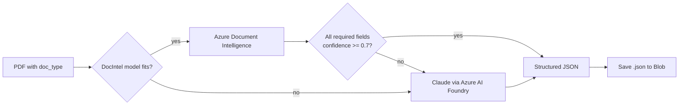

# ECDD AI Summarisation — Architecture & OCR Pipeline

**Last updated:** 2026-04-22
**Status:** Design baselined after brainstorming session (see `docs/superpowers/specs/2026-04-21-ecdd-ai-azure-design.md`). Revised 2026-04-22 to source evidence from a centralized SharePoint drive instead of browser upload.

## 1. Overview

This document describes the end-to-end architecture for the ECDD AI Summarisation system. Case evidence lives in a **centralized CDL SharePoint Online drive**, one folder per case (structure mirrors the sample `data/` tree in this repo). The reviewer opens the web app, picks a case folder from a searchable dropdown, and the system reads the PDFs via Microsoft Graph, extracts structured data from each document, aggregates a case-level profile, infers the Dow Jones screening result, and generates a copy-ready **Approval Request** markdown summary that the reviewer edits in-browser before submitting it into CDL's downstream approval workflow.

All services run inside the CDL Azure tenant (Southeast Asia region). The "contained environment" principle from `docs/USR.md` is enforced by private endpoints on every data-plane Azure service and by keeping Microsoft Graph traffic on the Microsoft backbone via Azure service tags — no PII crosses the public internet.

**Key input-source property:** raw PDFs are **not copied into Blob**. Each pipeline run streams the PDFs on-demand from SharePoint via Graph (using the signed-in reviewer's token — on-behalf-of flow). Blob stores only AI-derived artifacts (per-doc extractions, case profile, draft / final markdown). SharePoint remains the single source of truth for raw evidence, and its existing CDL retention policy applies.

## 2. Source Documents & Scenarios

### 2.1 Source location — SharePoint drive

In production the evidence lives in a single configured CDL SharePoint Online site / document library / root folder. Each child folder of the root is one ECDD case. File naming and folder naming inside each case are CDL-team conventions; the system does not require a fixed schema.

The sample `data/` tree committed to this repo is a **development fixture** that mirrors the SharePoint structure one-to-one — so local CLI runs and integration tests can work without Graph access:

```
data/                          ← dev fixture; prod equivalent lives in SharePoint
├── scenario 1/   (Irwell Hill Residences #16-10 — Foreign Retiree)
├── scenario 2/   (CanningHill Piers #09-09 — Student Purchaser)
├── scenario 3/   (CanningHill Piers #06-09 — Trust Arrangement + DJ Adverse Hit)
└── scenario 4/   (Newport Residences — Self-Funding)
```

Each folder contains a mix of digital PDFs (Form Z, Dow Jones reports, emails, ACRA profiles), scanned images (NRICs, birth certs, bank statements, CPF statements), and mixed content (OTP, Appendix AMLTF forms). Non-PDF files in a folder are ignored by the pipeline.

### 2.2 Scenario matrix (from `docs/USR.md`)

The AI produces scenario-aware summaries. A "scenario" is the combination of **stage** (user-provided) and **DJ result** (system-inferred):

| Stage | No Hit | False Positive | True Hit |
|---|---|---|---|
| A. Pre-Sales Launch | ✓ | ✓ | ✓ (incl. PEP) |
| B. Post-Sales + Pre-OTP | — | ✓ | ✓ (incl. PEP) |
| C. Post-Sales + Post-OTP | ✓ | ✓ | ✓ (Low ML Risk) |

Templates for the three **stage-C** combinations are provided under `docs/desired_output_sample/`. Stage-A and stage-B templates are expected to follow the same 7-section structure with stage-appropriate field omissions (e.g. no SPA execution date in Pre-OTP).

### 2.3 Document type inventory

| Document Type | Typical content | Primary extraction route |
|---|---|---|
| Form Z (Approval Form) | Structured approval summary, purchaser + source of funds + DJ results | Azure Doc Intelligence (custom model) → Claude fallback |
| Option to Purchase (OTP) | Legal contract with purchase price, unit, vendor, purchaser | Text PDF (pdftotext) + Claude extraction prompt |
| NRIC | Scanned ID card | Azure Doc Intelligence `prebuilt-id` → Claude fallback |
| Birth Certificate | Scanned | Claude Vision |
| Dow Jones Report | Screening results (text PDF, may include Chinese names) | Text extraction + Claude (preserve Chinese verbatim) |
| Dow Jones Search Summary | Search criteria + result count | Text extraction |
| Appendix (AMLTF) Form | Source of funds declaration, checkboxes | Azure Doc Intelligence (custom) → Claude fallback |
| Form A1 / A3 / B / C | Regulatory declarations | Azure Doc Intelligence (custom) → Claude fallback |
| Financial Statements (bank, payslip, CPF, tax) | Mostly scanned images | Azure Doc Intelligence `prebuilt-invoice` / custom → Claude fallback |
| Email Correspondence | Compliance review emails, solicitor correspondence | Text PDF + Claude |
| ACRA Business Profile | Company registration | Text PDF + Claude |
| Power of Attorney / Trust Deed | Legal documents | Claude (text + vision as needed) |
| ECDD Declaration | Self-funding declaration | Azure Doc Intelligence (custom) → Claude fallback |
| LinkedIn Profile | Screenshot | Claude Vision |
| ERM Review Email | Internal compliance assessment | Text + Claude |
| News Article | External reference | Text + Claude |

## 3. High-Level Architecture

```
   ┌──────────────────────────────────────┐
   │ CDL SharePoint Online (M365 tenant)  │   ← source of truth for raw PDFs
   │   site / library / root folder       │
   │     ├── case folder 1 / *.pdf        │
   │     ├── case folder 2 / *.pdf        │
   │     └── ...                          │
   └───────────────┬──────────────────────┘
                   │  Microsoft Graph (OBO — user's Entra ID token)
                   │  egress allowed via service tag:
                   │     MicrosoftGraph + AzureActiveDirectory
                   ▼
┌────────────────────────── CDL internal network (Azure SEA) ──────────────────┐
│                                                                              │
│  Browser (Entra ID SSO)                                                      │
│      │                                                                       │
│      ▼                                                                       │
│  ┌───────────────────────┐    ┌──────────────────────────────────┐           │
│  │  Azure Container Apps │◄──►│  Azure Blob Storage              │           │
│  │  (FastAPI + HTMX)     │    │   NO raw PDFs — only derivatives:│           │
│  │  - scenario picker    │    │    - per-doc extractions/*.json  │           │
│  │    (list + search)    │    │    - profile.json                │           │
│  │  - SharePoint/Graph   │    │    - draft.md / final.md         │           │
│  │    connector (OBO)    │    └──────────────────────────────────┘           │
│  │  - orchestrator       │                                                   │
│  │  - summary renderer   │                                                   │
│  └─────────┬─────────────┘                                                   │
│            │                                                                 │
│   ┌────────┼──────────────────┬──────────────────────┬───────────────┐       │
│   ▼        ▼                  ▼                      ▼               ▼       │
│ Azure Doc  Azure AI Foundry   Azure SQL DB       Azure Key Vault   App       │
│ Intellig.  (Claude Sonnet/    (cases, documents, (secrets, MIs)    Insights  │
│            Opus multimodal)   audit_events)                        Log       │
│                                                                    Analytics │
│                                                                              │
│  Azure data-plane traffic over PRIVATE ENDPOINTS                             │
│  Public egress DENIED by default; ALLOWED only to Microsoft service tags     │
│  (MicrosoftGraph, AzureActiveDirectory) for SharePoint access                │
└──────────────────────────────────────────────────────────────────────────────┘
```

**Properties:**
- Single Azure tenant, single region (SEA), single resource group per environment (`dev`, `prod`)
- Container Apps min-replicas = 1 during business hours, max = 10 for burst
- **SharePoint auth:** Microsoft Graph **on-behalf-of (OBO)** flow — the FastAPI app exchanges the signed-in user's Entra ID token for a Graph token. Folder visibility and per-file read permission are enforced by SharePoint's own ACL, not by the ECDD app. If a reviewer cannot see a case folder in SharePoint, they cannot select it in ECDD.
- **No raw PDFs in Blob.** Pipeline streams each file on demand via `GET /sites/{site}/drives/{drive}/items/{itemId}/content`. SharePoint's existing retention policy owns raw-PDF lifecycle.
- Managed Identity used for Foundry / DocIntel / Blob / SQL / Key Vault (internal Azure services). Graph access uses delegated user token, NOT the app's MI.
- No long-lived API keys stored in Container Apps env; secrets referenced via Key Vault.
- Graph egress is the only permitted public-internet path out of the VNet — pinned to Microsoft service tags so it cannot reach arbitrary hosts.

## 4. Pipeline Stages

### 4.1 Stage 1 — List & stream from SharePoint, then route

```python
# Pseudocode — runs with the signed-in reviewer's Graph token (OBO)
children = graph.list_children(drive_id, case_folder_id)   # DriveItems
pdfs = [c for c in children if c.file and c.name.lower().endswith(".pdf")]

for item in pdfs:
    pdf_bytes = graph.download_content(drive_id, item.id)  # streamed, never persisted to Blob
    text = pdftotext(pdf_bytes)
    if len(text.strip()) > 50:
        route = "TEXT"
        content = text
    else:
        route = "IMAGE"
        content = render_pages_as_images(pdf_bytes)        # PyMuPDF
    doc_type = classify_doc_type(item.name, first_page_text_or_image)
    # item.id and item.eTag are recorded on the documents row for audit
```

`classify_doc_type` uses filename heuristics (e.g. `"NRIC"`, `"Form Z"`, `"Dow Jones"` tokens) with a Claude fallback when the filename is uninformative.

The SharePoint `DriveItem.id` and `eTag` captured at ingest are written to the `documents` table. If a reviewer reprocesses the case later and a file's eTag changed, the audit log records both the original and current eTag — so a reviewer can tell whether a mid-run edit invalidated a prior draft.

### 4.2 Stage 2 — Extract (parallel per doc)



- **Azure Document Intelligence** handles NRIC, birth cert, Form Z / A1 / A3 / B / C, Appendix AMLTF, bank / CPF statements. Uses prebuilt models (`prebuilt-id`, `prebuilt-invoice`) plus custom-trained models for CDL-specific forms.
- **Claude on Azure AI Foundry** handles Dow Jones reports, emails, trust deeds, POA, news articles, LinkedIn screenshots, ACRA profiles, and any doc DocIntel flags as low-confidence.
- All extractions are saved as per-doc JSON files in Blob for audit and traceability.

### 4.3 Stage 3 — Aggregate case profile

All per-doc JSON files are merged into a single `scenario_profile.json`:

```json
{
  "case_id": "...",
  "stage": "C",
  "property": {"project": "...", "unit": "...", "address": "...", "purchase_price": 0.0},
  "purchasers": [{"name": "...", "nric": "...", "nationality": "...", "occupation": "..."}],
  "related_parties": [{"role": "POA holder", "name": "..."}],
  "source_of_funds": [{"type": "...", "amount": 0.0, "details": "..."}],
  "dow_jones_screening": [{"name": "...", "hit_status": "...", "reason": "..."}],
  "compliance_review": {"reviewer": "...", "findings": [...], "recommendation": "..."},
  "supporting_documents": [{"filename": "...", "doc_type": "..."}]
}
```

### 4.4 Stage 4 — Infer DJ result

Deterministic rule-based, with Claude tiebreak only for the last step:

```
if all searches have 0 profiles →               "No Hit"
elif all hits annotated as false/unrelated →    "False Positive"
else →  Claude classifies using the hits + compliance_review context
         → "True Hit (PEP)" or "True Hit (Low ML Risk)"
```

The inferred result is shown to the user in the UI **before** Stage 5 runs. If the user overrides, Stage 5 re-runs with the corrected value.

### 4.5 Stage 5 — Summarise (Approval Request)

Claude call to Azure AI Foundry:
- **System prompt:** scenario-aware instructions (`stage` + `dj_result`) selecting the correct template variant and field omissions.
- **User content:** `scenario_profile.json` (structured text input; no vision needed here).
- **Output:** markdown with the fixed 7-section template matching `docs/desired_output_sample/*.md`:

```markdown
# Approval Request – {project} {unit} Purchase by {buyer_name}

**Project:** ...
**Unit Number:** ...
**Purchase Price:** ...

**Buyer's Name:** ...
**Nationality:** ...
**Passport Number:** ...
**Dow Jones Hit:** ...

**Justification Reason:** ...

**Bank Statements or Sales Proceeds:**
- ...

**Dow Jones Search Result for Buyers:**
- ...

**Supporting Documents:**
- ...
```

The generator always prepends the "AI-assisted draft – for user validation" label (URS-05).

The draft is saved as `draft.md` (Blob) + a `cases` row update (SQL), then rendered in the browser review panel.

## 5. Detailed Data Flow

```mermaid
sequenceDiagram
    participant U as User (Browser)
    participant API as Container Apps (FastAPI)
    participant SP as SharePoint (Graph API, OBO)
    participant B as Blob Storage
    participant DI as Azure Doc Intelligence
    participant AF as Azure AI Foundry (Claude)
    participant DB as Azure SQL

    U->>API: Sign in (Entra ID SSO)
    U->>API: GET /cases/new (scenario picker)
    API->>SP: list_children(drive_id, root_folder_id) [OBO]
    SP-->>API: DriveItem[] (case folders)
    API-->>U: Dropdown + search (case names + last-modified)

    U->>API: Pick case + choose stage (A/B/C) → POST /cases
    API->>SP: get_item(drive_id, folder_id) [OBO] — verify access
    API->>DB: INSERT cases row (status=selected, sharepoint_drive_id, sharepoint_folder_id)
    API-->>U: 201 {case_id}

    U->>API: POST /cases/{id}/process
    API->>DB: status=processing
    API->>SP: list_children(drive_id, folder_id) [OBO] — PDFs only
    SP-->>API: DriveItem[] (PDFs with id + eTag)
    API->>DB: INSERT documents rows (sharepoint_item_id, sharepoint_etag)

    loop For each PDF (parallel, streamed)
        API->>SP: download_content(item.id) [OBO] — bytes in-memory
        SP-->>API: PDF bytes (never persisted to Blob)
        API->>API: pdftotext / render images, classify
        alt Route = DocIntel first
            API->>DI: Extract structured fields
            DI-->>API: JSON + per-field confidence
            alt Confidence >= 0.7
                API->>B: Write extractions/<doc>.json
            else Low confidence
                API->>AF: Claude vision/text with type-specific prompt
                AF-->>API: JSON
                API->>B: Write extractions/<doc>.json
            end
        else Route = Claude
            API->>AF: Claude with type-specific prompt
            AF-->>API: JSON
            API->>B: Write extractions/<doc>.json
        end
    end

    API->>API: Aggregate into scenario_profile.json
    API->>B: Write profile.json
    API->>API: Rule-based DJ result; Claude tiebreak if needed
    API->>DB: UPDATE cases SET inferred_dj_result
    API-->>U: Show inferred DJ result for confirmation

    U->>API: Confirm (or override)
    API->>AF: Claude summarise (scenario_profile + stage + dj_result)
    AF-->>API: Approval Request markdown
    API->>B: Write draft.md
    API->>DB: UPDATE cases SET status=drafted
    API-->>U: Render editable draft

    U->>API: Edit + Save draft
    API->>B: Write final.md
    API->>DB: UPDATE cases SET status=edited; INSERT audit_events
```

## 6. Data Model

### 6.1 Blob storage — derivatives only

Raw PDFs live in SharePoint and are **not** copied into Blob. Blob stores only what the AI produces:

```
ecdd-cases (container)/
└── {case_id}/                     ← UUIDv7
    ├── extractions/               ← per-doc JSON (180-day lifecycle)
    │   ├── {sharepoint_item_id}.json
    │   └── ...
    ├── profile.json               ← aggregated profile
    ├── draft.md                   ← AI-drafted Approval Request
    └── final.md                   ← user-edited version (1 year, then archive)
```

Extraction filenames use the SharePoint `DriveItem.id` (URL-safe) so every extraction is traceable back to its source file even if the original filename is renamed upstream.

### 6.2 Azure SQL

```sql
cases (
  case_id                  UNIQUEIDENTIFIER PRIMARY KEY,
  case_reference           NVARCHAR(100)  NOT NULL,
  stage                    NVARCHAR(20)   NOT NULL,    -- A | B | C
  inferred_dj_result       NVARCHAR(30)   NULL,
  status                   NVARCHAR(20)   NOT NULL,    -- selected | processing | awaiting_dj | drafted | edited | failed | closed
  created_by               NVARCHAR(200)  NOT NULL,    -- Entra ID UPN
  created_at               DATETIME2      NOT NULL,
  updated_at               DATETIME2      NOT NULL,
  blob_prefix              NVARCHAR(300)  NOT NULL,    -- derivatives-only prefix
  sharepoint_site_id       NVARCHAR(200)  NOT NULL,
  sharepoint_drive_id      NVARCHAR(200)  NOT NULL,
  sharepoint_folder_id     NVARCHAR(200)  NOT NULL,
  sharepoint_folder_path   NVARCHAR(1000) NOT NULL,    -- e.g. "/ECDD Cases/CanningHill #09-09"
  sharepoint_folder_web_url NVARCHAR(1000) NULL        -- for reviewer deep-links
)

documents (
  doc_id                UNIQUEIDENTIFIER PRIMARY KEY,
  case_id               UNIQUEIDENTIFIER NOT NULL,    -- FK cases
  filename              NVARCHAR(300)    NOT NULL,    -- DriveItem.name at ingest
  doc_type              NVARCHAR(50)     NULL,
  extraction_route      NVARCHAR(20)     NOT NULL,   -- doc_intel | claude_vision | text
  page_count            INT              NOT NULL,
  extracted_at          DATETIME2        NULL,
  confidence_min        FLOAT            NULL,
  sharepoint_item_id    NVARCHAR(200)    NOT NULL,
  sharepoint_etag       NVARCHAR(100)    NOT NULL,    -- captured at ingest; detects mid-run edits on re-process
  sharepoint_web_url    NVARCHAR(1000)   NULL
)

audit_events (
  event_id       BIGINT IDENTITY PRIMARY KEY,
  case_id        UNIQUEIDENTIFIER NOT NULL,        -- FK cases
  event_type     NVARCHAR(40)     NOT NULL,        -- e.g. case_selected, pipeline_started, dj_confirmed, final_saved
  actor          NVARCHAR(200)    NOT NULL,
  payload_json   NVARCHAR(MAX)    NULL,            -- redacted to field names + hashes
  occurred_at    DATETIME2        NOT NULL
)
```

## 7. Security, Compliance & Networking

- **Authentication:** Entra ID SSO enforced at Container Apps ingress; three role groups: `ecdd-reviewer`, `ecdd-supervisor`, `ecdd-admin`.
- **SharePoint access (delegated):** Microsoft Graph **on-behalf-of (OBO)** flow — the FastAPI backend exchanges the signed-in user's Entra ID token for a Graph token scoped to `Sites.Selected` + `Files.Read.All` (delegated). SharePoint's native folder ACL is authoritative: a reviewer can only list/stream case folders they already have read permission on. The app performs NO permission mirroring — ACL changes in SharePoint take effect immediately.
- **Service-to-service (Azure-internal):** Managed Identity for Foundry, DocIntel, Blob, SQL, Key Vault where supported; remaining keys in Key Vault, referenced via Container Apps secret refs. Graph is NOT accessed via the app's MI — always via the user's delegated token.
- **Network:** VNet + private endpoints for every Azure data-plane service. Container Apps public egress is **denied by default**; a narrow exception allows outbound traffic to the Microsoft service tags `MicrosoftGraph` and `AzureActiveDirectory` only — so the app can talk to Graph/SharePoint and the Entra token endpoint without opening general internet access.
- **Data residency:** Azure Southeast Asia. SharePoint tenant residency is governed by CDL's M365 configuration (outside the scope of this system).
- **Encryption:** TLS 1.2+ in transit; platform-managed keys at rest for PoC; customer-managed keys (CMK) via Key Vault for production.
- **PII in logs:** App Insights filter strips NRIC / passport / phone / price; full payloads live only in Blob and SharePoint.
- **Retention:**
  - **Raw PDFs** — governed by SharePoint / CDL M365 retention policy (not in Blob, so nothing to retain on our side).
  - **Extractions** (`extractions/*.json`) — 180 days via Blob lifecycle rule.
  - **Profile / drafts / finals** — 1 year, then archived to cool tier; SQL `cases` row retained as system-of-record reference.
- **Traceability on re-process:** `documents.sharepoint_etag` is captured at ingest. If a reviewer re-runs a case later and a file's eTag has changed in SharePoint, an `audit_events` row is written with both the old and new eTag, so a later reviewer can see the prior draft was based on a superseded version.
- **Purge:** admin "delete case" hard-deletes Blob derivatives + SQL `cases`/`documents`/`audit_events` rows. Raw PDFs are untouched — SharePoint remains authoritative.
- **URS-05 banner:** "AI-assisted draft – for user validation" enforced both in the generator output and the UI footer.

## 8. Technology Stack

| Component | Technology | Purpose |
|---|---|---|
| Frontend | HTMX + Jinja2 templates | Browser UI: scenario picker (dropdown + search), SSE progress, editable summary |
| API / orchestrator | Python 3.11+, FastAPI | Pipeline coordination, API endpoints |
| SharePoint/Graph client | `msgraph-sdk` (or `msgraph-core`) + `msal` | List case folders, stream PDF content on-demand |
| Entra OBO flow | `msal` (ConfidentialClientApplication) | Exchange signed-in user token → Graph token |
| Text extraction | `pdftotext` (poppler), `pdfplumber` | Digital PDFs |
| Image rendering | `PyMuPDF` (fitz), `pdf2image` | Scanned pages → images |
| Structured OCR | Azure Document Intelligence | NRIC, forms, invoices |
| Multimodal LLM | Azure AI Foundry (Claude Sonnet/Opus) | Vision OCR fallback + summarisation |
| Hosting | Azure Container Apps | Stateless app, auto-scale |
| Object storage | Azure Blob Storage | Derivatives only (extractions, profile, drafts) |
| Relational DB | Azure SQL Database | Case metadata (incl. SharePoint IDs/eTags), audit log |
| Secrets | Azure Key Vault | API keys, connection strings, OBO client secret |
| Identity | Microsoft Entra ID | SSO + RBAC + delegated Graph auth |
| Observability | App Insights, Log Analytics | Traces, logs, metrics |
| IaC | Bicep (or Terraform) | Tenant provisioning, service-tag egress rules |
| CI/CD | GitHub Actions (self-hosted VNet runner) | Build → ACR → Container Apps |

## 9. Tradeoffs & Considerations

### SharePoint as source-of-truth (vs. browser upload)
- **Pros:**
  - No duplicate PII store — Blob holds no raw PDFs, so purge is a one-place operation (SharePoint owns retention).
  - CDL's existing M365 access controls are reused; nobody has to maintain a parallel ACL inside ECDD.
  - Reviewers work against folders they already collaborate in — no re-upload step and no risk of stale copies.
  - Graph `eTag` on each DriveItem gives deterministic audit of "was the underlying file edited mid-process?" — a clean answer a browser upload model can't give.
- **Cons:**
  - Adds a Graph dependency — SharePoint outage / throttling blocks new pipeline runs (drafts already in Blob are unaffected).
  - Requires Graph egress exception in the otherwise-closed VNet (see §7; pinned to Microsoft service tags so blast radius is tight).
  - Large folders stream slower than local upload; mitigated by parallel downloads per document.

### OBO (delegated) vs. application-permission Graph auth
- **Pros of OBO (chosen):** The app cannot see more than the signed-in user sees. No risk of a compromised app token leaking the entire SharePoint library.
- **Cons:** Every pipeline run needs a live user token; background re-processing of a case requires the user to be signed in. Acceptable because re-process is an explicit UI action.

### Hybrid OCR (Azure Doc Intelligence + Claude Vision)
- **Pros:** DocIntel's prebuilt models are accurate and cheap on structured docs (NRIC, invoices); Claude handles the long tail (Dow Jones, legal text, screenshots) where DocIntel struggles.
- **Cons:** More orchestration logic than Claude-only; need to maintain custom DocIntel models for CDL-specific forms over time.

### Claude-Vision-only alternative
- **Pros:** Simpler pipeline, single integration, consistent API for every doc.
- **Cons:** Higher per-page cost; no deterministic OCR for structured forms; harder to audit field-level confidence.

### Scenario awareness
- **Pros:** Stage dropdown keeps the workflow state explicit and auditable; rule-based DJ classification with Claude tiebreak is deterministic where possible.
- **Cons:** User must know the stage before picking the case; misclassification requires re-processing (mitigated by showing inferred DJ result before Stage 5).

### Data sensitivity
- NRICs, financial details, addresses, and Chinese name variants all qualify as PII.
- Mitigated by: private endpoints, PII-scrubbed logging, stream-only raw PDFs (SharePoint authoritative), managed identities for internal Azure services, OBO for SharePoint, Entra ID SSO.

## 10. Open Items

See `docs/superpowers/specs/2026-04-21-ecdd-ai-azure-design.md` §7 for the tracked list. Summary:

1. Exact Claude SKU + vision support in Azure AI Foundry (Southeast Asia region) at go-live.
2. Custom DocIntel model training for Form Z / A1 / A3 / B / C — PoC can launch Claude-only for these, add DocIntel later.
3. Templates for 5 missing scenario × DJ-result combinations (A×*, B×*, C×True-Hit-PEP) — stage-C templates ship first.
4. Final banner / label copy (English or bilingual) — config-driven, no redeploy needed to adjust.
5. Prod "delete case" admin assignment — post-PoC decision with CDL InfoSec.
6. SharePoint site/library/root-folder identity — CDL to nominate the specific site and root folder (`sharepoint_site_id` + root `sharepoint_drive_id` + root `sharepoint_folder_id`) that the ECDD app is configured against. Required before Phase 0 smoke test.
7. Graph egress firewall exception — CDL NetSec sign-off on the service-tag allowlist (`MicrosoftGraph` + `AzureActiveDirectory`) for the ECDD Container Apps VNet. Alternative if rejected: a CDL-run Graph egress proxy inside the VNet.

## 11. References

- `docs/USR.md` — User Requirement Specification
- `docs/desired_output_sample/` — target Approval Request format
- `docs/superpowers/specs/2026-04-21-ecdd-ai-azure-design.md` — full design spec (decisions, assumptions, risks, rollout, success criteria)
