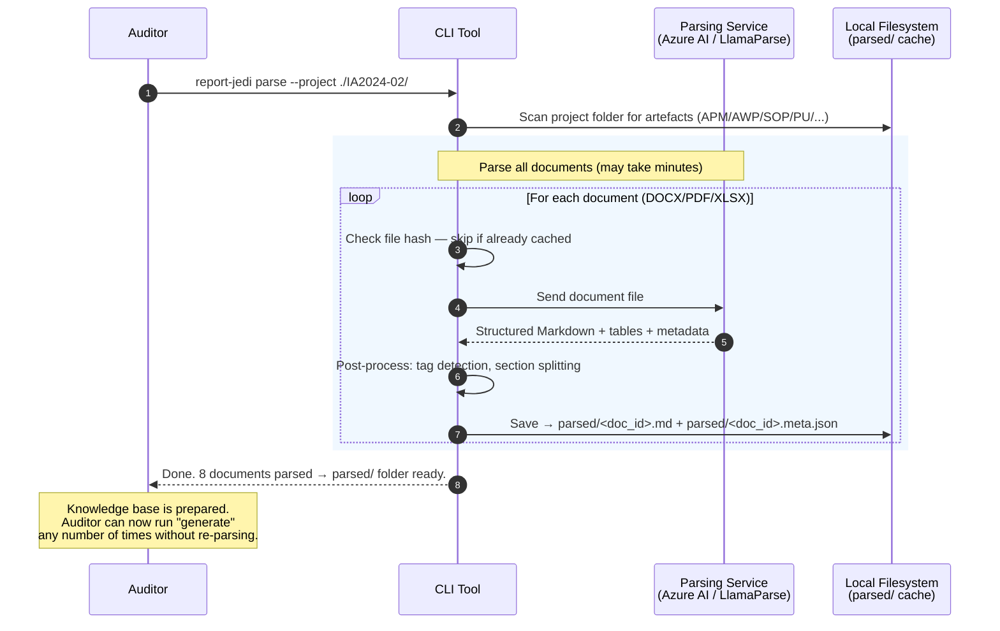
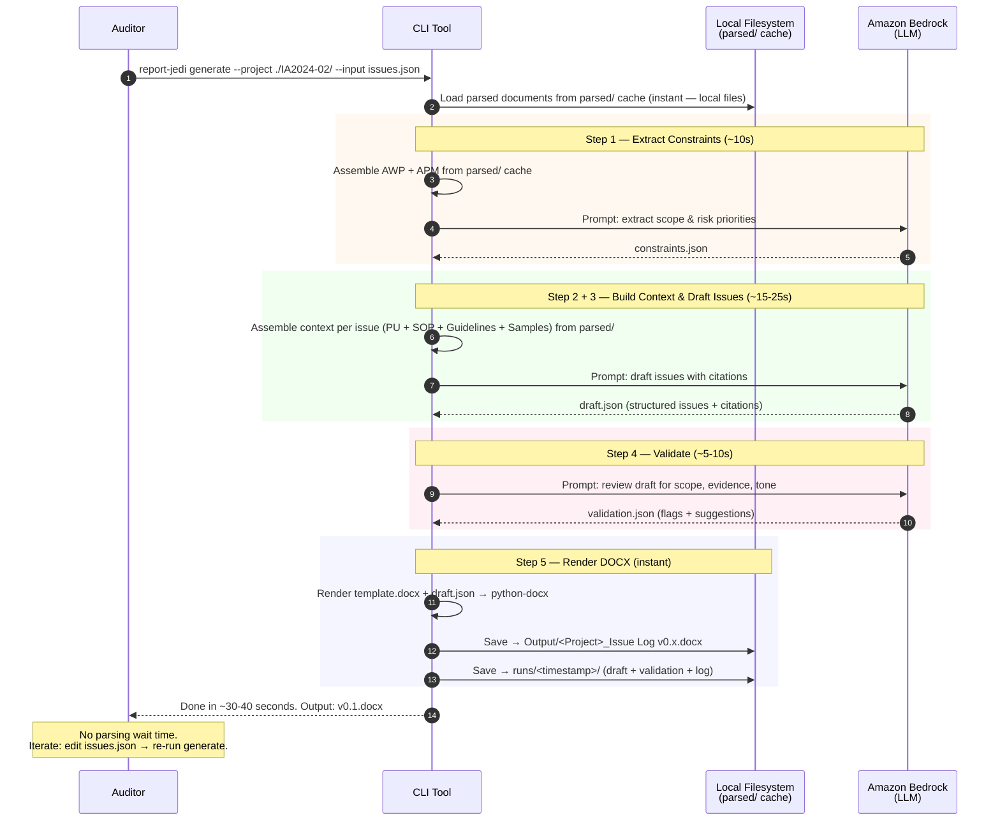

# Architecture Proposal — Operation Report Jedi (POC)
## AI-Assisted Audit Issue Log Drafting

| Item | Detail |
|------|--------|
| **Version** | 1.0 |
| **Date** | 2026-04-16 |
| **Status** | Draft — pending leadership review |
| **Cloud** | AWS (primary) + external parsing service |
| **LLM** | Amazon Bedrock (Claude / other model) |
| **Delivery** | CLI tool (Python) |
| **Design principle** | Simplest stack that meets spec; minimise cost; iterate fast |

---

## Table of Contents

1. [Executive Summary](#1-executive-summary)
2. [POC Scope Recap](#2-poc-scope-recap)
3. [Design Decisions & Trade-offs](#3-design-decisions--trade-offs)
4. [High-Level Architecture](#4-high-level-architecture)
5. [Document Parsing Strategy](#5-document-parsing-strategy)
6. [Context Building & Retrieval Strategy](#6-context-building--retrieval-strategy)
7. [Prompt Engineering — 3-Step Chain](#7-prompt-engineering--3-step-chain)
8. [Guardrails & Validation](#8-guardrails--validation)
9. [DOCX Rendering](#9-docx-rendering)
10. [CLI Tool Design](#10-cli-tool-design)
11. [AWS Services & Infrastructure](#11-aws-services--infrastructure)
12. [Security & Governance](#12-security--governance)
13. [Observability & Audit Trail](#13-observability--audit-trail)
14. [Cost Estimate (POC)](#14-cost-estimate-poc)
15. [Implementation Roadmap (4 Sprints)](#15-implementation-roadmap-4-sprints)
16. [Risks & Mitigations](#16-risks--mitigations)
17. [Data Requirements from IA Team](#17-data-requirements-from-ia-team)
18. [Decisions to Confirm Before Build](#18-decisions-to-confirm-before-build)
19. [Future Enhancements (Post-POC)](#19-future-enhancements-post-poc)

---

## 1. Executive Summary

Operation Report Jedi is a POC to evaluate AI-assisted drafting of Internal Audit issue logs. The system reads approved audit artefacts (APM, AWP, Guidelines, Process SOP, Process Understanding, Samples), takes auditor inputs (observed gaps, evidence summaries), and generates a draft Issue Log in DOCX format.

**This proposal optimises for POC reality:**
- **No OpenSearch / vector database** — the corpus per project is small (~15 documents); we load relevant context directly into the LLM's large context window.
- **No Step Functions** — a Python CLI script handles orchestration; simpler to develop, debug, and iterate.
- **External document parsing service** — instead of building custom parsers for DOCX/PDF/XLSX with complex tables, formatting, and mixed content, we use a proven service (recommended: **Azure AI Document Intelligence** or **LlamaParse**).
- **3-step prompt chain** — constraint extraction, issue drafting with RAG-style context, and self-critique/validation.
- **Structured intermediate output** — LLM generates `draft.json` (with citations), then a DOCX renderer produces the final file from a template.

---

## 2. POC Scope Recap

### In-Scope
- AI-assisted drafting of **audit issue logs only**
- **10 completed audit projects** as reference/test dataset
- Generate issue log sections: **Finding, Impact, Recommendation** (plus index, tables, comments)
- Apply IA-approved tone, formatting, and structure
- Output: DOCX file saved to `Output/` folder with versioning (`v0.1`, `v0.2`, ...)

### Out-of-Scope
- Audit testing, control evaluation, or assurance conclusions
- 3-agent system (Harvester/Sorter/Review Agent) — planned for later phase
- Automated submission/finalisation without human review
- Web UI (CLI only for POC)

### Success Criteria
1. Drafts comply with IA structure and formatting standards
2. Measurable reduction in drafting effort
3. Output requires refinement, not full redrafting
4. When tested on completed audits, draft closely aligns with approved report
5. No scope breaches or unsupported assertions

---

## 3. Design Decisions & Trade-offs

| Decision | Choice | Rationale |
|----------|--------|-----------|
| **Orchestration** | Python CLI script | POC speed; no infrastructure overhead; easy to debug |
| **Vector DB / RAG** | None — direct context loading | Corpus is ~15 docs/project; fits in context window (~200K tokens); eliminates indexing complexity and cost |
| **Document parsing** | External service (Azure AI Document Intelligence or LlamaParse) | Complex layouts, tables, mixed formats (DOCX/PDF/XLSX); no time to build custom parsers; proven accuracy |
| **LLM** | Amazon Bedrock (Claude recommended) | Large context window (200K), strong instruction following, good at structured output |
| **Output format** | LLM → JSON → DOCX (two-step) | Separates content generation from formatting; easier to validate and iterate |
| **Delivery** | CLI tool | Fastest to build; auditor runs from terminal; no web infrastructure |
| **Storage** | S3 for datasets + local filesystem for runs | Minimal cost; S3 optional if datasets stay local during POC |

---

## 4. High-Level Architecture

### 4.1 System Components

```
┌─────────────────────────────────────────────────────────────────────┐
│                         CLI Tool (Python)                           │
│                                                                     │
│  ┌───────────┐  ┌───────────┐  ┌───────────┐  ┌─────────────────┐  │
│  │  Document  │  │  Context  │  │  Prompt   │  │     DOCX        │  │
│  │  Parser    │  │  Builder  │  │  Chain    │  │     Renderer    │  │
│  │  Module    │  │  Module   │  │  Engine   │  │     Module      │  │
│  └─────┬─────┘  └─────┬─────┘  └─────┬─────┘  └────────┬────────┘  │
│        │              │              │                  │           │
└────────┼──────────────┼──────────────┼──────────────────┼───────────┘
         │              │              │                  │
    ┌────▼────┐    ┌────▼────┐   ┌────▼────┐       ┌────▼────┐
    │ External │    │  Local  │   │ Amazon  │       │  Local  │
    │ Parsing  │    │  File   │   │ Bedrock │       │ Output/ │
    │ Service  │    │ System  │   │  (LLM)  │       │ folder  │
    └─────────┘    └─────────┘   └─────────┘       └─────────┘
```

### 4.2 Two Separate Flows

The system is split into **two independent flows** so that document parsing (slow, one-time) does not block report generation (fast, repeated).

#### Flow 1 — Knowledge Base Preparation (one-time per project)

Run once when a project is set up, or when artefacts change. This is the "slow" step — parsing complex documents can take minutes — but it only happens once.

```
    ┌─────────────────────────┐
    │  Auditor runs:          │
    │  report-jedi parse      │
    │  --project ./IA2024-02/ │
    └────────────┬────────────┘
                 │
    ┌────────────▼────────────┐
    │  Read all project docs  │
    │  APM / AWP / Guidelines │
    │  SOP / PU / Samples     │
    └────────────┬────────────┘
                 │
    ┌────────────▼────────────┐
    │  Send to external       │
    │  parsing service        │       ┌─────────────────┐
    │  (Azure AI / LlamaParse)│──────►│ Parsing Service  │
    │                         │◄──────│ (external API)   │
    └────────────┬────────────┘       └─────────────────┘
                 │
    ┌────────────▼────────────┐
    │  Post-parse enrichment  │
    │  - Tag detection        │
    │  - Section splitting    │
    │  - Folder-type labels   │
    └────────────┬────────────┘
                 │
    ┌────────────▼────────────┐
    │  Save to parsed/ cache  │
    │  (local knowledge base) │
    │  parsed/*.md            │
    │  parsed/*.meta.json     │
    └─────────────────────────┘
    
    ✓ Done. Knowledge base ready.
      Auditor can now run "generate" any time.
```

#### Flow 2 — Report Generation (fast, repeatable)

Reads from the **local parsed/ cache** — no external parsing calls. This is the flow the auditor runs repeatedly while iterating on drafts.

```
    ┌─────────────────────────┐
    │  Auditor runs:          │
    │  report-jedi generate   │
    │  --project ./IA2024-02/ │
    │  --input issues.json    │
    └────────────┬────────────┘
                 │
    ┌────────────▼────────────┐
    │  STEP 1: EXTRACT        │
    │  CONSTRAINTS             │
    │  Read parsed AWP + APM  │        ┌──────────────┐
    │  from parsed/ cache     │───────►│ Amazon       │
    │  → LLM call             │◄───────│ Bedrock      │
    │  → constraints.json     │        │ (LLM)        │
    └────────────┬────────────┘        └──────┬───────┘
                 │                            │
    ┌────────────▼────────────┐               │
    │  STEP 2: BUILD CONTEXT  │               │
    │  Assemble relevant      │               │
    │  sections from parsed/  │               │
    │  PU, SOP, Guidelines,   │               │
    │  Samples                │               │
    └────────────┬────────────┘               │
                 │                            │
    ┌────────────▼────────────┐               │
    │  STEP 3: DRAFT ISSUES   │               │
    │  LLM generates          │───────────────┤
    │  structured JSON        │◄──────────────┤
    │  with citations         │               │
    │  → draft.json           │               │
    └────────────┬────────────┘               │
                 │                            │
    ┌────────────▼────────────┐               │
    │  STEP 4: VALIDATE       │               │
    │  Guardrails check       │───────────────┤
    │  (scope, evidence,      │◄──────────────┘
    │  format, tone)          │
    │  → validation.json      │
    └────────────┬────────────┘
                 │
    ┌────────────▼────────────┐
    │  STEP 5: RENDER DOCX    │
    │  template + draft.json  │
    │  → Output/v0.x.docx     │
    └────────────┬────────────┘
                 │
    ┌────────────▼────────────┐
    │  Auditor reviews,       │
    │  edits, re-runs if      │
    │  needed                 │
    └─────────────────────────┘
```

**UX benefit**: Flow 2 only calls Bedrock (fast, ~20-40 seconds). No waiting for document parsing.

### 4.3 Sequence Diagrams

#### Flow 1 — Knowledge Base Preparation (`report-jedi parse`)



#### Flow 2 — Report Generation (`report-jedi generate`)



---

## 5. Document Parsing Strategy

### 5.1 The Problem

The audit artefacts are complex documents with:
- **Mixed content**: prose paragraphs, numbered lists, nested tables, headers, footers
- **Multiple formats**: DOCX (with tables, tracked changes), PDF (text-based and potentially scanned), XLSX (tabular data)
- **Special structures**: tagged findings (`[CONTROL]`, `[GAP]`, `[LAPSE]`, `[ENHANCEMENT]`), cross-references, approval matrices
- **Formatting rules**: specific fonts, shading, alignment that carry semantic meaning

Building custom parsers from scratch is **not feasible within POC timeline**.

### 5.2 Recommended External Services

| Service | Strengths | Pricing (approx.) | Recommendation |
|---------|-----------|-------------------|----------------|
| **Azure AI Document Intelligence** | Best table extraction; handles complex layouts; DOCX/PDF/XLSX; prebuilt + custom models; outputs structured Markdown or JSON | ~$1.50 per 1000 pages (prebuilt) | **Primary recommendation** — best accuracy for complex IA documents with tables |
| **LlamaParse** (by LlamaIndex) | AI-powered parsing; good Markdown output; handles complex PDFs; simple API | Free tier: 1000 pages/day; Pro: $0.30/1000 pages | **Good alternative** — simpler API, lower cost, very good for PDF/DOCX |
| **Unstructured.io** (API or self-hosted) | Open-source option; handles many formats; partitioning + chunking built-in | Free (self-hosted) or API pricing | **Fallback** — more setup effort but no vendor lock-in |
| **AWS Textract** | Good OCR; native AWS integration | ~$1.50 per 1000 pages | Weaker on complex table layouts vs Azure; consider only if must stay pure AWS |

### 5.3 Recommended Approach

```
Project Folder (raw)
    │
    ├── DOCX files ──┐
    ├── PDF files  ──┼──→ Azure AI Document Intelligence (Layout API)
    ├── XLSX files ──┘         │
    │                          ▼
    │                   Structured output per doc:
    │                   - Full text with structure (Markdown format)
    │                   - Tables preserved as Markdown tables
    │                   - Section hierarchy (headings/paragraphs)
    │                   - Page numbers
    │                          │
    │                          ▼
    │                   parsed/<doc_id>.md  (cached locally)
    │                   parsed/<doc_id>.meta.json (metadata: pages, tables, sections)
```

### 5.4 Parsing Cache

- Parse each document **once** and cache the result in `parsed/` folder inside the project directory.
- Re-parse only if source file changes (compare file hash).
- This avoids repeated API calls and costs during iterative development.

### 5.5 Post-Parsing Enhancement (in-code, lightweight)

After the external service returns structured text, apply **lightweight in-code enrichment**:

- **Tag detection**: regex scan for `[CONTROL]`, `[GAP]`, `[LAPSE]`, `[ENHANCEMENT]` tags in Process Understanding docs → annotate in metadata
- **Section splitting**: split by heading hierarchy → create logical sections for context assembly. Each section stored as a separate entry in `meta.json` with heading, page range, and token count.
- **Section index (TOC) generation**: build a structured table of contents per document — this is the key index used for smart section selection during generation (see Section 6).
- **Folder-type labelling**: tag each parsed doc with its `folder_type` (APM/AWP/Guidelines/SOP/PU/Samples) based on source path

Example `parsed/SOP_CDL_PDPA_Manual.meta.json`:

```json
{
  "doc_id": "SOP_CDL_PDPA_Manual",
  "source_path": "Process SOP/CDL PDPA Manual - Final v1.pdf",
  "source_hash": "sha256:abc123...",
  "folder_type": "Process SOP",
  "total_pages": 76,
  "total_tokens": 48000,
  "sections": [
    {
      "id": "s1",
      "heading": "1. Introduction to the Personal Data Protection Act",
      "level": 1,
      "pages": "4-10",
      "token_count": 3800,
      "tags": []
    },
    {
      "id": "s2",
      "heading": "2. The Consent, Purpose Limitation and Notification Obligation",
      "level": 1,
      "pages": "11-22",
      "token_count": 7200,
      "tags": ["consent", "notification", "purpose limitation"]
    },
    {
      "id": "s3",
      "heading": "3. The Accuracy Obligation",
      "level": 1,
      "pages": "18-20",
      "token_count": 2100,
      "tags": []
    }
  ]
}
```

This section index is what powers **smart section selection** in Section 6.

---

## 6. Context Building & Retrieval Strategy

### 6.1 The Problem with Loading Full Documents

Loading full documents into the LLM context is **not feasible**:

| Document | Pages | Est. Tokens |
|----------|-------|-------------|
| CDL PDPA Manual (SOP) | 76 | ~48K |
| AWP | 20-40 | ~15-25K |
| APM | 15-30 | ~10-20K |
| Process Understanding | 30-50 | ~20-35K |
| Guidelines | 16 | ~10K |
| Samples | 10-20 | ~8-15K |
| **Total if all loaded** | **~200+** | **~120-170K** |

Even with a 200K context window, loading everything leaves almost no room for the prompt instructions, auditor input, and LLM output. And every token loaded = cost paid. Most of that content is **irrelevant** to any single issue.

### 6.2 Why No Vector Database (for POC)

| Factor | Analysis |
|--------|----------|
| **Corpus size** | ~15 docs per project — too small to justify vector DB infrastructure |
| **Document structure** | IA documents are well-structured (headings, TOC, numbered sections) — we can use **structure-based selection** instead of semantic search |
| **Cost** | OpenSearch Serverless minimum ~$700/month; even local FAISS adds chunking + embedding complexity |
| **POC speed** | Vector DB adds a sprint of work (chunking strategy, embedding pipeline, retrieval tuning) |

**Decision**: Use **smart section selection** based on document structure (TOC + headings) instead of vector search. This leverages the structured nature of IA documents.

### 6.3 Smart Section Selection Strategy

The core idea: **don't load full documents — load only the sections relevant to each issue**, selected using document structure metadata built during the `parse` step.

#### How It Works

```
┌────────────────────────────────┐
│  Auditor's issue input:        │
│  in_scope_process: "PDPA -     │
│  Collection of Personal Data"  │
│  observed_gap: "consent        │
│  notification wording..."      │
└──────────────┬─────────────────┘
               │
       ┌───────▼────────┐
       │  SELECTION      │
       │  STRATEGY       │
       └───────┬────────┘
               │
    ┌──────────▼──────────────────────────────────────┐
    │  Method A: TOC-Based Matching (fast, free)      │
    │                                                  │
    │  1. Read section index from meta.json            │
    │  2. Keyword match: issue's in_scope_process      │
    │     + observed_gap keywords                      │
    │     → against section headings + tags            │
    │  3. Select matching sections                     │
    │                                                  │
    │  Example: "Collection of Personal Data"          │
    │  → matches: "2. The Consent, Purpose Limitation  │
    │    and Notification Obligation" (pages 11-22)    │
    │  → matches: "Annex B. Procedures to Allow        │
    │    Individuals to Withdraw Consent" (p.40)       │
    │  → skips: "5. Retention Limitation" (irrelevant) │
    └──────────────────┬──────────────────────────────┘
                       │
          ┌────────────▼──────────────┐
          │  Token budget check:      │
          │  Selected sections fit    │
          │  within budget? (< 30K)   │
          ├─────YES────┬───NO─────────┤
          │            │              │
          ▼            │              ▼
    Load sections      │     ┌────────────────────┐
    into prompt        │     │ Method B: LLM-     │
                       │     │ Assisted Selection  │
                       │     │ (fallback)          │
                       │     │                     │
                       │     │ Send TOC list to    │
                       │     │ LLM → ask "which    │
                       │     │ sections relevant   │
                       │     │ to this issue?"     │
                       │     │ → load only those   │
                       │     └─────────────────────┘
                       │
          ┌────────────▼──────────────┐
          │  Assemble into prompt     │
          │  with role tags:          │
          │  [PROCESS SOP — §2]       │
          │  [PROCESS SOP — Annex B]  │
          └───────────────────────────┘
```

#### Method A: TOC-Based Matching (primary — fast, no LLM cost)

1. Extract keywords from the auditor's input (`in_scope_process`, `observed_gap`)
2. Match against **section headings** and **tags** in each document's `meta.json`
3. Rank sections by relevance (number of keyword hits)
4. Select top sections up to a **token budget** (configurable, default ~30K per document type)

This works well because IA documents have **descriptive section headings** (e.g., "The Consent, Purpose Limitation and Notification Obligation" clearly matches a PDPA consent issue).

#### Method B: LLM-Assisted Selection (fallback — small extra cost)

When TOC-based matching is ambiguous (too many matches, or too few), use a lightweight LLM call:

```
Prompt (~2K tokens):
  "Given this audit issue about [topic], which sections from the
   following table of contents are relevant? Return section IDs only."

  [List of section headings + IDs from meta.json — just the TOC, not content]

Response (~200 tokens):
  ["s2", "s5", "annex_b"]
```

Cost: ~$0.01 per call (minimal). Only used as fallback when Method A is unclear.

### 6.4 Context Assembly Strategy (per artefact type)

Each artefact type uses a **different selection approach** based on its size and role:

| Artefact | Size | Selection Strategy | Role in Prompt |
|----------|------|-------------------|----------------|
| **AWP** | ~20-40 pages | **Load full** — it's the scope document, all of it is relevant for constraint extraction | Scope boundaries — Step 1 |
| **APM** | ~15-30 pages | **Load full** — risk priorities need the full picture | Risk priorities — Step 1 |
| **Process SOP** | **Large (e.g., 76 pages)** | **Smart section selection** — TOC match by issue topic, load only matching sections (~10-15 pages) | Benchmark "should-be" — Step 3 |
| **Process Understanding** | ~30-50 pages | **Smart section selection** — match by issue topic + filter for `[GAP]`/`[CONTROL]` tagged sections | Evidence "as-is" — Step 3 |
| **Guidelines** | ~16 pages | **Load full** — small enough, and formatting rules apply to all issues | Writing rules — Step 3 |
| **Samples (Template)** | ~5 pages | **Load full** — small, essential structure reference | Structure — Step 3 |
| **Samples (Approved Report)** | ~10-20 pages | **Select 1-2 example issues** most similar to the current issue (keyword match on issue titles) | Tone/vocabulary — Step 3 |

### 6.5 Context Window Budget (estimated — with smart selection)

For a typical project using Claude on Bedrock (200K token context):

**Step 1 — Constraint Extraction:**

| Component | Estimated Tokens | Strategy |
|-----------|-----------------|----------|
| AWP (full) | ~15K | Load full — scope document |
| APM (full) | ~20K | Load full — planning document |
| System prompt + instructions | ~3K | |
| **Step 1 total** | **~38K** | Well within limit |

**Step 3 — Issue Drafting (per issue):**

| Component | Estimated Tokens | Strategy |
|-----------|-----------------|----------|
| Process SOP (selected sections) | **~8-12K** | Smart selection: 2-3 sections instead of 76 pages |
| Process Understanding (selected sections) | **~8-12K** | Smart selection: tagged sections for this issue |
| Guidelines (full) | ~10K | Load full — small document |
| Samples (template + 1 example) | ~8K | Template full + 1 matched example |
| constraints.json | ~1K | From Step 1 |
| System prompt + instructions | ~5K | |
| Auditor input | ~1K | |
| **Step 3 total** | **~45-55K** | Comfortable margin within 200K |

**Savings vs. loading everything:**

| Approach | Tokens per Step 3 call | Est. Cost per call |
|----------|----------------------|-------------------|
| Load full documents | ~120-170K | ~$0.40-0.55 |
| Smart section selection | ~45-55K | ~$0.15-0.18 |
| **Savings** | **~60-70% fewer tokens** | **~60-70% cost reduction** |

---

## 7. Prompt Engineering — 3-Step Chain

The core intelligence of the system. Each step is a separate LLM call with a focused purpose.

### 7.1 Step 1: Constraint Extraction

**Purpose**: Extract structured scope boundaries and risk priorities from AWP and APM so that subsequent steps can enforce compliance.

```
┌─────────────────────────────────────────────────────────┐
│ PROMPT: Constraint Extraction                           │
│                                                         │
│ SYSTEM:                                                 │
│   You are an Internal Audit scope analyst. Extract      │
│   structured constraints from the Approved Work Program │
│   and Approved Planning Memo. Output strict JSON.       │
│                                                         │
│ INPUT:                                                  │
│   - Full text of AWP                                    │
│   - Full text of APM                                    │
│                                                         │
│ OUTPUT (constraints.json):                              │
│   {                                                     │
│     "project_title": "...",                             │
│     "audit_period": "...",                              │
│     "in_scope_processes": [                             │
│       {                                                 │
│         "process": "PDPA - Collection of Personal Data",│
│         "sub_areas": ["consent", "notification", ...],  │
│         "risk_level": "Medium",                         │
│         "awp_reference": "Section 4.3"                  │
│       }                                                 │
│     ],                                                  │
│     "out_of_scope": ["...", "..."],                     │
│     "risk_priorities": ["...", "..."],                  │
│     "key_stakeholders": ["...", "..."],                 │
│     "key_systems": ["CHS", "Salesforce", "..."],       │
│     "audit_objectives": ["...", "..."]                  │
│   }                                                     │
└─────────────────────────────────────────────────────────┘
```

**Key design choices**:
- Separate LLM call (not combined with drafting) so constraints are explicit and reviewable
- JSON output is machine-parseable for guardrail checks in Step 4
- Cached per project — only re-extract if AWP/APM changes

### 7.2 Step 2 + 3: Context Assembly & Issue Drafting

**Purpose**: For each issue the auditor wants drafted, assemble relevant context and generate a structured issue with citations.

```
┌─────────────────────────────────────────────────────────────────┐
│ PROMPT: Issue Drafting                                          │
│                                                                 │
│ SYSTEM:                                                         │
│   You are an Internal Audit report writer. Draft audit issues   │
│   for the issue log based strictly on the provided artefacts.   │
│                                                                 │
│   RULES:                                                        │
│   1. Every statement in Finding and Impact MUST cite a source   │
│      document (Process Understanding or SOP) with page/section. │
│   2. Do NOT introduce information not present in the artefacts. │
│   3. Stay within the audit scope defined in constraints.json.   │
│   4. Use positive tone for issue titles (per Guidelines).       │
│   5. Follow the Issue Log Template structure exactly.           │
│   6. Use professional IA vocabulary consistent with Samples.    │
│   7. Use British spelling.                                      │
│   8. Format cross-references as "Refer to Table X for details".│
│                                                                 │
│ CONTEXT (loaded via smart section selection — see Section 6):    │
│   [CONSTRAINTS]                                                 │
│   {constraints.json from Step 1}                                │
│                                                                 │
│   [GUIDELINES — FORMATTING AND WRITING STANDARDS]               │
│   {Full parsed text — small doc, load all ~10K tokens}          │
│                                                                 │
│   [ISSUE LOG TEMPLATE — REQUIRED STRUCTURE]                     │
│   {Full parsed text of template from Samples/ — small}          │
│                                                                 │
│   [SAMPLE APPROVED ISSUES — TONE AND VOCABULARY REFERENCE]      │
│   {1-2 example issues keyword-matched to current issue}         │
│                                                                 │
│   [PROCESS SOP — BENCHMARK "SHOULD-BE" — SELECTED SECTIONS]    │
│   {Only sections matching issue topic via TOC-based selection   │
│    e.g., §2 Consent Obligation from 76-page PDPA Manual ~7K}   │
│                                                                 │
│   [PROCESS UNDERSTANDING — EVIDENCE "AS-IS" — SELECTED]        │
│   {Only [GAP]/[CONTROL]/[LAPSE]/[ENHANCEMENT] tagged sections  │
│    matching issue topic via smart section selection ~8-12K}      │
│                                                                 │
│ AUDITOR INPUT:                                                  │
│   {issue-specific inputs from auditor: observed_gap,            │
│    evidence_summary, preferred_risk_level, in_scope_process}    │
│                                                                 │
│ OUTPUT FORMAT (JSON):                                           │
│   {draft.json schema — see Section 7.4}                         │
└─────────────────────────────────────────────────────────────────┘
```

**Key design choices**:
- Context is **role-tagged** (`[GUIDELINES]`, `[PROCESS SOP]`, etc.) so the LLM knows which document serves which purpose
- **Few-shot examples** from approved reports teach tone and vocabulary more effectively than instructions alone
- If multiple issues are requested, they can be generated in a **single call** (if total context fits) or **batched per issue** (if context is large)
- Citations are **mandatory** in the output schema — the LLM must reference source doc + page/section for every key claim

### 7.3 Step 4: Self-Critique & Validation

**Purpose**: A separate LLM call reviews the draft for quality, compliance, and grounding.

```
┌──────────────────────────────────────────────────────────────────┐
│ PROMPT: Draft Review & Validation                                │
│                                                                  │
│ SYSTEM:                                                          │
│   You are a senior Internal Audit quality reviewer. Review the   │
│   draft issue log for compliance with IA standards.              │
│                                                                  │
│   CHECK EACH ISSUE FOR:                                          │
│   1. SCOPE: Is the issue within the approved scope               │
│      (constraints.json)? Flag: SCOPE_BREACH                      │
│   2. EVIDENCE: Does every Finding/Impact statement have a        │
│      citation to Process Understanding or SOP? Flag:             │
│      UNSUPPORTED_ASSERTION                                       │
│   3. TONE: Is the issue title written in positive tone?          │
│      Flag: TONE_VIOLATION                                        │
│   4. COMPLETENESS: Are all required sections filled              │
│      (Finding, Impact, Recommendation)?                          │
│      Flag: INCOMPLETE_SECTION                                    │
│   5. HALLUCINATION: Does any content appear fabricated or        │
│      not traceable to provided artefacts?                        │
│      Flag: POSSIBLE_HALLUCINATION                                │
│   6. FORMAT: Cross-references, table numbering, structure        │
│      consistent with template? Flag: FORMAT_ISSUE                │
│                                                                  │
│ INPUT:                                                           │
│   - draft.json (from Step 3)                                     │
│   - constraints.json (from Step 1)                               │
│   - Guidelines text (for format/tone rules)                      │
│                                                                  │
│ OUTPUT (validation.json):                                        │
│   {                                                              │
│     "overall_status": "PASS" | "PASS_WITH_WARNINGS" | "FAIL",   │
│     "issues": [                                                  │
│       {                                                          │
│         "issue_code": "A1",                                      │
│         "status": "PASS" | "WARNING" | "FAIL",                   │
│         "flags": [                                               │
│           {                                                      │
│             "type": "UNSUPPORTED_ASSERTION",                     │
│             "location": "finding, paragraph 2",                  │
│             "detail": "Claim about data retention has no cite",  │
│             "suggestion": "Add citation to SOP section 4.2"     │
│           }                                                      │
│         ]                                                        │
│       }                                                          │
│     ],                                                           │
│     "summary": "..."                                             │
│   }                                                              │
└──────────────────────────────────────────────────────────────────┘
```

**Key design choices**:
- **Separate LLM call** from drafting — the "reviewer" has a different persona and is not biased by having written the draft
- Flags are **structured** (type + location + detail + suggestion) so the CLI can display actionable warnings
- The system does NOT auto-fix — it flags for auditor attention (human-in-the-loop)

### 7.4 Draft JSON Schema (output of Step 3)

```json
{
  "project_title": "Audit of CDL Zenith Pte Ltd (Lumina Grand)",
  "generated_at": "2026-04-16T10:30:00Z",
  "run_version": "v0.1",
  "issue_index": [
    {
      "code": "A1",
      "title": "Strengthening of PDPA Consent Notification Process",
      "risk_level": "Medium",
      "page": null
    }
  ],
  "issues": [
    {
      "code": "A1",
      "title": "Strengthening of PDPA Consent Notification Process",
      "risk_level": "Medium",
      "finding": "During our review of the personal data collection process at Lumina Grand...",
      "possible_impact": "Without adequate consent notification...",
      "recommendations": [
        "Management should review and update the PDPA consent notification...",
        "A periodic review mechanism should be established..."
      ],
      "management_comments": "",
      "action_plan": "",
      "responsibility": "",
      "target_date": "",
      "tables": [
        {
          "table_id": "A1-1",
          "title": "Summary of PDPA Consent Notification Gaps",
          "columns": ["S/N", "Channel", "Gap Identified", "Reference"],
          "rows": [
            ["1", "E-Application", "Consent wording does not specify...", "PU p.5"]
          ]
        }
      ],
      "citations": [
        {
          "folder_type": "Process Understanding",
          "doc_name": "Process Understanding - Lumina Grand PDPA.docx",
          "page_or_section": "Section 3.2, p.5",
          "quote_snippet": "The consent notification on the e-application..."
        },
        {
          "folder_type": "Process SOP",
          "doc_name": "CDL PDPA Manual - Final v1.pdf",
          "page_or_section": "Section 4.1, p.12",
          "quote_snippet": "All personal data collected must be accompanied by..."
        }
      ],
      "flags": []
    }
  ]
}
```

---

## 8. Guardrails & Validation

Guardrails operate at **two levels**: within the prompt (preventive) and in post-generation validation (detective).

### 8.1 Preventive (Prompt-Level)

| Guard | Implementation |
|-------|---------------|
| **Scope enforcement** | `constraints.json` is injected into the drafting prompt; instructions explicitly say "do not draft issues outside these processes" |
| **Evidence grounding** | Prompt requires mandatory `citations[]` for every Finding and Impact statement |
| **No hallucination** | System prompt: "Do NOT introduce information not present in the provided artefacts" |
| **Tone** | Few-shot examples + explicit instruction for positive issue titles |

### 8.2 Detective (Post-Generation — Step 4)

| Check | Type | Action on Failure |
|-------|------|-------------------|
| Scope breach | LLM review + rule-based (match `in_scope_process` against `constraints.json`) | Flag `SCOPE_BREACH` — CLI shows warning |
| Missing citations | Rule-based: every issue must have >= 1 citation from PU or SOP | Flag `UNSUPPORTED_ASSERTION` |
| Weak evidence | Rule-based: citations only from Samples/Guidelines (not PU/SOP) | Flag `WEAK_EVIDENCE` |
| Tone violation | LLM review: check issue titles for positive tone | Flag `TONE_VIOLATION` |
| Incomplete sections | Rule-based: check `finding`, `possible_impact`, `recommendations` are non-empty | Flag `INCOMPLETE_SECTION` |
| Format issues | Rule-based: cross-reference pattern, table numbering | Flag `FORMAT_ISSUE` |

### 8.3 Flag Handling

- Flags are displayed in CLI output with severity (WARNING / ERROR)
- Flags are saved to `validation.json` for audit trail
- **DOCX is always generated** (even with warnings) — auditor decides whether to act on flags
- Only `SCOPE_BREACH` can optionally block DOCX generation (configurable)

---

## 9. DOCX Rendering

### 9.1 Approach

Use `python-docx` with the provided `template.docx` as the base:

1. Load `Output/template.docx` as the starting point
2. Populate the **Issue Index table** (code, title, risk level, page)
3. For each issue, populate a **detail section** with:
   - S/N, Finding, Possible Impact, Recommendations, Management Comments
   - Exception tables (if any, from `draft.json` tables)
4. Apply basic formatting rules (font: Arial 10, table headers grey/bold)
5. Add footer: "CONFIDENTIAL"
6. Save as `Output/<Project Title>_Issue Log v0.x.docx`

### 9.2 POC Formatting Scope

| Format Rule | POC Implementation |
|-------------|-------------------|
| Font (Arial 10/9) | Yes — set via python-docx styles |
| Table structure (header bold, grey shade) | Yes — basic styling |
| Cross-reference text pattern | Yes — "Refer to Table A1-1 for more details" |
| Page numbers / section breaks | Best effort — python-docx has limitations |
| Precise spacing/alignment | Approximate — auditor adjusts |
| British spelling | Enforced in prompt, not in renderer |

### 9.3 Version Management

```python
# Pseudocode for version management
existing_files = glob("Output/*_Issue Log v*.docx")
if existing_files:
    latest_version = extract_max_version(existing_files)  # e.g., 0.1
    new_version = latest_version + 0.1                    # e.g., 0.2
else:
    new_version = 0.1

output_path = f"Output/{project_title}_Issue Log v{new_version}.docx"
```

---

## 10. CLI Tool Design

### 10.1 Commands

```bash
# Parse project documents (one-time or when docs change)
report-jedi parse --project ./IA2024-02/

# Generate draft issue log
report-jedi generate \
  --project ./IA2024-02/ \
  --input issues.json \
  [--model claude-sonnet-4-5] \
  [--skip-validation] \
  [--verbose]

# View last run status & flags
report-jedi status --project ./IA2024-02/

# List all runs for a project
report-jedi runs --project ./IA2024-02/
```

### 10.2 Auditor Input File (`issues.json`)

```json
{
  "project_id": "IA2024-02_Lumina_Grand",
  "issues": [
    {
      "issue_hint_title": "PDPA consent and notification wording",
      "observed_gap": "The PDPA consent notification on the e-application form does not clearly specify the purpose of data collection as required by CDL PDPA Manual Section 4.1.",
      "evidence_summary": "Reviewed e-application forms submitted during Phase 1 launch. Compared wording against CDL PDPA Manual requirements.",
      "preferred_risk_level": "Medium",
      "in_scope_process": "PDPA - Collection of Personal Data"
    },
    {
      "issue_hint_title": "Data retention period not defined",
      "observed_gap": "No documented retention period for personal data collected during sales process.",
      "evidence_summary": "Reviewed PDPA Manual and process documentation. No retention schedule found.",
      "preferred_risk_level": "Low",
      "in_scope_process": "PDPA - Care of Personal Data"
    }
  ]
}
```

### 10.3 CLI Output Example

```
$ report-jedi generate --project ./IA2024-02/ --input issues.json

[1/5] Parsing documents... (using cached parsed/ — 8 docs up to date)
[2/5] Extracting constraints from AWP + APM...
      → 4 in-scope processes, 2 risk priorities identified
[3/5] Drafting 2 issues...
      → Issue A1: "Strengthening of PDPA Consent Notification Process" ✓
      → Issue A2: "Establishment of Personal Data Retention Schedule"   ✓
[4/5] Validating draft...
      → Issue A1: PASS
      → Issue A2: WARNING — WEAK_EVIDENCE (1 citation from SOP only, no PU reference)
[5/5] Rendering DOCX...
      → Output/Audit of Lumina Grand_Issue Log v0.1.docx

Done. 2 issues drafted. 1 warning.
Run details saved to: runs/2026-04-16T103000/
```

### 10.4 Project Directory Structure (after CLI runs)

```
IA2024-02 CDL Zenith Pte Ltd (Lumina Grand)(Updated)/
├── APM/
├── AWP/
├── Guidelines/
├── Output/
│   ├── template.docx
│   └── Audit of Lumina Grand_Issue Log v0.1.docx    ← generated
├── Process SOP/
├── Process Understanding/
├── Samples/
├── parsed/                                            ← cached parsed docs
│   ├── APM_Lumina_Grand_APM.md
│   ├── AWP_Lumina_Grand_AWP.md
│   ├── Guidelines_Formatting.md
│   ├── SOP_CDL_PDPA_Manual.md
│   ├── SOP_PDPA_Policy.md
│   ├── PU_Process_Understanding_PDPA.md
│   ├── PU_PD_Roles_AccessRights.md
│   ├── Samples_Issue_Log_Template.md
│   └── Samples_FY2024_Audit_Report.md
└── runs/                                              ← run history
    └── 2026-04-16T103000/
        ├── constraints.json
        ├── draft.json
        ├── validation.json
        └── run_log.json
```

---

## 11. AWS Services & Infrastructure

### 11.1 Minimal AWS Footprint (POC)

| Service | Purpose | Why Needed |
|---------|---------|------------|
| **Amazon Bedrock** | LLM inference (Claude / other) + embeddings (if needed later) | Core AI capability — no self-hosting overhead |
| **Amazon S3** | Store project datasets (optional — can use local filesystem for POC) | Shared access if multiple auditors; versioned storage |
| **AWS IAM** | Access control to Bedrock API | Security baseline |
| **CloudWatch Logs** | Log LLM calls, token usage, errors (optional for POC) | Observability |

### 11.2 What We Removed (vs. original proposal)

| Removed | Reason |
|---------|--------|
| OpenSearch Serverless | Corpus too small; direct context loading is sufficient and free |
| Step Functions | Overkill for a CLI tool; Python script handles orchestration |
| DynamoDB | Run metadata stored as local JSON files in `runs/` folder |
| API Gateway + Lambda | No web API needed — CLI tool |
| ECS Fargate | DOCX rendering runs locally via python-docx |
| Textract | External parsing service (Azure AI / LlamaParse) is more capable |

### 11.3 Infrastructure Diagram (POC)

```
┌──────────────────────────────────────────────────────┐
│              Auditor's Machine (or EC2)               │
│                                                       │
│   ┌──────────────────────────────────────────────┐   │
│   │          CLI Tool (Python)                    │   │
│   │  - Document parsing (via external API)        │   │
│   │  - Context assembly                           │   │
│   │  - Prompt chain orchestration                 │   │
│   │  - Guardrails validation                      │   │
│   │  - DOCX rendering (python-docx)              │   │
│   └──────────┬──────────────┬────────────────────┘   │
│              │              │                         │
└──────────────┼──────────────┼─────────────────────────┘
               │              │
    ┌──────────▼──────┐  ┌───▼───────────────┐
    │  Azure AI Doc   │  │  Amazon Bedrock   │
    │  Intelligence   │  │  (Claude / other) │
    │  (parsing)      │  │  (LLM inference)  │
    └─────────────────┘  └───────────────────┘
```

---

## 12. Security & Governance

| Requirement | Implementation |
|-------------|---------------|
| **Data confidentiality** | Documents stay on auditor's machine or S3 (private, encrypted). Only parsed text + prompts sent to Bedrock/parsing service. |
| **Access control** | IAM roles restrict who can call Bedrock. CLI requires AWS credentials. |
| **No cross-project leakage** | Each CLI run operates on a single project folder. No shared index or database. |
| **No data persistence in LLM** | Bedrock does not retain prompts/responses. Azure AI Document Intelligence processes are stateless. |
| **Encryption at rest** | S3 SSE-S3 (if S3 used). Local filesystem encryption per org policy. |
| **Encryption in transit** | HTTPS for all API calls (Bedrock, parsing service). |
| **Audit trail** | Every run produces `run_log.json` with: timestamp, input hashes, doc hashes, model used, token counts, flags. |
| **NDA/Legal** | Required for any external service vendor (Azure, LlamaParse). Must be confirmed before POC begins. |

### 12.1 Data Flow — What Leaves the Machine

| Destination | Data Sent | Sensitivity |
|-------------|-----------|-------------|
| **Parsing service** (Azure AI) | Raw document files (DOCX/PDF/XLSX) | HIGH — contains audit artefacts. Requires NDA + data processing agreement. |
| **Amazon Bedrock** (LLM) | Parsed text excerpts + prompts | HIGH — contains audit findings and evidence. Bedrock does not store data by default. |

**Note**: If the organisation cannot send documents to external parsing services due to confidentiality, consider:
- Self-hosted **Unstructured.io** (runs on your own infrastructure)
- Self-hosted **Docling** (IBM open-source, runs locally)
- Accept lower parsing quality with local `python-docx` + `PyMuPDF` + `openpyxl`

---

## 13. Observability & Audit Trail

### 13.1 Run Log (`run_log.json`)

Each run creates a log file with:

```json
{
  "run_id": "2026-04-16T103000",
  "project_id": "IA2024-02_Lumina_Grand",
  "timestamp": "2026-04-16T10:30:00Z",
  "model": "anthropic.claude-sonnet-4-5-20250514",
  "input_file": "issues.json",
  "input_hash": "sha256:abc123...",
  "documents_used": [
    {"path": "AWP/Lumina Grand_5. AWP (8 Mar) (V3).docx", "hash": "sha256:..."},
    {"path": "Process Understanding/Process Understanding - Lumina Grand PDPA.docx", "hash": "sha256:..."}
  ],
  "token_usage": {
    "step1_constraints": {"input": 35000, "output": 2000},
    "step3_drafting": {"input": 85000, "output": 8000},
    "step4_validation": {"input": 15000, "output": 3000}
  },
  "total_tokens": 148000,
  "estimated_cost_usd": 0.45,
  "issues_generated": 2,
  "flags": ["WEAK_EVIDENCE"],
  "output_version": "v0.1",
  "output_path": "Output/Audit of Lumina Grand_Issue Log v0.1.docx",
  "duration_seconds": 42
}
```

### 13.2 Metrics to Track Across POC

| Metric | How |
|--------|-----|
| Time per draft (AI) | `duration_seconds` in run log |
| Time saved vs manual | Auditor self-report (survey) |
| Citation coverage | `#issues with full citations / total issues` |
| Flag rate | `#flags / total issues` by type |
| Quality score | Auditor rates each draft 1-5 after review |
| Alignment with approved report | Side-by-side comparison (manual for POC) |

---

## 14. Cost Estimate (POC)

### 14.1 Per-Run Cost (one project, ~2 issues)

Parsing is a **one-time cost** (Flow 1), not charged per generation run (Flow 2).

**Flow 1 — Parse (one-time per project):**

| Component | Units | Cost (USD) |
|-----------|-------|------------|
| **Parsing service** (~15 docs, ~300 pages) | 300 pages | ~$0.45 (Azure) or ~$0.09 (LlamaParse) |

**Flow 2 — Generate (per run, with smart section selection):**

| Component | Tokens | Cost (USD) |
|-----------|--------|------------|
| **Bedrock — Step 1** (constraints: AWP + APM full) | ~38K tokens | ~$0.12 |
| **Bedrock — Step 3** (drafting: selected sections only) | ~55K tokens | ~$0.18 |
| **Bedrock — Step 4** (validation) | ~15K tokens | ~$0.05 |
| **Total per generate run** | **~108K tokens** | **~$0.35** |

*Savings vs. loading full documents: ~60-70% fewer tokens per run (~108K vs ~300K).*

*Note: Pricing based on Claude Sonnet 4.6 on Bedrock. Opus would be ~5x more. Haiku would be ~5x less.*

### 14.2 Full POC Cost Estimate

| Item | Estimate |
|------|----------|
| **Parsing service** (one-time per project × 10 projects) | ~$5 – $15 |
| **10 audit projects × ~5 generate runs each** (iterating) | ~$17 – $25 |
| **Development/testing** (~100 generate runs) | ~$35 – $50 |
| **AWS infrastructure** (Bedrock access, S3 minimal) | ~$10/month |
| **Total POC budget** | **~$70 – $110** |

This is **dramatically lower** than the original proposal with OpenSearch ($700+/month) and Step Functions. Smart section selection further reduces costs by ~60-70% compared to loading full documents.

---

## 15. Implementation Roadmap (4 Sprints)

### Sprint 1 — Document Parsing & Project Setup (Week 1-2)

**Goal**: Parse all artefacts from 1 sample project; establish project structure.

| Task | Details |
|------|---------|
| Set up Python project | Poetry/pip, project structure, config |
| Integrate parsing service | Azure AI Document Intelligence or LlamaParse API |
| Parse all doc types | DOCX, PDF, XLSX → structured Markdown |
| Caching mechanism | Parse once, cache in `parsed/` folder, hash-based invalidation |
| Post-parse enrichment | Tag detection (`[GAP]`, `[CONTROL]`...), section splitting, folder-type labelling |
| CLI skeleton | `report-jedi parse --project ...` command |

**Deliverable**: All Lumina Grand artefacts parsed and cached; `parsed/` folder populated.

### Sprint 2 — Prompt Chain & Draft Generation (Week 3-4)

**Goal**: Generate draft issues for 1 project via the 3-step prompt chain.

| Task | Details |
|------|---------|
| Step 1 implementation | Constraint extraction prompt + `constraints.json` output |
| Context assembly module | Role-based document loading per artefact type |
| Step 3 implementation | Issue drafting prompt with citations |
| Step 4 implementation | Self-critique/validation prompt |
| Draft JSON output | Schema validation, citation checking |
| CLI command | `report-jedi generate --project ... --input issues.json` |

**Deliverable**: Working end-to-end generation for Lumina Grand; `draft.json` + `validation.json` produced.

### Sprint 3 — DOCX Rendering & Guardrails (Week 5-6)

**Goal**: Produce a real DOCX output; enforce all guardrails.

| Task | Details |
|------|---------|
| DOCX renderer | `python-docx` / `docxtpl` to populate template with `draft.json` |
| Issue index table | Auto-generated from `issue_index` in draft JSON |
| Exception tables | Render `tables[]` from draft JSON into DOCX tables |
| Version management | Auto-increment `v0.x`, save to `Output/` |
| Rule-based guardrails | Scope check, citation check, completeness check (code, not LLM) |
| Flag display in CLI | Colored warnings/errors in terminal output |

**Deliverable**: DOCX output for Lumina Grand that an auditor can open and edit in Word.

### Sprint 4 — Evaluation & Scale to 10 Projects (Week 7-8)

**Goal**: Run POC across all 10 audit projects; measure quality and time savings.

| Task | Details |
|------|---------|
| Onboard remaining 9 projects | Parse and set up folder structure |
| Evaluation framework | Side-by-side comparison script/checklist |
| Quality metrics | Citation coverage, flag rates, auditor quality scores |
| Time-saving measurement | Auditor survey + stopwatch comparison |
| Run log aggregation | Summary report across all 10 projects |
| CLI polish | `report-jedi status`, `report-jedi runs`, error handling, help text |
| Documentation | User guide for auditors, architecture doc |

**Deliverable**: POC evaluation report with metrics across 10 projects.

---

## 16. Risks & Mitigations

| Risk | Impact | Likelihood | Mitigation |
|------|--------|------------|------------|
| **Document parsing quality** — tables, special formatting lost | Draft misses key data | Medium | Use best-in-class parsing service; manual review of parsed output; auditor validates |
| **LLM hallucination** — fabricated findings or citations | Credibility loss; incorrect audit conclusions | Medium | Mandatory citations; self-critique step; `POSSIBLE_HALLUCINATION` flag; human review always |
| **Scope breach** — AI generates issues outside AWP | Audit governance violation | Low | Constraint extraction + scope check + `SCOPE_BREACH` flag |
| **Confidentiality** — sensitive data sent to external services | Data breach | Low | Use services with data processing agreements; no data retention; consider self-hosted parsing if required |
| **Insufficient ground truth** — no approved issue logs to compare | Cannot measure POC success accurately | Medium | Request issued/approved reports from IA team for all 10 projects |
| **Context window overflow** — very large projects exceed token limit | Generation fails or truncates | Low | Monitor token counts; implement section selection heuristics for large docs; use Bedrock's largest context models |
| **Template DOCX limitations** — python-docx cannot replicate all formatting | Output requires more manual formatting | Medium | Accept "approximate" formatting for POC; document gaps for production phase |

---

## 17. Data Requirements from IA Team

To execute the POC, the IA team must provide:

| # | Item | Purpose | Priority |
|---|------|---------|----------|
| 1 | **10 completed audit projects** with full artefact folders (APM/AWP/Guidelines/SOP/PU/Samples) | Training and test dataset | Must have |
| 2 | **Approved/issued Issue Logs** for all 10 projects | Ground truth for quality comparison | Must have |
| 3 | **3-5 example auditor inputs** (observed gaps + evidence summaries) | Calibrate input format and detail level | Should have |
| 4 | **Clean template DOCX** (without sample data if possible) | DOCX rendering base | Should have |
| 5 | **Access to subject matter expert** for prompt calibration | Validate tone, terminology, scope interpretation | Should have |

---

## 18. Decisions to Confirm Before Build

| # | Decision | Options | Impact |
|---|----------|---------|--------|
| 1 | **Parsing service** | Azure AI Document Intelligence / LlamaParse / Self-hosted | Cost, accuracy, confidentiality |
| 2 | **Bedrock model** | Claude Sonnet (cost-effective) / Claude Opus (highest quality) / Claude Haiku (cheapest) | Quality vs. cost trade-off |
| 3 | **Data residency** | Can documents be sent to external cloud services? | Determines parsing service choice |
| 4 | **Citation granularity** | Page-level / section-level / quote-level | Affects prompt design and validation |
| 5 | **DOCX fidelity** | Approximate (POC) / Pixel-perfect (needs more effort) | Sprint 3 scope |
| 6 | **Flag behaviour** | Always render DOCX (with warnings) / Block render on ERROR flags | UX design |

---

## 19. Future Enhancements (Post-POC)

These are explicitly out of scope for the POC but should be considered for production:

| Enhancement | Description |
|-------------|-------------|
| **3-Agent System** (Harvester / Sorter / Review Agent) | As described in the Functional Spec — end-to-end automation |
| **Web UI** | Full web application with project management, input forms, draft preview, inline editing |
| **Vector database** (OpenSearch / pgvector) | Needed when scaling beyond 10 projects for cross-project learning |
| **Auto-extraction of issues** | AI reads Process Understanding and suggests issues (currently auditor provides input) |
| **Continuous learning** | Use auditor edits to improve prompts over time |
| **Multi-format output** | PDF, SharePoint integration, email distribution |
| **RBAC** | Role-based access control per project and per auditor |
| **Step Functions orchestration** | When moving to production with multiple concurrent users |
| **Feedback loop** | Auditor rates each issue; ratings inform prompt tuning |

---

*End of Architecture Proposal — Operation Report Jedi (POC) v1.0*
