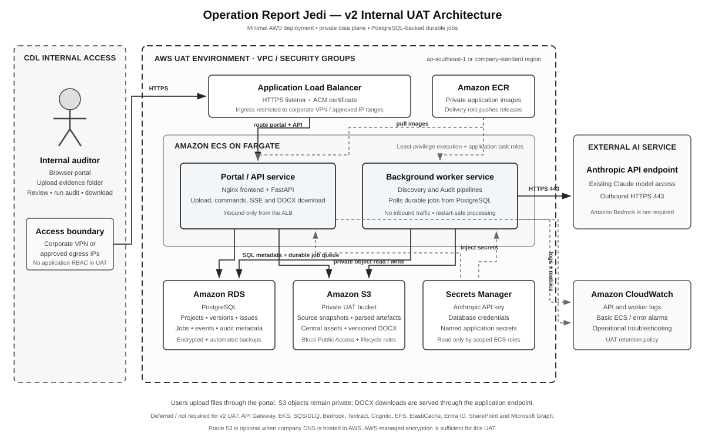

# Architecture Proposal - Operation Report Jedi
## AI-Assisted Audit Issue Log Drafting - Production Architecture

| Item | Detail |
|------|--------|
| **Version** | 1.0 |
| **Date** | 2026-05-25 |
| **Status** | Draft - production architecture update |
| **Primary Cloud** | AWS-hosted service inside CDL internal network |
| **User Channel** | CDL Portal with Entra ID SSO |
| **Evidence Source** | SharePoint project folder specified by user in Portal |
| **LLM** | AWS Bedrock Claude |
| **Delivery Model** | Web App API + Orchestrator + Worker containers |
| **Reference Diagram** | [operation_report_jedi_architecture.svg](../diagrams/operation_report_jedi_architecture.svg) |

---

## 1. Executive Summary

Operation Report Jedi is a production web service for AI-assisted drafting of Internal Audit issue logs. Auditors upload project files to SharePoint, specify the SharePoint project folder in the Portal, enter issue details, run the audit generation job, and download generated draft outputs.

The production architecture moves from the POC CLI model to a controlled Portal + AWS-hosted service:

- Users authenticate through Entra ID SSO.
- Users provide a SharePoint folder URL/path instead of uploading files directly to the Portal.
- The backend reads project documents from SharePoint through Microsoft Graph.
- AWS-hosted workers parse documents, assemble context, call AWS Bedrock Claude, validate outputs, and render draft reports.
- S3 stores artifacts, ElastiCache tracks live job state, RDS stores durable metadata/audit logs, and CloudWatch provides logs/metrics/traces.

The system remains a drafting assistant. Final report review, evidence sufficiency assessment, approval, and issuance remain with IA users.

---

## 2. Background and POC Learning

The first POC used Lumina Grand resources. A generated `sample_issues.json` was created from APM/AWP scope, then Guidelines, Process SOP, Process Understanding, and sample reports were used as reference documents and citation sources to generate a draft audit issue log.

Key learnings carried forward:

| POC Learning | Production Implication |
|---|---|
| APM/AWP scope is critical for constraining generated findings. | Extract and persist project constraints before drafting. |
| Guidelines, SOP, Process Understanding, and Samples improve tone and structure. | Classify and retrieve these document types from the SharePoint folder. |
| Unsupported assertions can still appear. | Add LLM validation and deterministic citation/scope checks. |
| CLI is useful for POC but not operational rollout. | Use Portal, API Gateway, async workers, managed storage, and audit logs. |
| Repeated parsing wastes time and cost. | Cache parsed outputs by source file ID/version/hash. |

---

## 3. Target Architecture



High-level flow:

```text
User via Portal
  -> Entra ID SSO
  -> specify SharePoint project folder
  -> input issues
  -> run audit
  -> download output

Amazon API Gateway
  -> Web App API + Orchestrator + Worker on AWS ECS/EKS
  -> Microsoft Graph read from SharePoint
  -> S3 + ElastiCache for artifacts and job state
  -> AWS Textract for PDF/image OCR
  -> AWS Bedrock Claude for drafting and validation
  -> Amazon RDS for case metadata and audit logs
  -> Amazon CloudWatch for observability
```

---

## 4. Core Components

| Component | Purpose | Key Responsibilities |
|---|---|---|
| Portal | User-facing entry point | SSO login, SharePoint folder entry, issue input, job status, downloads |
| Amazon API Gateway | API boundary | Route Portal requests to backend APIs; apply throttling and API controls |
| Web App API | Backend API layer | Validate requests, create cases/jobs, return status/download information |
| Orchestrator | Workflow coordinator | Sequence file discovery, parsing, context assembly, Bedrock calls, validation, rendering |
| Worker | Async job executor | Run long-running parsing/generation jobs without blocking API requests |
| SharePoint Project Folder | Evidence source | Store APM, AWP, SOP, Process Understanding, Guidelines, Samples, and evidence files |
| Microsoft Graph Connector | SharePoint integration | Resolve folder paths, list files, fetch metadata/content, enforce access |
| AWS Textract | Document parsing | OCR and table/layout extraction for PDFs/images |
| AWS Bedrock Claude | LLM endpoint | Constraint extraction, issue drafting, validation, rewrite suggestions |
| S3 | Artifact storage | Working copies, parsed cache, JSON outputs, DOCX/PDF packages |
| ElastiCache | Live job state | Progress, locks, retries, short-lived worker coordination |
| Amazon RDS | Metadata database | Cases, jobs, users, source refs, artifacts, audit log indexes |
| CloudWatch | Observability | Logs, metrics, alarms, traces |

---

## 5. End-to-End Workflow

1. Auditor uploads project files to a SharePoint project folder.
2. Auditor signs into Portal using Entra ID SSO.
3. Auditor enters SharePoint folder URL/path and issue inputs.
4. Portal calls backend through Amazon API Gateway.
5. Web App API creates a case/job record in RDS and dispatches a worker job.
6. Worker reads SharePoint files through Microsoft Graph.
7. Worker stores working metadata/artifacts in S3 and job state in ElastiCache.
8. Worker parses documents using native extraction and AWS Textract where OCR/layout extraction is required.
9. Worker calls AWS Bedrock Claude for constraint extraction, drafting, and validation.
10. Worker renders DOCX output and stores the output package in S3.
11. Portal shows completion status and provides the output download.

---

## 6. AI Processing Pipeline

| Step | Name | Inputs | Output |
|---|---|---|---|
| 1 | Document discovery | SharePoint folder URL/path | File manifest and document classification |
| 2 | Parsing and cache | Source files, file metadata/hash/version | Normalized parsed text/Markdown + metadata |
| 3 | Constraint extraction | APM + AWP | `constraints.json` |
| 4 | Context assembly | Constraints, issue inputs, relevant SOP/PU/Guidelines/Samples/Evidence | Prompt context package |
| 5 | Issue drafting | Issue input + context package | `draft.json` |
| 6 | Validation | Draft, constraints, citations, guidelines | `validation.json` |
| 7 | Rendering | Draft JSON, validation summary, template | DOCX output package |

Initial production does not require a vector database. Per-project document volumes are expected to be small enough for direct context loading plus section selection. OpenSearch/pgvector can be introduced later if cross-project retrieval or larger repositories become necessary.

---

## 7. Data Storage and State Management

| Store | Data Stored | Notes |
|---|---|---|
| SharePoint | Source documents and evidence | Source of truth managed by IA/users |
| S3 | Working copies, parsed cache, generated JSON, output packages | Apply encryption and lifecycle policy |
| ElastiCache | Live job state, locks, retry state | Ephemeral, not system of record |
| Amazon RDS | Case/job metadata, source references, audit log indexes | Durable application metadata |
| CloudWatch | Logs, metrics, alarms, traces | Retention and redaction policy required |

---

## 8. Security and Governance

| Area | Proposed Control |
|---|---|
| User authentication | Entra ID SSO through Portal |
| SharePoint access | Microsoft Graph permission model confirmed with security and SharePoint admins |
| AWS access | IAM least privilege for API, workers, S3, RDS, ElastiCache, Textract, Bedrock |
| Data in transit | TLS/HTTPS for Portal, Graph, AWS APIs, Bedrock, Textract |
| Data at rest | S3/RDS encryption, CloudWatch encryption where required |
| LLM usage | Use AWS Bedrock enterprise controls; confirm data retention terms |
| Logging | Log metadata and execution state, not raw confidential document text |
| Auditability | Store job IDs, source file references, hashes/versions, model/prompt versions, validation status, artifact IDs |

---

## 9. Observability and Audit Trail

CloudWatch should capture:

- API request logs and latency
- worker step transitions
- Graph access failures
- Textract page counts and parser failures
- Bedrock token usage and errors
- job duration, completion, failure, retry counts
- alarms for failed jobs, queue backlog, high error rate, and abnormal latency

RDS should preserve audit metadata:

- case/job IDs
- user/project references
- SharePoint folder URL/path
- source file IDs and versions/hashes
- prompt/model version
- output artifact references
- validation result and warning/error counts
- timestamped job state changes

---

## 10. Design Decisions and Trade-offs

| Decision | Choice | Rationale |
|---|---|---|
| Evidence input | SharePoint project folder URL/path | Matches preferred user workflow and keeps SharePoint as source of truth |
| File access | Microsoft Graph read | Standard Microsoft 365 integration path |
| Runtime | ECS or EKS containers | Supports API/worker model and production operations |
| Orchestration | App orchestrator + async worker | Simpler first production version than Step Functions |
| Parsing | AWS Textract where OCR/layout is required | Aligns with AWS-hosted service diagram |
| LLM | AWS Bedrock Claude | Managed LLM with IAM controls |
| Vector DB | Defer | Direct context loading is sufficient for expected per-project scope |
| Metadata | Amazon RDS | Relational metadata is easy to audit and query |
| Artifacts | S3 | Durable, encrypted, lifecycle-managed object storage |

---

## 11. Risks and Mitigations

| Risk | Impact | Mitigation |
|---|---|---|
| SharePoint permission mismatch | Worker cannot read files | Validate Graph access before job starts and show actionable Portal error |
| Inconsistent folder structure | Misclassification or missing context | Provide folder convention and user mapping override |
| Poor OCR/parsing quality | Weak context and citations | Store parsed preview/metadata and flag parser errors |
| Unsupported LLM assertions | Draft contains unsupported claims | Require citations, validation, and deterministic checks |
| Prompt/context overflow | Bedrock call fails or truncates | Section selection, token budgets, per-issue batching |
| Sensitive data in logs | Confidentiality breach | Redact logs and avoid storing raw prompts/doc text in standard logs |
| Long job duration | Poor user experience | Async worker, progress status, resumable/retryable job state |

---

## 12. Open Decisions

| Decision | Options | Recommendation / Next Step |
|---|---|---|
| Container platform | ECS vs EKS | Use ECS/Fargate unless CDL standard requires EKS |
| Graph permission model | Delegated vs application permissions | Confirm with security and SharePoint admins |
| Folder convention | Fixed folder names vs user mapping | Start with convention + mapping fallback |
| Output format | DOCX only vs DOCX + PDF | Start with DOCX; add PDF after template fidelity stabilizes |
| Retention policy | 30/90/180+ days | Confirm with IA records management and security |
| Approval workflow | Download-only vs in-app approval | Start with download-only; defer approval workflow |

---

*End of Architecture Proposal - Operation Report Jedi v1.0*
