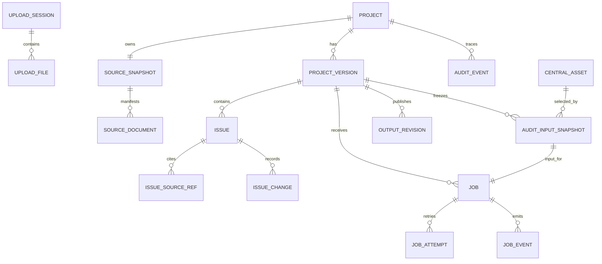

# Bản nháp Domain, Data Model và API Contract cho UAT

> **Trạng thái:** Bản nháp để thảo luận, chưa phải implementation contract.
>
> **Phạm vi:** Backend UAT; Entra ID, user ownership và RBAC được để sau UAT.
>
> **Nguồn yêu cầu:** [SRS 0.4](SOFTWARE_REQUIREMENTS_SPECIFICATION.md) và [Backend/AI checklist](BACKEND_AI_IMPLEMENTATION_CHECKLIST.md).

## 1. Mục tiêu và các quyết định đã chốt

Tài liệu này là baseline thiết kế trước khi viết SQLAlchemy model, Alembic
migration và API route. Nó thay flow POC hiện tại:

```text
upload -> chạy AI ngay -> tạo một DOCX
```

bằng lifecycle UAT:

```text
stage upload -> validate -> tạo project + v0.1
  -> find candidates -> review issues -> audit -> output revision
```

Các quyết định đã được SRS chốt:

- Tạo project phải đồng thời tạo source snapshot bất biến và version `v0.1`.
- Discovery và Audit là hai durable job độc lập. Cả hai không tăng số audit
  version.
- Chỉ lệnh **+ New audit** mới cấp version toàn project tiếp theo (`v0.2`,
  `v0.3`, ...) và copy issues từ base version được chọn.
- AI issue phải có source reference loại Evidence và Criteria. Manual issue chỉ
  cần `observed_gap` để lưu và chạy Audit.
- Audit đóng băng input. Sửa issue sau Audit làm output thành stale, không sửa
  input đã đóng băng và không xóa DOCX cũ.
- UAT nội bộ chưa có login/RBAC. Tuy vậy, record audit vẫn phải lưu actor để sau
  này thêm Entra mà không phải thay cấu trúc dữ liệu lớn.
- MVP upload trực tiếp lên S3 bằng presigned URL; API chỉ nhận metadata,
  xác nhận hoàn tất và chạy validation sau upload.
- Malware scan và các security controls bổ sung không thuộc MVP hiện tại. Không
  được chặn create project vì chưa có malware scan.
- Tên project là duy nhất trong phạm vi UAT. Người dùng được upload lại chính bộ
  file đã có trong history, nhưng phải chọn một tên project khác.

Các POC endpoint hiện tại và import `sample_issues.json` chỉ được giữ với nhãn
legacy compatibility trong thời gian frontend chuyển đổi. Chúng không được là
một phần của command UAT mới.

## 2. Thuật ngữ dùng thống nhất

| Thuật ngữ | Nghĩa |
|---|---|
| Upload session | Vùng staging tạm, tách biệt. Nó chưa phải project và tự hết hạn nếu không được promote. |
| Source snapshot | Manifest và file gốc đã promote, bất biến, thuộc một project. |
| Project | Container ổn định cho source snapshot và toàn bộ audit versions. |
| Audit version | Workspace issue độc lập có thể sửa, được đánh số `v0.N`. |
| Issue | Finding AI candidate hoặc finding nhập tay, thuộc đúng một audit version. |
| Job | Command chạy durable, loại `DISCOVERY` hoặc `AUDIT`. |
| Audit-input snapshot | Bộ issue, references và central Guideline/template ID/hash đã đóng băng cho một Audit job. |
| Output revision | Một DOCX bất biến do Audit thành công tạo ra. Một version có thể có nhiều revision. |
| Central asset | Guideline hoặc DOCX template do app quản lý; không bao giờ là evidence từ folder upload. |

## 3. Mô hình trạng thái và hành động

State là các chiều độc lập. Đặc biệt, project state chỉ là read model tổng hợp,
không được nhét job state vào đó.

### 3.1 Upload session

```text
UPLOADING -> VALIDATING -> READY_TO_CREATE -> PROMOTED
                       -> INVALID
UPLOADING | VALIDATING | READY_TO_CREATE | INVALID -> EXPIRED
```

| Trạng thái | Hành động cho phép | Ghi chú |
|---|---|---|
| `UPLOADING` | `VIEW_STATUS` | File vẫn đang được upload. |
| `VALIDATING` | `VIEW_STATUS` | Server đang validate. |
| `READY_TO_CREATE` | `VIEW_VALIDATION`, `CREATE_PROJECT`, `DISCARD` | Warning không chặn create; error chặn. |
| `INVALID` | `VIEW_VALIDATION`, `DISCARD` | Cần upload lại sau blocking error. |
| `PROMOTED`, `EXPIRED` | `VIEW_STATUS` | Terminal; không sửa source file qua session này. |

### 3.2 Project read model

```text
READY_FOR_DISCOVERY -> CANDIDATES_AVAILABLE -> OUTPUT_AVAILABLE
         ^                  |                       |
         +------------------+-----------------------+
             (version vẫn có thể được chỉnh sửa; đây chỉ là summary)
```

`project_state` được suy ra từ source snapshot, job thành công liên quan gần
nhất và output availability. Nó không phải permission system và không ngăn mở
hoặc chỉnh historical version.

| Trạng thái | Hành động cho phép |
|---|---|
| `READY_FOR_DISCOVERY` | `VIEW_PROJECT`, `VIEW_VERSIONS`, `START_DISCOVERY`, `CREATE_VERSION` |
| `CANDIDATES_AVAILABLE` | `VIEW_PROJECT`, `VIEW_VERSIONS`, `START_DISCOVERY`, `CREATE_VERSION` |
| `OUTPUT_AVAILABLE` | `VIEW_PROJECT`, `VIEW_VERSIONS`, `START_DISCOVERY`, `CREATE_VERSION`, `DOWNLOAD_OUTPUT` |

`START_DISCOVERY` còn phụ thuộc version được chọn và active-job guard. API trả
lý do disabled action khi UI không thể thực hiện action đó.

### 3.3 Audit version

```text
DRAFT -> CANDIDATES_READY -> AUDITING -> DOCX_READY
  ^             ^                 |          |
  |             +-----------------+----------+
  +---------------- edit after output -> STALE_OUTPUT
```

| Trạng thái version | Ý nghĩa | Hành động cho phép chính |
|---|---|---|
| `DRAFT` | Version mới tạo/copy; có thể chỉ gồm manual issues. | `EDIT_ISSUES`, `START_DISCOVERY`, `START_AUDIT`, `CREATE_VERSION` |
| `CANDIDATES_READY` | Discovery đã hoàn thành thành công cho workspace này. | Như `DRAFT` |
| `AUDITING` | Có ít nhất một Audit job đang active. | `VIEW_JOB`, `EDIT_ISSUES`, `CREATE_VERSION` |
| `DOCX_READY` | Output revision mới nhất phản ánh đúng issue content hiện tại. | `DOWNLOAD_OUTPUT`, `EDIT_ISSUES`, `START_AUDIT`, `CREATE_VERSION` |
| `STALE_OUTPUT` | Issue đã đổi sau output thành công gần nhất. | `DOWNLOAD_OUTPUT`, `EDIT_ISSUES`, `START_AUDIT`, `CREATE_VERSION` |

Vẫn cho phép edit trong `AUDITING`, nhưng edit chỉ ảnh hưởng Audit tiếp theo.
Job đang chạy luôn render audit-input snapshot đã đóng băng.

### 3.4 Job và issue

```text
Job:   QUEUED -> RUNNING -> SUCCEEDED | INCOMPLETE | FAILED
Issue: DRAFT -> READY_FOR_REVIEW -> APPROVED
                              -> NEEDS_EVIDENCE | REJECTED | OUT_OF_SCOPE
```

- Job type là `DISCOVERY` hoặc `AUDIT`; stage và progress tách khỏi terminal
  state.
- `INCOMPLETE` là thiếu business input, parse coverage hoặc validation cần user
  xử lý; `FAILED` là lỗi kỹ thuật. Cả hai có thể `RETRY_JOB` nếu an toàn.
- Chỉ issue `APPROVED` được đưa vào audit-input snapshot.

## 4. Mô hình dữ liệu logic

### 4.1 Quan hệ entity



### 4.2 Các bảng lõi

| Bảng | Fields/constraints cần có |
|---|---|
| `upload_sessions` | `id`, `state`, `created_at`, `expires_at`, `validation_report`, `actor_*`; chưa có project FK trước khi promote. |
| `upload_files` | `id`, `session_id`, `relative_path` an toàn, `size_bytes`, MIME khai báo/phát hiện, SHA-256, readability status, staging object key; unique `(session_id, relative_path)`. |
| `projects` | `id`, `name`, timestamps. `name` unique trong UAT; source snapshot nằm ở bảng riêng theo `project_id`. Không dùng một workflow `status` duy nhất cho logic mới. |
| `source_snapshots` | `id`, `project_id` unique, manifest hash/version, thời điểm promote; bất biến sau khi tạo. |
| `source_documents` | `id`, `snapshot_id`, `relative_path`, logical role, original object key, hash, size, MIME, upload/parse status, parser version, derived artefact key; unique `(snapshot_id, relative_path)`. |
| `project_versions` | `id`, `project_id`, `sequence_no`, display label, `base_version_id` nullable, state, `issue_revision`, latest output revision FK, timestamps; unique `(project_id, sequence_no)`. |
| `issues` | `id`, `project_version_id`, `origin`, `status`, business fields, `confidence`, `validation_flags`, `row_version`, actor/timestamps. `origin` là immutable. |
| `issue_source_refs` | `id`, `issue_id`, `ref_kind`, `document_id`, `unit_id` nullable, structured location, quote optional; document phải thuộc source snapshot của project. |
| `issue_changes` | Append-only before/after JSON hoặc patch, action, actor, correlation ID, timestamp. |
| `jobs` | `id`, `project_id`, `project_version_id`, `type`, state, stage, progress counters, input hash, checkpoint, correlation ID, lease owner/until, heartbeat, `attempt_count`, timestamps. Repository ngăn duplicate active `(project_version_id, type, input_hash)`. |
| `job_events` | `event_id` tăng đơn điệu, `job_id`, stage, message, item counters, warning, timestamp. |
| `audit_input_snapshots` | `id`, `project_version_id`, `job_id` unique, selected issue payload/hash, frozen central asset manifest, run manifest reference, created time; immutable. |
| `output_revisions` | `id`, `project_version_id`, `audit_input_snapshot_id`, ordinal, state, DOCX object key/hash/filename, run manifest reference, created time; unique `(project_version_id, ordinal)`. |
| `central_assets` | Bộ hiện hành gồm nhiều Guidelines và một `template.docx`; unique `(kind, filename)`, upload cùng tên overwrite metadata/object hiện hành. Audit snapshot giữ immutable copy và content hash. |

Dùng UUID/ULID làm external identifier; internal object key không được trả như
public URL. Enum lưu dưới dạng string có database constraint hoặc native
PostgreSQL enum, nhưng phải chọn nhất quán toàn bộ migrations.

### 4.3 Integrity rules quan trọng

1. Promotion transaction tạo cùng lúc `projects`, `source_snapshots`, toàn bộ
   manifest documents và `project_versions(sequence_no=1)`. Promotion lỗi không
   để lại partial project.
2. Khi cấp version, khóa project row (hoặc dùng atomic update tương đương), lấy
   `MAX(sequence_no) + 1`, sau đó copy issue content và source references của
   selected base version trong cùng transaction.
3. `issues.row_version` tăng sau mọi mutation. Request update phải gửi version
   đã đọc gần nhất qua `If-Match` hoặc request body.
4. Edit issue tăng `project_versions.issue_revision`. Nếu output snapshot gần
   nhất dùng revision cũ hơn thì version read model thành `STALE_OUTPUT`.
5. Chỉ publish output khi DOCX đã tồn tại và hash được xác nhận; publish không
   ghi đè output revision cũ.
6. Worker claim job bằng row lock/skip-locked và renewable lease. Lease hết hạn
   có thể được khôi phục lúc worker startup.

## 5. API conventions

- Base path: `/api/v1`.
- JSON dùng `snake_case`; timestamp là UTC ISO-8601.
- Command response có `correlation_id` (header và body khi hữu ích). Client có
  thể gửi `Idempotency-Key` cho command create/promote/job.
- Resource response có `allowed_actions` và
  `action_reasons: {action: reason}` để UI giải thích action bị disabled.
- Error shape thống nhất:

```json
{
  "error": {
    "code": "VERSION_CONFLICT",
    "message": "Issue đã thay đổi từ khi được mở.",
    "details": {"current_row_version": 8},
    "correlation_id": "corr_..."
  }
}
```

- Dùng `409` cho optimistic-concurrency/active-job conflict, `422` cho business
  input hoặc preflight không hợp lệ, `404` cho resource không có hoặc không
  thuộc phạm vi. File-level validation errors phải nằm trong upload-session
  report, không gộp thành một message tự do.

## 6. Bản nháp endpoint

| Method | Path | Mục đích | Success |
|---|---|---|---|
| `POST` | `/upload-sessions` | Tạo upload session và trả presigned S3 upload URLs cho files/`relative_paths`. | `201 UploadSession` |
| `GET` | `/upload-sessions/{id}` | Lấy validation report, tree, roles và allowed actions. | `200 UploadSession` |
| `POST` | `/upload-sessions/{id}/validate` | Validate/revalidate staged content. | `202 UploadSession` |
| `POST` | `/upload-sessions/{id}/create-project` | Promote staging hợp lệ, tạo project + `v0.1`. Body: `{ "name": "..." }`. | `201 Project` |
| `DELETE` | `/upload-sessions/{id}` | Discard staging chưa promote. | `204` |
| `GET` | `/projects` | List project summary. | `200 Project[]` |
| `GET` | `/projects/{project_id}` | Project, source summary và version summaries. | `200 Project` |
| `GET` | `/projects/{project_id}/versions` | List tất cả audit versions. | `200 ProjectVersion[]` |
| `POST` | `/projects/{project_id}/versions` | Tạo version tiếp theo từ base được chọn. Body: `{ "base_version_id": "..." }`. | `201 ProjectVersion` |
| `GET` | `/projects/{project_id}/versions/{version_id}` | Lấy workspace summary của version. | `200 ProjectVersion` |
| `POST` | `/projects/{project_id}/versions/{version_id}/discovery-jobs` | Enqueue/reuse Discovery job theo idempotency. | `202 Job` |
| `GET` | `/projects/{project_id}/versions/{version_id}/issues` | List issues, filter/pagination. | `200 IssuePage` |
| `POST` | `/projects/{project_id}/versions/{version_id}/issues` | Tạo manual issue. | `201 Issue` |
| `GET` | `/projects/{project_id}/versions/{version_id}/issues/{issue_id}` | Lấy issue, references và history summary. | `200 Issue` |
| `PATCH` | `/projects/{project_id}/versions/{version_id}/issues/{issue_id}` | Edit issue với `If-Match`/`row_version`. | `200 Issue` |
| `POST` | `/projects/{project_id}/versions/{version_id}/issues/{issue_id}/disposition` | Đổi review state/comment của issue. | `200 Issue` |
| `POST` | `/projects/{project_id}/versions/{version_id}/audit-jobs` | Preflight, freeze input, enqueue Audit. | `202 Job` |
| `GET` | `/jobs/{job_id}` | Job snapshot, retry eligibility và allowed actions. | `200 Job` |
| `GET` | `/jobs/{job_id}/events` | Durable events sau `after_event_id`. | `200 JobEvent[]` |
| `GET` | `/jobs/{job_id}/events/stream` | SSE tương đương durable events. | `200 text/event-stream` |
| `POST` | `/jobs/{job_id}/retry` | Tạo retry/new attempt an toàn. | `202 Job` |
| `GET` | `/projects/{project_id}/versions/{version_id}/outputs` | List immutable output revisions. | `200 OutputRevision[]` |
| `GET` | `/projects/{project_id}/versions/{version_id}/outputs/{output_id}/download` | Download DOCX. | `302/200 DOCX` |

UAT cố ý không có endpoint mutate source document, edit output content hoặc
cancel job.

## 7. Cấu trúc dữ liệu chính

### 7.1 Project version

```json
{
  "version_id": "ver_01...",
  "project_id": "prj_01...",
  "label": "v0.2",
  "sequence_no": 2,
  "base_version_id": "ver_00...",
  "state": "STALE_OUTPUT",
  "issue_revision": 12,
  "issue_counts": {"approved": 3, "needs_evidence": 1},
  "latest_output": {"output_id": "out_01...", "status": "STALE"},
  "allowed_actions": ["EDIT_ISSUES", "START_AUDIT", "CREATE_VERSION", "DOWNLOAD_OUTPUT"],
  "action_reasons": {}
}
```

### 7.2 Issue và typed reference

```json
{
  "issue_id": "iss_01...",
  "origin": "AI_DISCOVERED",
  "status": "READY_FOR_REVIEW",
  "title_hint": "Privileged access reviews are incomplete",
  "observed_gap": "...",
  "evidence_summary": "...",
  "risk_category": null,
  "confidence": 0.78,
  "validation_flags": ["NEAR_DUPLICATE"],
  "source_refs": [
    {
      "ref_kind": "EVIDENCE",
      "document_id": "doc_01...",
      "unit_id": "unit_01...",
      "location": {"sheet": "Access review", "range": "A14:F23"},
      "quote": "Short excerpt optional"
    },
    {
      "ref_kind": "CRITERIA",
      "document_id": "doc_02...",
      "location": {"section": "4.2"},
      "quote": null
    }
  ],
  "row_version": 7
}
```

`origin` là `AI_DISCOVERED` hoặc `MANUAL`. Manual issue chỉ cần
`observed_gap` khi create/audit preflight; API không được thể hiện manual issue
như AI-verified chỉ vì hệ thống tìm được evidence sau đó.

### 7.3 Job

```json
{
  "job_id": "job_01...",
  "job_type": "AUDIT",
  "state": "RUNNING",
  "stage": "RENDERING",
  "progress": {"completed_items": 2, "total_items": 3},
  "current_message": "Generating DOCX...",
  "attempt_count": 1,
  "checkpoint": {"stage": "RENDERING", "input_hash": "sha256:..."},
  "correlation_id": "corr_...",
  "allowed_actions": ["VIEW_EVENTS"]
}
```

## 8. Validation tại API boundary

| Command | Blocking rules |
|---|---|
| Create project | Session phải là `READY_TO_CREATE`; validate path/file count/size/type/readability/role pass; project name chưa tồn tại. Malware scan không phải MVP gate. |
| Start Discovery | Version thuộc project; không có discovery job tương đương đang active; immutable source có scope, risk context, evidence và criteria readable. |
| Create/patch issue | `observed_gap` bắt buộc; `origin` immutable; mọi typed ref resolve tới source snapshot document của project; row version khớp khi patch. |
| Approve AI issue | AI candidate có `evidence_summary` và ít nhất một source ref `EVIDENCE` và `CRITERIA` hợp lệ. |
| Start Audit | Không có Audit active cùng frozen input; có ít nhất một approved issue; các AI issue pass rule trên; central Guideline/template hiện hành đầy đủ; có thể lưu immutable input snapshot. |
| Retry job | Job là `FAILED` hoặc `INCOMPLETE`, retry policy cho phép và không thể tạo duplicate active attempt. |

## 9. Actor model sẵn sàng cho Entra

Mọi record có mutation/audit lưu:

```text
actor_id, actor_label, actor_type, occurred_at, correlation_id
```

Với UAT, `actor_id` là actor cấu hình chung (ví dụ `uat_shared_user`) và
`actor_type` là `UAT_SHARED` hoặc `SYSTEM`. API access bị giới hạn bằng network
/ ingress. Khi thêm Entra, map tenant/object identifier ổn định của Entra vào
`actor_id`; lúc đó có thể thêm ownership/RBAC tables mà không đổi project,
version, issue hay audit-event identifiers.

## 10. Các điểm cần review trước implementation

1. **Upload flow:** đã chốt dùng presigned S3 upload. Cần quyết định request
   shape chính xác: một session request khai báo toàn bộ file metadata và trả
   nhiều presigned URLs, hay tạo URL từng file. Khuyến nghị MVP: một request cho
   toàn bộ manifest để server check giới hạn 20 files/100 MB ngay từ đầu.
2. **Project name conflict:** đã chốt tên project unique trong UAT. `create-project`
   trả `409 PROJECT_NAME_EXISTS`; UI yêu cầu đổi tên. Nội dung file có thể trùng
   hoàn toàn với history, không cần deduplicate ở MVP.
3. **Discovery target:** Draft chạy discovery trên selected audit version. Cần
   chốt UAT có cho rediscover version đã review không, hay chỉ `DRAFT` /
   `CANDIDATES_READY`.
4. **JSON schemas cho AI artifacts:** đây là điểm để thảo luận thêm, chưa là
   hạng mục MVP bắt buộc trong bản này. Xem giải thích ngắn bên dưới.

### 10.1 JSON schema cho AI artifacts là gì?

Đây chỉ là một "mẫu dữ liệu bắt buộc" cho JSON đi qua các bước AI, ví dụ một AI
candidate phải luôn có `observed_gap`, `source_refs` và mỗi ref có
`document_id`/`location`. Nó giúp backend kiểm tra dữ liệu AI trả về có đúng
format trước khi lưu hoặc render DOCX, thay vì code phải đoán từng key trong JSON.

Nó **không** phải database schema, không phải một service mới, không cần vector
database và không cần làm ngay cho MVP. Ở giai đoạn này, ta chỉ cần giữ các
Pydantic request/response model cho Issue, source reference và Job. Khi bắt đầu
làm AI discovery, ta sẽ cùng chốt output JSON nhỏ nhất cho từng AI call dựa trên
prompt thực tế, rồi mới thêm validation tương ứng.

## 11. Handoff để bắt đầu implementation

Sau khi draft được chấp nhận, triển khai theo thứ tự:

1. Freeze OpenAPI 3.1 document và contract tests từ phần 5–8.
2. Thêm domain enums, transition guards, actor context và unit tests.
3. Thêm SQLAlchemy models mới và Alembic migration có thể upgrade/downgrade an
   toàn.
4. Làm upload session S3 + atomic promotion, rồi làm version/issue APIs.
5. Thay POC executor chạy trong process bằng durable jobs trước khi port AI
   pipeline vào Discovery và Audit handlers.

Không được xóa POC table/endpoint hiện có trước khi thống nhất migration/backfill,
contract tests và kế hoạch frontend migration.
