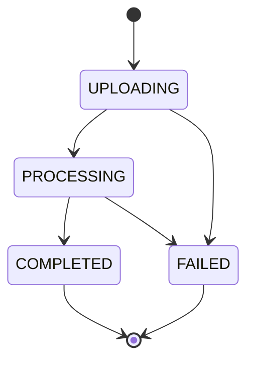

# Operation Report Jedi — Frontend Flow

> **Trạng thái:** POC scope đã chốt
> **Mục tiêu:** Một màn Projects cho upload, theo dõi xử lý và tải DOCX
> **Không thuộc POC:** Observation Inbox, Draft Issues và Draft Review

## 1. Quyết định sản phẩm

POC chỉ cần một happy path:

```text
Select local project folder
  → Upload
  → Processing progress
  → COMPLETED hoặc FAILED
  → Download DOCX nếu COMPLETED
```

Auditor không cần đi qua màn review observation hoặc draft issue trước khi
export. Pipeline hiện tại vẫn draft/validate/render ở backend, nhưng các bước
đó là tiến trình tự động và không tạo thêm navigation screen.

Khi lên production, local folder picker được thay bởi SharePoint folder
picker. Project list, status contract, progress UI và download/output flow
không đổi.

## 2. Một màn Projects

Màn hình gồm hai vùng:

1. Project list ở bên trái.
2. Project detail/status ở bên phải khi chọn một project.

Project list hiển thị:

| Field | Ví dụ |
|---|---|
| Project | `CDL Hospitality Trusts Audit FY2024` |
| Source | `File upload` |
| Status | `UPLOADING`, `PROCESSING`, `COMPLETED`, `FAILED` |
| Current activity | `Reading APM...` |
| Updated | `2 minutes ago` |
| Action | `Open`, `Download DOCX` |

Project detail hiển thị:

- Tên project và source type.
- Status hiện tại.
- Live processing timeline.
- Error message nếu `FAILED`.
- Ngày raw upload hết hạn.
- Version và số issues nếu `COMPLETED`.
- Nút `Download DOCX` khi backend trả `DOWNLOAD_OUTPUT` trong
  `allowed_actions`.

Không hiển thị navigation `Observations` hoặc `Draft Issues` trong POC.

## 3. Tạo project

Frontend dùng folder input:

```html
<input type="file" webkitdirectory multiple />
```

Mỗi file phải gửi cả content và `webkitRelativePath`:

```ts
const form = new FormData();
form.append("name", projectName);

for (const file of selectedFiles) {
  form.append("files", file);
  form.append("relative_paths", file.webkitRelativePath);
}

await fetch("/api/v1/projects/upload", {
  method: "POST",
  body: form,
});
```

Không gửi hoặc lưu absolute path trên máy auditor.

Folder POC hiện tại phải có `sample_issues.json` ở root vì pipeline đang dùng
file này làm auditor input. Nếu thiếu, upload được ghi nhận nhưng project sẽ
chuyển sang `FAILED` với lỗi rõ ràng.

## 4. Status và action



| Status | Ý nghĩa | UI |
|---|---|---|
| `UPLOADING` | Backend đang nhận/lưu folder | Spinner, disable download |
| `PROCESSING` | Pipeline đang parse/draft/validate/render | Live progress |
| `COMPLETED` | DOCX đã render và có thể tải | Enable `Download DOCX` |
| `FAILED` | Upload hoặc pipeline lỗi | Hiển thị error, không download |

Frontend phải dùng `allowed_actions` từ backend thay vì tự suy luận:

| Backend action | UI |
|---|---|
| `VIEW_STATUS` | Cho mở project detail |
| `VIEW_PROGRESS` | Hiển thị timeline/SSE |
| `DOWNLOAD_OUTPUT` | Enable nút tải DOCX |

## 5. Live processing

Sau khi upload, frontend:

1. Render snapshot trả về từ `POST /projects/upload`.
2. Mở `EventSource` tới
   `/api/v1/projects/{project_id}/events/stream`.
3. Hiển thị từng event theo thứ tự.
4. Khi nhận event `end`, gọi lại `GET /projects/{project_id}` để lấy trạng
   thái terminal.

Ví dụ:

```text
✓ Uploaded 33 files
✓ Parsing project documents...
✓ Building audit context...
● Extracting scope and constraints...
○ Drafting audit issues...
○ Reviewing draft quality...
○ Producing DOCX style spec...
○ Validating draft issues...
○ Generating DOCX...
```

SSE có heartbeat. Nếu kết nối mất, frontend gọi snapshot endpoint rồi reconnect
với `after_event_id` cuối cùng. Project vẫn xử lý khi auditor rời màn hình.

## 6. API frontend cần dùng

```text
POST /api/v1/projects/upload
GET  /api/v1/projects
GET  /api/v1/projects/{project_id}
GET  /api/v1/projects/{project_id}/events
GET  /api/v1/projects/{project_id}/events/stream
GET  /api/v1/projects/{project_id}/output
```

Response không expose absolute storage path. `output_download_url` chỉ xuất
hiện khi project `COMPLETED`.

## 7. Retention hiển thị cho người dùng

- Raw uploaded folder: giữ 7 ngày mặc định để điều tra lỗi/retry, sau đó xoá
  `input/`.
- Generated DOCX: nằm riêng trong `output/`, không bị xoá cùng raw input.
- PostgreSQL giữ project metadata, status, error và progress events để project
  list vẫn hiển thị sau restart.

Nếu raw input đã bị xoá, UI có thể hiển thị `raw_deleted_at`. POC chưa có Retry;
người dùng upload lại folder để tạo project mới.

## 8. Deferred sau POC

Các chức năng sau không nằm trong frontend hiện tại:

- Observation Inbox.
- Add/Edit/Merge/Reject observation.
- Draft Issue Review.
- Approval gates trước render.
- SharePoint picker/publish.
- Retry cùng project và reprocess từng stage.

Các module này có thể bổ sung sau mà không đổi upload/status/output contract
hiện tại.
