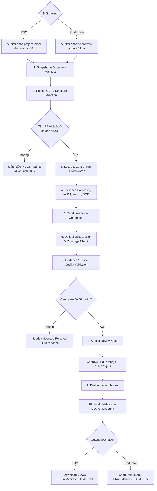
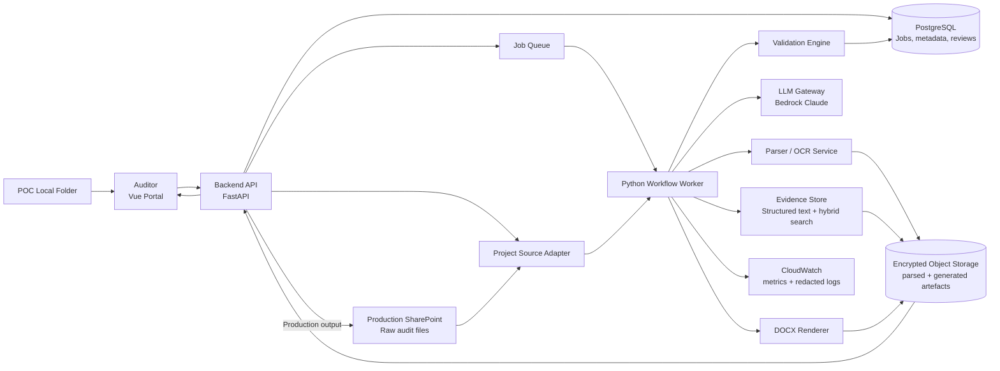

# Operation Report Jedi — Architecture v2

> **Trạng thái:** Đề xuất kiến trúc mới
> **Mục tiêu:** Đọc bộ tài liệu của một audit project, phát hiện các candidate issues có bằng chứng, hỗ trợ auditor duyệt, sau đó soạn toàn bộ Issue Log.
> **Tài liệu chính:** File này là điểm bắt đầu duy nhất cho kiến trúc v2. Các file Markdown khác trong `docs/` được xem là tài liệu lịch sử hoặc tài liệu tham khảo.
> **Source code architecture:** Xem [Backend, frontend và integration patterns](SOURCE_CODE_ARCHITECTURE.md).

## Bắt đầu tại đây khi tiếp tục development

Đọc [Implementation Handoff](IMPLEMENTATION_HANDOFF.md) trước. File đó ghi lại:

- Những phần backend đã hoàn thành.
- API contract frontend phải dùng.
- Database và storage decisions.
- Test status và known limitations.
- Checklist chuyển code từ macOS sang VPS Linux.
- Thứ tự công việc tiếp theo để không bị lạc context.

> **POC implementation scope (quyết định mới nhất):** Frontend hiện tại chỉ
> có một màn Projects: upload local folder, xem `PROCESSING`, nhận live
> progress, xem `COMPLETED/FAILED` và tải DOCX. Observation/Draft Review và
> human approval gates trong tài liệu này là target sau POC, chưa nằm trong
> flow triển khai hiện tại. Xem contract chính xác tại
> [Frontend Flow](FRONTEND_FLOW.md).

## 1. Kết luận ngắn

Việc soạn toàn bộ issues từ một bộ tài liệu là **khả thi ở mức trợ lý phát hiện và soạn thảo**, với các điều kiện:

- Tài liệu phải chứa đủ thông tin về scope, quy trình, tiêu chí kiểm soát, testing và evidence.
- Mỗi candidate issue phải truy ngược được tới file, page, section, table hoặc sheet nguồn.
- Hệ thống phải công khai tài liệu nào đọc thành công, tài liệu nào lỗi và phần scope nào chưa có evidence.
- Auditor phải duyệt candidate issues trước khi hệ thống tạo Issue Log chính thức.

Hệ thống không nên cam kết “tự tìm đúng 100% mọi issue”. Một số issue phụ thuộc vào phỏng vấn, quan sát thực tế, professional judgement hoặc evidence chưa nằm trong tài liệu.

Kiến trúc v2 vì vậy tạo ra:

1. **Candidate Issue Register**: danh sách issue do AI đề xuất, có evidence và confidence.
2. **Coverage Matrix**: scope/control nào đã được xem xét, chưa có evidence hoặc chưa thể kết luận.
3. **Draft Issue Log**: chỉ được tạo từ candidate đã được auditor chấp thuận.

## 2. Thay đổi quan trọng so với v1

| V1 hiện tại | V2 đề xuất |
|---|---|
| Cần auditor nhập `sample_issues.json` trước | Có thể tự phát hiện candidate issues từ artefacts |
| Artefacts chủ yếu làm context để viết | Artefacts được phân tích có hệ thống để tìm evidence và gaps |
| LLM có thể tự thêm hoặc bỏ issue mà không có mapping | Mỗi evidence fact và candidate đều có ID, nguồn và trạng thái |
| Validation chỉ kiểm tra draft đã sinh | Validation kiểm tra parsing, coverage, evidence, scope và draft |
| Số issue phụ thuộc seed và hành vi LLM | Số candidate xuất phát từ evidence; số issue cuối do auditor duyệt |
| Cảnh báo không chặn output | Lỗi nghiêm trọng chặn bước phát hành draft |
| Load nhiều tài liệu vào một prompt lớn | Parse một lần, chia theo cấu trúc, tìm context theo từng scope/control |

V2 vẫn hỗ trợ chế độ **Draft Selected Observations** để auditor nhập observation thủ công khi không cần chạy discovery.

### Quyết định triển khai nguồn dữ liệu

Workflow phía sau dùng một `Project Source Adapter` chung để không phụ thuộc vào cách chọn folder:

| Môi trường | Cách auditor chọn project | Cách hệ thống nhận/ghi file |
|---|---|---|
| POC | Chọn folder project trên máy cá nhân | Browser upload các file trong folder vào vùng staging của POC; output DOCX được tải về máy |
| Production | Chọn project folder từ SharePoint | SharePoint Connector đọc file theo quyền được cấp và ghi output về SharePoint nếu policy cho phép |

POC không giả lập việc gọi SharePoint API. Metadata không tồn tại ở local, như SharePoint item ID hoặc version, được để trống; provenance dùng relative path, content hash, size và modified time. Cả hai adapter đều phải tạo cùng contract `document_manifest.json` để các bước parse, discovery, review và render không phải thay đổi khi lên production.

## 3. Nguyên tắc thiết kế

1. **Evidence trước, issue sau:** Hệ thống trích xuất các fact có nguồn trước khi diễn giải thành audit issue.

2. **Workflow cố định, không phải agent tự do:** Các bước, input, output và validation gate được xác định trước để dễ test và audit.

3. **Không nhầm vai trò tài liệu:** `Samples` chỉ dùng cho tone/format. `SOP/Policy` cung cấp tiêu chí “should-be”. `Process Understanding` và working papers cung cấp tình trạng “as-is” và evidence.

4. **Không che giấu coverage gap:** Nếu file lỗi OCR, thiếu quyền, định dạng không hỗ trợ hoặc không có evidence cho một audit objective, hệ thống phải hiển thị trạng thái `INCOMPLETE`.

5. **Human-in-the-loop:** AI đề xuất; auditor quyết định issue có hợp lệ không, risk rating là gì, cần merge/split hay cần thêm evidence.

6. **Mọi kết quả phải versioned và reproducible:** Lưu document hash, parser version, prompt version, model ID, review decisions và output version.

## 4. Luồng tổng thể



Không có đường đi trực tiếp từ artefacts tới DOCX. Candidate issues luôn phải qua validation và auditor review.

## 5. Mười bước xử lý

### Bước 1 — Snapshot và Document Manifest

Hệ thống đọc folder project và tạo danh mục tài liệu:

- Source type (`LOCAL_UPLOAD` hoặc `SHAREPOINT`), file ID nếu có, relative path và folder role.
- SharePoint item ID/version cho production; content hash, size và modified time cho cả hai môi trường.
- MIME type, quyền truy cập và trạng thái upload/download.
- Phân loại tài liệu: `SCOPE`, `CRITERIA`, `EVIDENCE`, `STYLE`, `TEMPLATE`.

Kết quả: `document_manifest.json`.

Nếu một file bắt buộc không đọc được, run không được mang trạng thái “complete coverage”.

Trong POC, browser không thể chỉ gửi đường dẫn local cho backend. Folder picker phải upload nội dung file vào một vùng staging có `project_id`/`run_id`; hệ thống không lưu absolute path của máy auditor. Staging phải có encryption, access isolation và thời hạn xóa rõ ràng.

### Bước 2 — Parse, OCR và bảo toàn cấu trúc

Mỗi tài liệu được chuyển thành các `Document Unit` nhỏ nhưng vẫn giữ provenance:

- DOCX: heading, paragraph, table và cell.
- PDF: page, block, table; dùng OCR cho scanned PDF.
- XLSX: workbook, sheet, cell range, formula/value.
- PPTX nếu có: slide, shape, table và speaker notes.

Mỗi unit có `document_id`, `location`, `text`, `table_data`, `parser_confidence`.

Parsed output được cache theo content hash. Chỉ parse lại file đã thay đổi.

### Bước 3 — Scope và Control Map

Từ APM/AWP, hệ thống tạo:

- Audited entities và audit period.
- In-scope/out-of-scope processes.
- Audit objectives và risk focus.
- Expected controls và planned testing.

Kết quả: `scope_map.json`.

Đây là boundary bắt buộc cho discovery. Một gap có evidence nhưng ngoài scope không được tự động đưa vào Issue Log.

### Bước 4 — Evidence Harvesting

Hệ thống đi qua toàn bộ tài liệu `EVIDENCE` và `CRITERIA`, sau đó tạo các `Evidence Fact`:

- Control/process đang được mô tả.
- Expected state từ SOP/policy/contract.
- Actual state từ Process Understanding, testing hoặc transaction data.
- Exception, lapse, enhancement, contradiction hoặc missing evidence.
- Nguồn chính xác và đoạn trích ngắn.

Ví dụ:

```json
{
  "fact_id": "FACT-0042",
  "scope_id": "SCOPE-A1",
  "control_id": "CTRL-ACCESS-REVIEW",
  "fact_type": "CONTROL_GAP",
  "expected": "Profile permissions are periodically reconciled to job roles.",
  "actual": "The review covered users and assigned profiles only.",
  "source_refs": [
    {
      "document_id": "DOC-018",
      "location": "Section E.1.2",
      "quote": "..."
    }
  ],
  "confidence": 0.91
}
```

Fact không có source reference hợp lệ bị loại khỏi bước candidate generation.

### Bước 5 — Candidate Issue Generation

Candidate được tạo bằng cách kết hợp:

- Criteria: điều đáng ra phải xảy ra.
- Condition: điều thực tế đã xảy ra.
- Cause: nguyên nhân, nếu evidence hỗ trợ.
- Effect/risk: rủi ro có cơ sở.
- Evidence facts liên quan.
- Scope/control mapping.

Mỗi candidate có `candidate_id` và danh sách `fact_ids`. Risk rating do AI đề xuất chỉ là gợi ý; auditor chịu trách nhiệm xác nhận.

Kết quả: `candidate_issues.json`.

### Bước 6 — Deduplicate, Cluster và Coverage Check

Sorter không được âm thầm bỏ content. Nó phải:

- Merge facts cùng control/root cause thành một candidate khi phù hợp.
- Giữ exception rows trong bảng của issue thay vì tách thành nhiều issue không cần thiết.
- Đánh dấu candidate gần trùng nhau.
- Ghi disposition cho mọi fact: `USED`, `DUPLICATE`, `INSUFFICIENT`, `OUT_OF_SCOPE`, `INFORMATIONAL`.
- Lập Coverage Matrix theo `scope → objective → control → evidence → candidate/disposition`.

Kết quả: `coverage_matrix.json`.

Coverage Matrix giúp auditor thấy:

- Phạm vi nào đã có evidence và không thấy gap.
- Phạm vi nào có candidate issue.
- Phạm vi nào thiếu evidence hoặc parsing chưa hoàn chỉnh.

### Bước 7 — Validation

Validation chạy ở nhiều lớp:

| Gate | Kiểm tra | Kết quả khi lỗi |
|---|---|---|
| Schema | JSON đúng schema, ID/reference tồn tại | Retry hoặc quarantine |
| Source | Citation thuộc current project và đúng source role | Block candidate |
| Evidence | Quote/location tồn tại trong parsed unit | Block candidate |
| Scope | Candidate nằm trong APM/AWP scope | Out-of-scope queue |
| Criteria-condition | Có cả “should-be” và “as-is” | Needs evidence |
| Unsupported assertion | Claim không được source hỗ trợ | Block drafting |
| Contradiction | Hai nguồn đưa thông tin xung đột | Auditor review |
| Completeness | File/scope/control chưa được xử lý | Run = `INCOMPLETE` |
| Tone/format | Tuân IA Guidelines | Auto-fix hoặc warning |

Các lỗi evidence, source và scope không chỉ là warning; chúng phải chặn candidate khỏi Issue Log.

### Bước 8 — Auditor Review Gate

Portal hiển thị từng candidate cùng:

- Finding summary.
- Expected vs actual.
- Evidence và link mở đúng file/location.
- Scope/control mapping.
- Confidence và validation flags.
- Candidate trùng hoặc liên quan.

Auditor chọn:

- `APPROVED`
- `EDITED`
- `MERGED`
- `SPLIT`
- `NEEDS_EVIDENCE`
- `REJECTED`
- `OUT_OF_SCOPE`

Mọi quyết định được lưu với user, timestamp và reason.

### Bước 9 — Draft Accepted Issues

Chỉ candidate đã được duyệt mới chuyển sang drafting. LLM dùng:

- Candidate và evidence đã khóa.
- Guidelines.
- Template.
- Một số sample issues tương tự để học tone, không dùng làm evidence.

Draft output phải giữ `candidate_id`, `fact_ids` và `source_refs`. LLM không được tạo issue mới trong bước này.

### Bước 10 — Final Validation, Render và Lưu vết

Trước khi render:

- Kiểm tra tất cả claim và citation.
- Kiểm tra issue coverage và review status.
- Kiểm tra mandatory fields.
- Kiểm tra numbering, tables, risk markers và template rules.

Output:

- Draft Issue Log DOCX.
- Candidate Issue Register.
- Coverage Matrix.
- Validation Report.
- Run Manifest.

## 6. Kiến trúc thành phần



### Vai trò từng thành phần

| Thành phần | Trách nhiệm |
|---|---|
| Vue Portal | Chọn local folder trong POC hoặc SharePoint folder ở production; hiển thị project status/live progress; review candidates và tải output |
| Backend API | Authentication, authorization, job/status/download APIs và progress snapshot/stream |
| Project Source Adapter | Chuẩn hóa local upload và SharePoint thành cùng document manifest/provenance contract |
| Local Upload Adapter (POC) | Nhận file từ folder picker, đưa vào staging cô lập theo run và cung cấp DOCX để download |
| SharePoint Connector (Production) | Đọc file theo quyền được phê duyệt, ghi output nếu được phép |
| Workflow Worker | Chạy mười bước theo state machine cố định |
| Parser/OCR | Trích xuất text, layout, table và provenance |
| Evidence Store | Lưu parsed units và tìm context theo scope/control |
| LLM Gateway | Quản lý model, prompt version, retry, token/cost limit |
| Validation Engine | Các rule deterministic và semantic review |
| PostgreSQL | Job state, document metadata, candidates, decisions, audit trail |
| Object Storage | Parsed cache, JSON artefacts, DOCX và reports |
| CloudWatch | Latency, errors, token usage, coverage và validation metrics |

Không cần agent framework cho MVP v2. “Harvester”, “Sorter” và “Reviewer” nên là các module có contract rõ ràng trong workflow, không phải autonomous agents.

## 7. Hai chế độ sử dụng

### Mode A — Discover and Draft All

Dùng khi auditor muốn hệ thống đọc toàn bộ project:

```text
Artefacts
  → Evidence Facts
  → Candidate Issues
  → Coverage Matrix
  → Auditor Approval
  → Draft Issue Log
```

Đây là mode mới của v2.

### Mode B — Draft Selected Observations

Dùng khi auditor đã biết issue và chỉ cần trợ lý soạn:

```text
Auditor Observations
  → Automatic Evidence Matching across project artefacts
  → Validation
  → Draft Issue Log
```

Mode này thay thế cách dùng `sample_issues.json` hiện tại. Auditor chỉ cần mô tả observation trên Portal; hệ thống tự tìm supporting evidence và criteria. Việc auditor chọn source là tùy chọn hoặc fallback khi không tìm được nguồn phù hợp, có nhiều version hoặc có evidence chưa được upload.

## 8. Data contracts chính

| Artefact | Nội dung |
|---|---|
| `document_manifest.json` | File inventory, role, hash, version, parse status |
| `parsed_units.jsonl` | Text/table units kèm document location |
| `scope_map.json` | Entities, scope, objectives, risks, controls |
| `evidence_facts.jsonl` | Expected/actual facts kèm exact source refs |
| `candidate_issues.json` | Candidate issues và fact mapping |
| `coverage_matrix.json` | Trạng thái từng scope/objective/control |
| `review_decisions.json` | Auditor approval/edit/merge/reject history |
| `draft_issues.json` | Structured issues đã được duyệt để render |
| `validation.json` | Blocking errors, warnings và quality metrics |
| `run_manifest.json` | Model/prompt/parser versions, hashes, cost, duration |
| `run_events.jsonl` | Progress/heartbeat events theo stage và current item để phục hồi UI sau reload/reconnect |

Tất cả contracts phải có JSON Schema và version, ví dụ `schema_version: "2.0"`.

## 9. Cách xử lý “rất nhiều tài liệu”

Không đưa toàn bộ documents vào một prompt.

Quy trình:

1. Parse và cache từng file.
2. Chia theo heading/page/table/sheet, không cắt theo số ký tự thuần túy.
3. Phân loại role của từng unit.
4. Tạo scope/control map.
5. Quét evidence theo từng scope/control bằng batch nhỏ.
6. Dùng hybrid retrieval: metadata filter + keyword + semantic search.
7. Chạy coverage pass để chắc rằng mọi in-scope control đều có disposition.

Vector database là tùy chọn. Với một project nhỏ, PostgreSQL full-text search hoặc in-memory index có thể đủ. OpenSearch/pgvector phù hợp khi số project và số document units tăng lớn.

## 10. Các giới hạn phải nói rõ với người dùng

| Trường hợp | Hệ thống nên làm |
|---|---|
| Scanned PDF OCR kém | Gắn `LOW_PARSE_CONFIDENCE`, yêu cầu kiểm tra |
| File bị password/permission block | Run `INCOMPLETE`, không tuyên bố full coverage |
| Evidence chỉ có trong phỏng vấn nhưng chưa ghi tài liệu | `NEEDS_EVIDENCE` |
| SOP và thực tế mâu thuẫn nhưng chưa rõ version/date | Flag contradiction |
| Không tìm thấy gap | Ghi “no gap identified from available evidence”, không ghi “control effective” |
| AI đề xuất risk rating | Hiển thị là recommendation, auditor xác nhận |
| Samples chứa finding cũ | Chỉ học style, không dùng finding cũ làm evidence |
| Issue ngoài AWP scope | Đưa vào out-of-scope queue, không render |

## 11. Security và governance

- Entra ID SSO cho Portal.
- Authorization dựa trên user và project.
- Ưu tiên SharePoint delegated access; service identity chỉ dùng khi đã phê duyệt phạm vi.
- Local folder upload chỉ dành cho POC; không lưu absolute path của máy auditor và không cho run khác truy cập vùng staging.
- File POC trong staging phải được mã hóa, có retention ngắn và được xóa theo policy sau khi run/output hết hạn.
- IAM role cho AWS workloads; không dùng shared human credentials.
- Encryption in transit và at rest.
- Không ghi raw document text hoặc full prompt vào application logs mặc định.
- Ở production, raw audit files tiếp tục ở SharePoint nếu data policy không cho phép copy.
- Derived parsed content và outputs có retention policy riêng.
- Mọi download, approval, rerun và output version phải có audit trail.

## 12. Quality metrics

Backtesting trên completed audits phải đo ít nhất:

| Metric | Ý nghĩa |
|---|---|
| Candidate precision | Tỷ lệ candidate được auditor approve |
| Issue recall proxy | Tỷ lệ issued findings lịch sử được discovery tìm lại |
| Citation accuracy | Tỷ lệ citation mở đúng evidence hỗ trợ claim |
| Unsupported assertion rate | Claim không đủ bằng chứng |
| Scope breach rate | Candidate ngoài scope |
| Coverage completeness | Tỷ lệ scope/control có disposition hợp lệ |
| Parse coverage | Tỷ lệ file/page/sheet đã đọc thành công |
| Merge/split rate | Mức độ sorter tạo cấu trúc phù hợp |
| Time saved | Thời gian auditor trước và sau khi dùng hệ thống |
| Draft edit distance | Mức chỉnh sửa từ AI draft tới auditor-approved draft |

“Issue recall” chỉ là proxy khi so với completed audits; approved report cũng không đại diện tuyệt đối cho mọi issue có thể tồn tại.

## 13. Trạng thái job

```text
SUBMITTED
→ INGESTING
→ PARSING
→ DISCOVERING
→ VALIDATING
→ AWAITING_REVIEW
→ DRAFTING
→ RENDERING
→ COMPLETED
```

Trạng thái kết thúc khác:

- `INCOMPLETE`: thiếu file, parse failure hoặc coverage gap nghiêm trọng.
- `FAILED`: lỗi kỹ thuật khiến workflow không tiếp tục.
- `CANCELLED`: user hủy.
- `COMPLETED_WITH_WARNINGS`: output tạo được nhưng còn warning không chặn.

### Progress events hiển thị cho auditor

Backend phải phát progress event thật theo từng stage/file để frontend hiển thị ngay sau khi auditor chọn project. Không dùng timer giả hoặc phần trăm tăng tự động.

| Job state | Ví dụ thông điệp |
|---|---|
| `INGESTING` | `Reading APM...`, `Reading Process Understanding...` |
| `PARSING` | `Parsing AWP...`, `Parsing Access Rights.xlsx (sheet 2/5)...` |
| `DISCOVERING` | `Extracting observations...`, `Matching evidence and criteria...` |
| `VALIDATING` | `Validating scope and citations...` |
| `DRAFTING` | `Drafting approved issues...` |
| `RENDERING` | `Generating DOCX...` |

Mỗi event nên có `event_id`, `run_id`, `stage`, `message`, `current_item`, `completed_items`, `total_items`, `timestamp` và optional `warning`. API cung cấp progress snapshot và stream (ưu tiên SSE; polling là fallback). Frontend hiển thị stage hiện tại, activity log gần nhất, elapsed time và heartbeat; nếu không thể tính đáng tin cậy thì dùng progress bar indeterminate thay vì phần trăm giả.

## 14. Lộ trình triển khai

### Phase 1 — Foundation

- Document manifest, parser/OCR và provenance.
- Project Source Adapter với local folder upload cho POC; giữ contract sẵn cho SharePoint Connector production.
- Scope/control map.
- Evidence facts schema.
- Job orchestration, progress events và audit trail.

### Phase 2 — Discovery MVP

- Evidence harvesting.
- Candidate generation.
- Deduplication và Coverage Matrix.
- Validation gates.

### Phase 3 — Human Review và Drafting

- Portal review workflow.
- Draft accepted candidates.
- DOCX rendering; POC download về máy và production ghi SharePoint.

### Phase 4 — Evaluation và hardening

- Backtest trên các completed audits.
- Tune precision/recall.
- Security, performance, cost và disaster recovery tests.
- Production acceptance với IA.

Không nên bắt đầu bằng multi-agent framework. Giá trị đầu tiên cần chứng minh là provenance, candidate quality và coverage transparency.

## 15. Quyết định cần chốt trước khi build

1. Những folder/file nào là source of evidence chính thức?
2. Có được lưu derived parsed content ngoài SharePoint không?
3. Risk rating bắt buộc do auditor nhập hay AI được phép đề xuất?
4. Candidate có cần hai nguồn độc lập hay một nguồn đủ?
5. Điều kiện nào khiến run phải `INCOMPLETE`?
6. Portal cần hỗ trợ merge/split candidate ở mức nào?
7. Mục tiêu precision/recall và time saved để production go-live là bao nhiêu?
8. Retention tối đa cho raw file trong POC staging là bao lâu?

## 16. Definition of Done cho v2

Một run chỉ được coi là hoàn tất khi:

- Manifest ghi nhận trạng thái của tất cả file trong scope.
- POC local upload và production SharePoint cùng tạo đúng một manifest contract; source type được ghi rõ.
- Trong lúc xử lý, frontend nhận progress/heartbeat thật và hiển thị activity hiện tại cho auditor.
- Không còn parse failure bắt buộc chưa xử lý.
- Mọi scope/objective/control có disposition trong Coverage Matrix.
- Mọi candidate được trace tới evidence facts và exact source locations.
- Không có blocking scope/evidence/schema error.
- Auditor đã quyết định tất cả candidate.
- Draft chỉ chứa candidate đã được duyệt.
- Run manifest chứa đầy đủ version và hashes để truy vết.

Kiến trúc này biến project từ một **seed-driven drafting POC** thành một **evidence-driven issue discovery and drafting assistant**, trong khi vẫn giữ auditor judgement và accountability.
