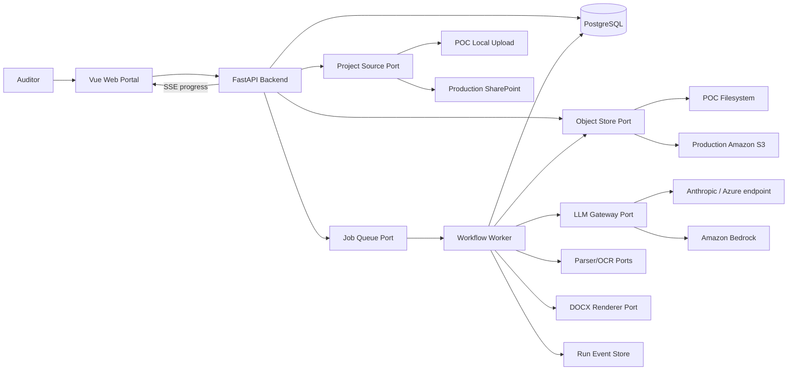
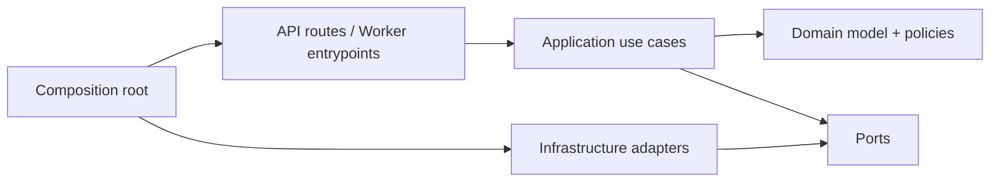
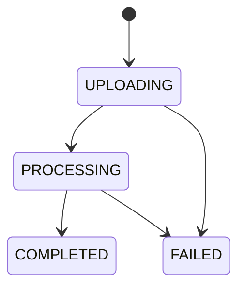
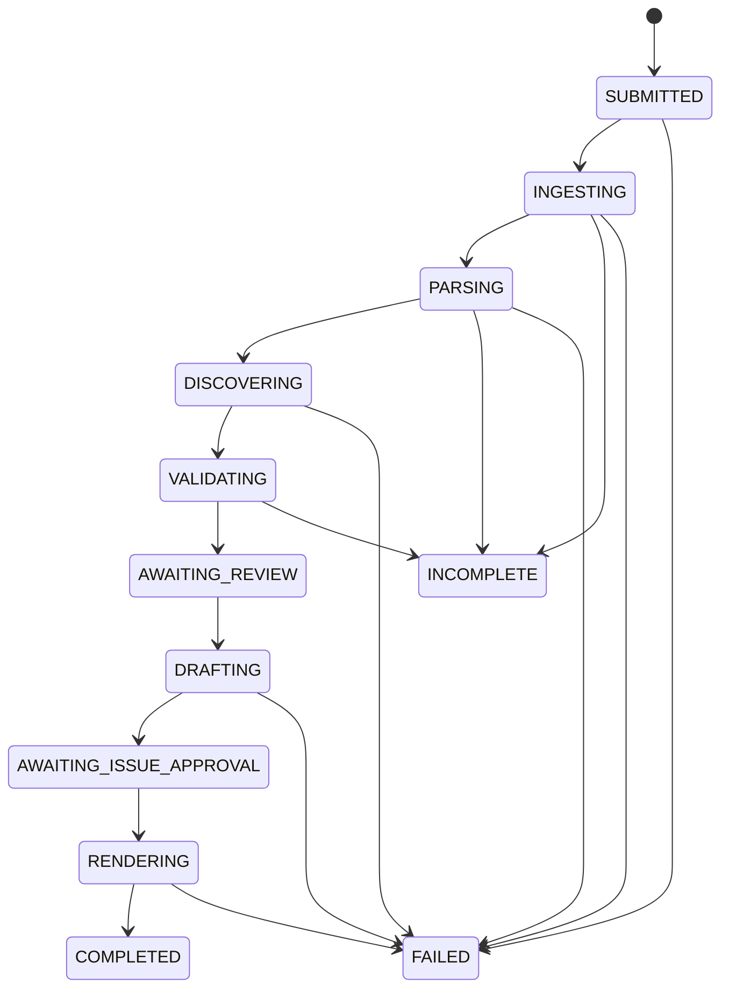
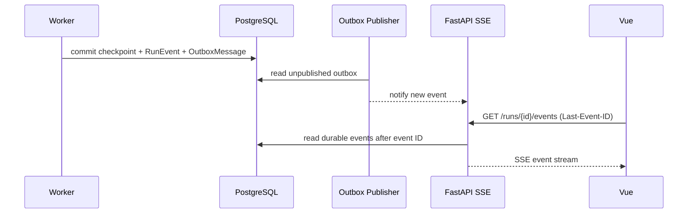
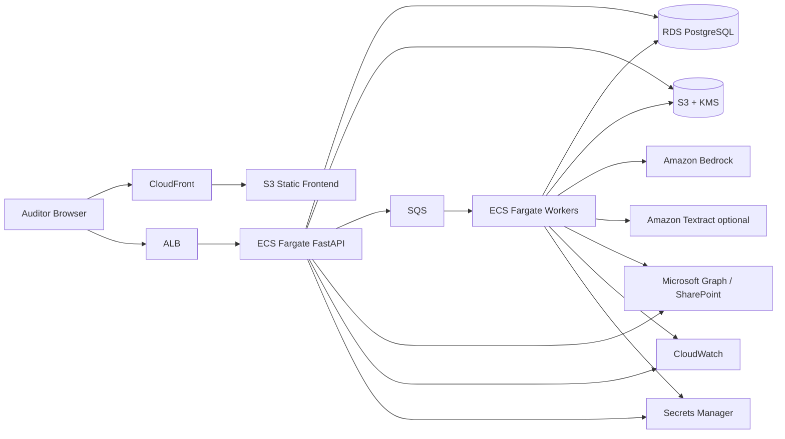

# Operation Report Jedi — Source Code Architecture

> **Cập nhật:** 03/08/2026
> **Trạng thái:** Tài liệu tham khảo về source boundaries và target evolution; xem `status/` để biết tiến độ
> **Phạm vi:** Backend, frontend, integration boundaries và deployment evolution
> **Liên quan:** [Target Architecture](TARGET_ARCHITECTURE.md) · [Frontend Status](../status/FRONTEND.md)

> **UAT scope note (10/08/2026):** [SRS UAT](../SOFTWARE_REQUIREMENTS_SPECIFICATION.md)
> và [UAT Target Architecture](TARGET_ARCHITECTURE.md) là authority cho luồng
> local-only, explicit Find candidates/Audit commands và project version history.
> Các SharePoint/production adapter trong tài liệu này chỉ là future extension,
> không thuộc UAT acceptance scope.

## 1. Kết luận thiết kế

Hệ thống được phát triển dưới dạng **modular monolith có background
execution**, không tách microservices ngay từ đầu.

Scope POC hiện tại đã được rút gọn:

```text
Upload folder → PROCESSING → COMPLETED | FAILED → Download DOCX
```

Không có Observation Inbox, Draft Issue Review hoặc approval gate trên
frontend. Các bounded module review bên dưới là hướng mở rộng sau POC, không
phải dependency của flow hiện tại.

Các pattern chính:

1. **Hexagonal Architecture / Ports and Adapters** để business workflow không phụ thuộc local folder, SharePoint, AWS, Anthropic hoặc Bedrock.
2. **Bounded modules + vertical slices** để Project, Ingestion, Observation, Issue Review và Output có ownership rõ ràng.
3. **Explicit state machine** cho run, observation và issue; không phân tán logic trạng thái trong API/UI.
4. **Durable workflow checkpoints** để job dài có thể retry/resume mà không chạy lại toàn bộ pipeline.
5. **Contract-first API** với OpenAPI và schema versioning; frontend dùng generated types/client.
6. **CQRS-lite**: command thay đổi trạng thái tách khỏi query/read model, nhưng vẫn dùng chung PostgreSQL trong MVP.
7. **Transactional outbox** cho progress/domain events khi production chạy nhiều API/worker instances.

Điểm mở rộng quan trọng:

```text
Local folder upload  ─┐
SharePoint / Graph   ─┴─> ProjectSourcePort

Local filesystem     ─┐
Amazon S3            ─┴─> ObjectStorePort

In-process runner    ─┐
Amazon SQS + worker  ─┴─> JobQueuePort

Anthropic endpoint   ─┐
Amazon Bedrock       ─┴─> LlmGatewayPort
```

Business modules chỉ gọi Port. Adapter cụ thể được chọn tại composition root theo environment.

## 2. Current state của repository

Source hiện tại đã có Vue frontend, Nginx reverse proxy, FastAPI API, PostgreSQL
persistence, Alembic migration và compatibility CLI dùng chung application
pipeline:

```text
Browser → Vue 3 SPA → Nginx /api proxy → FastAPI project routes
                                             ↓
                                      ProjectManager
                                        ↙          ↘
                                  PostgreSQL      Local storage
                                             ↓
                                        AuditPipeline

backend/main.py ─────────────────────────────→ AuditPipeline

AuditPipeline
  → parse_folder()
  → build_context()
  → extract_constraints()
  → draft_issues()
  → critique_draft()
  → produce_style_spec()
  → build_validation()
  → render()
```

Các module hiện có:

| Source hiện tại | Vai trò | Hạn chế cần tách |
|---|---|---|
| `backend/app/api/*` | Versioned FastAPI routes, schemas, errors và SSE | Chưa có authentication/authorization |
| `backend/app/application/audit_pipeline.py` | Orchestrate tám bước dùng chung cho API/CLI | Stage checkpoint chưa durable |
| `backend/app/application/project_manager.py` | Folder upload, background execution, progress và retention | POC dùng local thread; production đổi queue adapter |
| `backend/app/infrastructure/project_repository.py` | Project/status/event persistence | SQLAlchemy; hỗ trợ PostgreSQL và SQLite local |
| `backend/app/infrastructure/project_storage.py` | Raw input/output local storage | Production đổi sang encrypted S3/object storage |
| `backend/app/application/run_manager.py` | Internal compatibility run execution | Không còn được expose qua HTTP; state vẫn in-memory |
| `backend/app/documents/parsers.py` | Parse DOCX/PDF/XLSX | Gắn trực tiếp với `Path`, output chưa có provenance đủ chi tiết |
| `backend/app/ai/client.py` | Anthropic client, retry, JSON parsing | Chưa có provider port/Bedrock adapter |
| `backend/app/ai/prompts/*` | Prompt use cases | Prompt/schema/version chưa được quản lý như artefact |
| `backend/app/ai/validation.py` | Rule-based validation cho AI draft | Chưa có candidate citation/scope gates của UAT |
| `backend/app/documents/render.py` | DOCX rendering | Chưa có object-storage/output adapter |
| `backend/app/application/pipeline_versioning.py` | Tạo `Output/v0.N` cho compatibility pipeline | Không an toàn khi có concurrent workers; sẽ được thay bằng audit-version persistence |
| `backend/app/rag/context.py` | Role-tagged context assembly | Chưa có chunk index, retrieval hoặc provenance-aware context builder |
| `frontend/src/*` | Vue Projects workspace, upload, SSE progress và download | POC single-screen; coverage tự động còn mỏng |
| `frontend/nginx.conf` | Phục vụ SPA, proxy API/SSE và giới hạn upload 1 GB | Chưa có TLS/auth ở POC |
| `backend/alembic/*` | Initial PostgreSQL/SQLite schema revision `20260729_01` | Mới có initial migration |
| `compose.yaml` | PostgreSQL 16, backend và frontend | POC single-host |

Repository chưa có:

- External job queue/worker và durable stage recovery.
- Authentication/authorization.
- SharePoint hoặc AWS adapter.
- Production observability, secrets management và deployment hardening.

FastAPI không gọi `backend/main.py`; API và CLI cùng dùng `AuditPipeline`.

## 3. System context



## 4. Dependency rule



Quy tắc:

- Domain không import FastAPI, SQLAlchemy, boto3, Microsoft Graph SDK hoặc Anthropic SDK.
- Application không mở file, gọi HTTP provider hoặc ghi database trực tiếp.
- Adapter có thể import provider SDK nhưng không chứa audit judgement/business gate.
- API route chỉ validate transport, authorize và gọi use case.
- Frontend không tự quyết định observation/issue nào đủ điều kiện export; backend trả `allowed_actions`.
- Dependency injection chỉ thực hiện ở composition root; không dùng global service locator.

## 5. Backend architecture

### 5.1 Cấu trúc source đề xuất

```text
backend/
├── pyproject.toml
├── app/
│   ├── bootstrap/
│   │   ├── api.py                 # create FastAPI app
│   │   ├── worker.py              # create worker runtime
│   │   ├── container.py           # wire ports to adapters
│   │   └── settings.py
│   ├── api/
│   │   ├── dependencies.py
│   │   ├── errors.py
│   │   ├── middleware.py
│   │   └── router.py
│   ├── modules/
│   │   ├── projects/
│   │   │   ├── domain.py
│   │   │   ├── commands.py
│   │   │   ├── queries.py
│   │   │   ├── ports.py
│   │   │   ├── api.py
│   │   │   └── schemas.py
│   │   ├── ingestion/
│   │   ├── discovery/
│   │   ├── observations/
│   │   ├── issues/
│   │   ├── outputs/
│   │   └── identity/
│   ├── workflows/
│   │   ├── audit_run.py
│   │   ├── state_machine.py
│   │   └── stages/
│   │       ├── ingest.py
│   │       ├── parse.py
│   │       ├── map_scope.py
│   │       ├── harvest_evidence.py
│   │       ├── generate_candidates.py
│   │       ├── validate.py
│   │       ├── draft.py
│   │       └── render.py
│   ├── adapters/
│   │   ├── sources/
│   │   │   ├── local_upload.py
│   │   │   └── sharepoint_graph.py
│   │   ├── storage/
│   │   │   ├── local_filesystem.py
│   │   │   └── s3.py
│   │   ├── persistence/
│   │   │   ├── memory.py
│   │   │   └── sqlalchemy/
│   │   ├── queue/
│   │   │   ├── in_process.py
│   │   │   └── sqs.py
│   │   ├── llm/
│   │   │   ├── anthropic_messages.py
│   │   │   └── bedrock.py
│   │   ├── parsing/
│   │   │   ├── docx.py
│   │   │   ├── pdf.py
│   │   │   ├── xlsx.py
│   │   │   └── textract_ocr.py
│   │   ├── rendering/
│   │   │   └── python_docx.py
│   │   └── observability/
│   │       ├── logging.py
│   │       └── cloudwatch.py
│   └── shared/
│       ├── domain/
│       │   ├── ids.py
│       │   ├── events.py
│       │   └── errors.py
│       ├── application/
│       │   ├── unit_of_work.py
│       │   └── idempotency.py
│       └── contracts/
│           ├── pagination.py
│           └── provenance.py
├── migrations/
└── tests/
    ├── unit/
    ├── contract/
    ├── integration/
    └── e2e/
```

Module chỉ public những command/query/port cần thiết. Không cho module khác import sâu vào `adapters` hoặc sửa trực tiếp repository table của module.

### 5.2 Bounded modules

| Module | Ownership |
|---|---|
| Projects | Project metadata, source binding, access và project list status |
| Ingestion | Manifest, file inventory, document version và staging |
| Discovery | Parsed units, scope map, evidence facts, candidate generation |
| Observations | Auditor-added/extracted observations, validation và review decisions |
| Issues | Draft issue content, risk confirmation và approval |
| Outputs | Render request, output version, download/publish và run manifest |
| Identity | Principal, project authorization và audit actor |

`workflows/` phối hợp các module nhưng không sở hữu entity của chúng.

### 5.3 Domain model cốt lõi

| Aggregate/entity | Trường chính |
|---|---|
| `Project` | `project_id`, name, entity, period, `source_binding`, status summary |
| `SourceBinding` | source type, external reference, display path, capabilities |
| `AuditRun` | `run_id`, project, state, stage, checkpoint, started/finished time |
| `Document` | document identity, role, relative path, current version |
| `DocumentVersion` | source version, hash, size, MIME, storage key, parse status |
| `ParsedUnit` | document version, location, text/table, parser version/confidence |
| `Observation` | description, source, state, evidence refs, scope mapping |
| `IssueDraft` | source observation IDs, structured fields, validation, approval |
| `ReviewDecision` | actor, action, reason, timestamp, before/after version |
| `OutputArtifact` | output version, storage key, checksum, status, destination |
| `RunEvent` | sequence/event ID, stage, message, progress counters, timestamp |

Các ID là opaque UUID/ULID. Không dùng filename hoặc SharePoint item ID làm primary key.

### 5.4 Ports quan trọng

Các interface minh họa:

```python
class ProjectSourcePort(Protocol):
    def list_objects(self, binding: SourceBinding) -> list[SourceObject]: ...
    def open_object(self, ref: SourceObjectRef) -> BinaryIO: ...
    def publish_output(
        self, binding: SourceBinding, artifact: OutputArtifactRef
    ) -> ExternalObjectRef: ...


class ObjectStorePort(Protocol):
    def put(self, key: str, content: BinaryIO, metadata: dict[str, str]) -> StoredObject: ...
    def open(self, key: str) -> BinaryIO: ...
    def create_download_url(self, key: str, expires_in: int) -> str: ...


class LlmGatewayPort(Protocol):
    def generate_structured(
        self, request: StructuredGenerationRequest
    ) -> StructuredGenerationResult: ...


class JobQueuePort(Protocol):
    def enqueue(self, command: RunCommand, idempotency_key: str) -> JobRef: ...


class RunEventRepository(Protocol):
    def append(self, event: RunEvent) -> None: ...
    def list_after(self, run_id: RunId, event_id: EventId | None) -> list[RunEvent]: ...
```

Port dùng domain DTO, không trả object của boto3, Graph SDK, SQLAlchemy hoặc Anthropic.

### 5.5 Project source adapters

#### Local Upload Adapter — POC

```text
Browser folder picker
  → relative paths + file streams
  → upload session
  → ObjectStorePort
  → document manifest
```

Yêu cầu:

- Không gửi hoặc lưu absolute path trên máy auditor.
- Validate extension, MIME, size, file count và archive/path traversal.
- Upload session có expiry và project/run ownership.
- Hỗ trợ checksum để retry multipart upload không tạo duplicate.
- `source_type = LOCAL_UPLOAD`.
- Output dùng signed download hoặc authenticated streaming.

#### SharePoint Adapter — Production

```text
Microsoft Graph folder selection
  → site/drive/item references
  → SharePoint anti-corruption layer
  → normalized SourceObject
  → same document manifest
```

Adapter chịu trách nhiệm:

- Map Graph IDs, ETag/version, path, permissions và throttling sang contract nội bộ.
- Delta query hoặc change token cho incremental sync.
- Retry `429/5xx` theo `Retry-After`.
- Không để Graph DTO lan vào domain/application layer.
- Tùy data policy: stream trực tiếp, temporary copy hoặc encrypted S3 staging.
- Publish DOCX về đúng output folder với version/checksum.

### 5.6 Workflow state machine

POC hiện tại:



`COMPLETED` nghĩa là DOCX đã được render và promote sang output storage. Các
stage chi tiết (`PARSING`, `CONTEXT`, `CONSTRAINTS`, `DRAFTING`,
`CRITIQUING`, `STYLING`, `VALIDATING`, `RENDERING`) là progress events, không
phải project status.

State machine có review gate dưới đây là target sau POC:



Mỗi transition đi qua `RunTransitionPolicy`. API và worker không tự gán string state.

Mỗi stage handler:

- Nhận `run_id` và load checkpoint.
- Idempotent theo `run_id + stage + input_hash`.
- Ghi output artefact có schema/parser/prompt/model version.
- Chỉ commit state, artefact metadata và outbox event trong một transaction.
- Retry được mà không tạo observation, issue hoặc output version trùng.
- Phân biệt `RetryableFailure`, `UserActionRequired` và `TerminalFailure`.

### 5.7 Progress và event delivery



POC có thể publish notification in-process, nhưng `RunEvent` vẫn phải durable. Frontend reload hoặc reconnect bằng `Last-Event-ID`; notification mất không làm mất event.

Không phát phần trăm giả. Event gồm:

```json
{
  "event_id": "evt_01...",
  "run_id": "run_01...",
  "stage": "PARSING",
  "message_code": "document.parsing",
  "message": "Parsing AWP...",
  "current_item": "Approved Work Program.docx",
  "completed_items": 3,
  "total_items": 12,
  "occurred_at": "2026-07-28T10:30:00Z"
}
```

`message_code` cho phép frontend localization về sau; `message` là server fallback.

### 5.8 LLM và prompt architecture

LLM không được gọi trực tiếp từ route hoặc domain entity.

```text
Application stage
  → PromptRegistry.get(name, version)
  → context/evidence assembler
  → LlmGatewayPort.generate_structured()
  → JSON Schema validation
  → semantic/deterministic validation
  → versioned artefact
```

Yêu cầu:

- Provider adapter: Anthropic hiện tại; Bedrock về sau.
- Structured request chứa model profile, prompt version, schema version, timeout và token budget.
- Retry chỉ cho lỗi transient; invalid output có bounded repair attempt.
- Ghi token usage, latency và model ID nhưng không log raw audit content mặc định.
- Prompt templates không import provider SDK.
- Context builder dùng document units/retrieval, không nối toàn bộ file vào một prompt lớn.

### 5.9 Persistence

MVP production-like dùng PostgreSQL ngay từ đầu cho metadata và workflow state.

Các bảng logical:

```text
projects
project_source_bindings
runs
run_checkpoints
run_events
documents
document_versions
parsed_units
observations
observation_evidence_refs
issues
issue_observation_links
review_decisions
output_artifacts
idempotency_keys
outbox_messages
```

Nguyên tắc:

- Optimistic concurrency bằng `row_version` cho observation/issue edits.
- Unique constraint cho idempotency key và output version.
- Soft disposition cho audit records; không hard-delete review history.
- Raw/large binary không lưu trong PostgreSQL.
- Repository + Unit of Work bao transaction; không expose ORM models ra API.

### 5.10 API contract

API prefix:

```text
/api/v1
```

Các endpoint chính:

```text
GET    /projects
POST   /projects/local-upload-sessions
POST   /projects/from-local-upload
POST   /projects/from-sharepoint
GET    /projects/{project_id}
PATCH  /projects/{project_id}

POST   /projects/{project_id}/runs
GET    /runs/{run_id}
POST   /runs/{run_id}/cancel
POST   /runs/{run_id}/retry
GET    /runs/{run_id}/events

GET    /projects/{project_id}/documents
POST   /documents/{document_id}/exclude
POST   /documents/{document_id}/retry

GET    /projects/{project_id}/observations
POST   /projects/{project_id}/observations
PATCH  /observations/{observation_id}
POST   /observations/{observation_id}/approve
POST   /observations/{observation_id}/reject
POST   /observations/merge
POST   /observations/{observation_id}/split

GET    /projects/{project_id}/issues
PATCH  /issues/{issue_id}
POST   /issues/{issue_id}/revalidate
POST   /issues/{issue_id}/approve

POST   /projects/{project_id}/outputs
GET    /projects/{project_id}/outputs
GET    /outputs/{output_id}/download
```

Command endpoint nhận `Idempotency-Key`. Response project/run trả:

```json
{
  "status": "AWAITING_REVIEW",
  "current_activity": "3 observations need review",
  "allowed_actions": [
    "VIEW_OBSERVATIONS",
    "EDIT_PROJECT",
    "CANCEL_RUN"
  ]
}
```

Frontend render action từ `allowed_actions`; backend vẫn re-check authorization và transition policy khi command được gửi.

Error contract ổn định:

```json
{
  "error": {
    "code": "RUN_INVALID_TRANSITION",
    "message": "DOCX cannot be generated before all issues are approved.",
    "details": {},
    "correlation_id": "req_01..."
  }
}
```

### 5.11 Configuration và dependency injection

Configuration typed và validate khi startup:

```text
APP_ENV=poc|production
PROJECT_SOURCE_PROVIDER=local_upload|sharepoint
OBJECT_STORE_PROVIDER=filesystem|s3
QUEUE_PROVIDER=in_process|sqs
LLM_PROVIDER=anthropic|bedrock
DATABASE_URL=...
```

Không để module business tự đọc environment variable. `bootstrap/settings.py` đọc config; `container.py` tạo adapter:

```python
source: ProjectSourcePort = (
    LocalUploadSource(...)
    if settings.project_source_provider == "local_upload"
    else SharePointGraphSource(...)
)
```

Secrets production lấy từ AWS Secrets Manager/Parameter Store hoặc workload identity, không commit `.env`.

## 6. Frontend architecture

### 6.1 Technology baseline hiện tại

Frontend POC đang dùng:

- Vue 3 + TypeScript + Vite.
- Vue Composition API và state cục bộ trong Projects workspace.
- Typed API client viết tay theo backend contract.
- `XMLHttpRequest` cho upload progress.
- Native `EventSource` cho SSE và reconnect.
- CSS/theme nội bộ, không dùng component library.
- Vitest cho unit test và Nginx cho production static serving/reverse proxy.

Vue Router, `@tanstack/vue-query`, Pinia và generated OpenAPI client là target
khi frontend có thêm nhiều màn hình hoặc auth; chúng chưa phải dependency của
POC hiện tại. Khi bổ sung, không lưu cùng một canonical server state đồng thời
trong query cache và Pinia.

### 6.2 Cấu trúc source hiện tại

```text
frontend/
├── design/logo.png
├── Dockerfile
├── nginx.conf
├── package.json
├── vite.config.ts
├── src/
│   ├── main.ts
│   ├── app/App.vue
│   ├── assets/
│   │   ├── cdl-logo.png
│   │   └── styles.css
│   ├── modules/projects/
│   │   ├── ProjectsWorkspace.vue
│   │   └── ProjectSetupWizard.vue
│   └── shared/
│       ├── auditor-inputs.ts
│       ├── api/projects.ts
│       ├── formatting/date.ts
│       └── types/projects.ts
└── tests/
    ├── setup.ts
    └── unit/
```

POC giữ source nhỏ và trực tiếp. Khi thêm Observation, Issue Review, auth và
output history, source tiếp tục mở rộng theo feature module với import rule:

```text
app → modules → shared
```

Một module không import private component/store của module khác. Cross-module
data dùng API contract hoặc public module facade.

### 6.3 Màn hình và route

POC hiện tại là single-page workspace ở route gốc do Nginx/Vite phục vụ. Project
được chọn trong list và detail hiển thị bên phải; chưa dùng Vue Router.

Nếu mở rộng sau POC, route target là:

```text
/projects
/projects/:projectId
/projects/:projectId/observations
/projects/:projectId/issues
/projects/:projectId/outputs
```

`/projects/:projectId` vẫn là workspace gộp metadata, status, live progress và
contextual action. Documents không cần là top-level screen riêng.

### 6.4 Frontend state hiện tại

| State | Owner POC |
|---|---|
| Project list và selected project | `ProjectsWorkspace.vue` từ backend snapshot |
| Project setup/files/auditor inputs/progress | `ProjectSetupWizard.vue` |
| Live progress events | Native SSE merge vào project state |
| Kết nối/reconnect status | Projects workspace |
| Export eligibility | Backend `allowed_actions`; UI không tự suy luận |

Luồng progress hiện tại:

```text
fetch project snapshot/events
  → connect SSE từ event cuối
  → deduplicate theo event ID
  → cập nhật current activity/timeline
  → refresh snapshot khi terminal
  → reconnect khi mất kết nối
```

Khi SSE disconnect, workflow không được coi là failed. UI hiển thị trạng thái
kết nối; chỉ backend terminal state mới chuyển project sang `FAILED`. Polling
fallback nâng cao và query cache là phần tiến hóa sau POC.

### 6.5 Project source UI (target evolution)

UI phụ thuộc vào capability trả từ backend:

```json
{
  "project_source": {
    "provider": "local_upload",
    "capabilities": ["SELECT_LOCAL_FOLDER", "DOWNLOAD_OUTPUT"]
  }
}
```

POC render `LocalFolderPicker`; production render `SharePointFolderPicker`. Page/use case phía trên không chứa `if AWS` hoặc gọi Microsoft Graph trực tiếp.

```text
ProjectSourceSelector
  ├── LocalFolderPicker
  └── SharePointFolderPicker
```

SharePoint token, Graph paging và publish logic thuộc backend adapter. Frontend chỉ nhận picker configuration/reference phù hợp với auth design đã duyệt.

### 6.6 Form và concurrency (target evolution)

- Form dùng server DTO + explicit edit model; không bind trực tiếp generated response object.
- PATCH gửi `row_version`/ETag nội bộ.
- Nếu version conflict, UI hiển thị before/current/user edit để auditor quyết định.
- Unsaved changes có route guard.
- Approve/reject/merge/split là command riêng, không encode thành generic PATCH status.
- Mọi destructive/disposition action yêu cầu reason khi policy bắt buộc.

### 6.7 Error handling

`shared/api/http-client.ts` map error contract thành:

- Field validation error.
- Authorization/access error.
- Concurrency conflict.
- Business transition error.
- Retryable infrastructure error.
- Unknown error với correlation ID.

Component không parse message text để quyết định hành vi; dùng stable `error.code`.

## 7. AWS deployment target

Một target phù hợp cho workload document dài:



Khuyến nghị:

- API và worker dùng image chung nhưng entrypoint khác.
- Worker concurrency, memory và timeout tách khỏi API.
- SQS visibility timeout dài hơn stage timeout; heartbeat gia hạn khi cần.
- Dead-letter queue cho retry exhausted.
- S3 bucket tách raw staging, parsed artefacts và outputs bằng prefix/policy.
- KMS encryption và least-privilege IAM role.
- RDS Multi-AZ/backup theo production RTO/RPO.
- CloudWatch structured logs, metrics và alarms; không log raw document content.
- VPC endpoint/private networking khi policy yêu cầu.

Không dùng Lambda cho toàn bộ pipeline nếu parse/render vượt timeout hoặc cần nhiều memory/temp storage. Lambda vẫn phù hợp cho event glue hoặc job dispatch nhỏ.

## 8. Environment adapter matrix

| Capability | Local development | POC | Production |
|---|---|---|---|
| Project source | Local fixture | Browser folder upload | SharePoint Graph |
| Object storage | Local filesystem | Encrypted local/S3 staging | S3 + KMS |
| Database | SQLite/PostgreSQL container | PostgreSQL | RDS PostgreSQL |
| Queue | In-process | In-process hoặc SQS | SQS + DLQ |
| LLM | Stub/recorded | Anthropic-compatible endpoint | Bedrock hoặc approved provider |
| OCR | Local parser | Local parser | Textract adapter nếu cần |
| Auth | Dev principal | POC auth | Entra ID OIDC |
| Events | Durable DB + polling/SSE | DB + SSE | Outbox + SSE/pub-sub notification |
| Output | Local download | Authenticated download | SharePoint publish + download |

SQLite chỉ dùng local development. POC nên dùng PostgreSQL nếu mục tiêu là kiểm thử concurrency, idempotency và migration gần production.

## 9. Security boundaries

- Backend xác thực principal và authorize theo project ở mọi endpoint.
- Production dùng Entra ID; SharePoint delegated/on-behalf-of flow phải được security review.
- Không chuyển provider access token vào log, job payload hoặc domain event.
- SQS payload chỉ chứa IDs/storage references, không chứa raw document text.
- Signed URL có TTL ngắn và scoped object key.
- Validate filename/path, MIME, extension, macro-enabled files và size.
- Antivirus/malware scanning là một ingestion gate có thể cắm qua port.
- Raw/parsed/output retention khác nhau và được thực thi bằng lifecycle policy.
- Review, download, rerun, exclusion và publish đều có audit trail.
- Secrets chỉ tồn tại trong secret manager/environment injection.

## 10. Observability

Mọi request/job/event có:

- `correlation_id`
- `project_id`
- `run_id`
- `stage`
- `attempt`
- `actor_id` khi có user action

Metrics tối thiểu:

- Queue wait time và stage latency.
- Files/pages/sheets parsed.
- Parse failure/low-confidence rate.
- LLM latency, token/cost và invalid-schema rate.
- Retry/DLQ count.
- Progress heartbeat age.
- Candidate precision và review disposition.
- DOCX render/publish success.

OpenTelemetry có thể được cắm ở API/worker adapter layer; domain không phụ thuộc tracing SDK.

## 11. Testing strategy

| Test layer | Phạm vi |
|---|---|
| Domain unit | Transition policy, validation gate, merge/split mapping |
| Application unit | Use case với fake ports; không cần network/filesystem |
| Port contract | Mọi `ProjectSourcePort`, `ObjectStorePort`, `LlmGatewayPort` adapter phải vượt cùng test suite |
| Integration | PostgreSQL repository, S3/SQS adapter, Graph sandbox |
| Golden document | Parser provenance và DOCX rendering trên fixture đã kiểm soát |
| Workflow | Retry/resume/idempotency tại từng checkpoint |
| API contract | OpenAPI schema, error codes, authorization |
| Frontend component | Status/action rendering và progress reconnect |
| E2E | POC: local upload → progress → DOCX download; target: review → generate → publish |

Không gọi live LLM trong default unit test. Dùng recorded/fake structured responses; chỉ chạy provider smoke test ở pipeline riêng.

## 12. Evolution sequence tham khảo

Thứ tự dependency kỹ thuật đề xuất:

```text
POC modular monolith
  → provider/storage ports rõ ràng
  → idempotent stage handlers + durable checkpoints
  → queue/worker + production persistence adapters
  → identity, SharePoint và operational controls
  → Observation/Issue Review product modules
```

Nguyên tắc migration:

- API và CLI tiếp tục dùng chung application workflow.
- Thay adapter mà không fork business pipeline theo environment.
- Mỗi bước phải giữ regression fixtures cho parsing, drafting và rendering.
- Chỉ tách microservice khi có nhu cầu scale/deploy độc lập đã được đo lường.

Trạng thái và acceptance criteria được quản lý duy nhất tại
[Delivery Roadmap](../roadmap/README.md).

## 13. Anti-patterns cần tránh

- Đặt toàn bộ pipeline trong một FastAPI route/background task.
- Import boto3/Graph/Anthropic SDK trong domain/application use case.
- Dùng filename/path làm identity.
- Cho frontend tự tính export eligibility hoặc tự chuyển state.
- Lưu progress chỉ trong memory/WebSocket connection.
- Một generic repository cho mọi aggregate.
- Một `utils.py` chứa business logic dùng chung không ownership.
- Generic provider/service locator được gọi từ mọi nơi.
- Retry toàn workflow khi chỉ một stage lỗi.
- Đưa raw document hoặc access token vào queue/log/event.
- Tạo microservice cho từng stage trước khi có nhu cầu scale/deploy độc lập.

## 14. Architecture decisions cần ghi thành ADR

1. Modular monolith + worker thay vì microservices.
2. PostgreSQL là source of truth cho workflow/review metadata.
3. Object storage cho raw/parsed/output artefacts.
4. Durable run events + SSE/polling.
5. Project Source Port và SharePoint anti-corruption layer.
6. LLM Gateway và prompt/schema versioning.
7. Entra ID và SharePoint delegated/on-behalf-of access model.
8. SQS/ECS worker deployment và retry/DLQ policy.
9. Retention/residency cho local staging, parsed content và output.

## 15. Definition of Done cho source architecture

- Backend domain/application chạy test với fake adapters, không cần AWS/SharePoint.
- Local Upload và SharePoint implement cùng `ProjectSourcePort` contract.
- Anthropic và Bedrock implement cùng structured LLM contract.
- Workflow resume được từ checkpoint và không tạo duplicate khi retry.
- Backend là nơi duy nhất enforce state transition và `allowed_actions`.
- Run progress phục hồi được sau reload/reconnect.
- Frontend source tổ chức theo feature modules và dùng generated API types.
- Raw binaries nằm ngoài PostgreSQL; audit metadata và review history durable.
- Provider SDK không xuất hiện trong domain/application packages.
- POC và production chỉ khác adapter/configuration, không fork business workflow.
