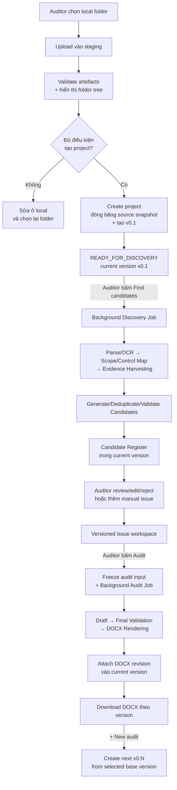
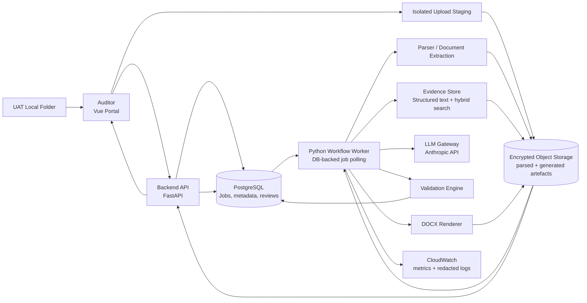

# Operation Report Jedi — Target Architecture

> **Cập nhật:** 21/08/2026
> **Trạng thái:** Baseline kiến trúc đích đã chốt cho UAT
> **Mục tiêu:** Nhận local audit folder bất biến, phát hiện candidate issues có bằng chứng, hỗ trợ auditor duyệt và tạo versioned Draft Issue Log DOCX.
> **Source code architecture:** [Backend, frontend và integration patterns](SOURCE_ARCHITECTURE.md).
> **Yêu cầu phần mềm chi tiết:** [Software Requirements Specification](../SOFTWARE_REQUIREMENTS_SPECIFICATION.md).
> **Kế hoạch delivery:** [Phân công FE, BE và AI](../UAT_FE_BE_AI_DELIVERY_PLAN.md).

## Phạm vi tài liệu

Tài liệu này mô tả trạng thái đích của sản phẩm, ranh giới kiến trúc, luồng xử
lý, data contracts và tiêu chí hoàn thành. Tài liệu có thể được đọc độc lập;
người đọc không cần biết kiến trúc hoặc cách vận hành của bất kỳ phiên bản nào
trước đó.

Các tài liệu được liên kết bổ sung chi tiết ở mức source code, requirement và
kế hoạch delivery; mọi quyết định kiến trúc cần thiết được trình bày đầy đủ tại
đây.

## 1. Kết luận ngắn

Việc soạn toàn bộ issues từ một bộ tài liệu là **khả thi ở mức trợ lý phát hiện và soạn thảo**, với các điều kiện:

- Tài liệu phải chứa đủ thông tin về scope, quy trình, tiêu chí kiểm soát, testing và evidence.
- Mỗi candidate issue phải truy ngược được tới file, page, section, table hoặc sheet nguồn.
- Hệ thống phải công khai tài liệu nào đọc thành công, tài liệu nào lỗi và phần scope nào chưa có evidence.
- Auditor phải duyệt candidate issues trước khi hệ thống tạo Issue Log chính thức.

Hệ thống không nên cam kết “tự tìm đúng 100% mọi issue”. Một số issue phụ thuộc vào phỏng vấn, quan sát thực tế, professional judgement hoặc evidence chưa nằm trong tài liệu.

Kiến trúc mục tiêu tạo ra ba kết quả chính:

1. **Candidate Issue Register**: danh sách issue do AI đề xuất, có evidence và confidence.
2. **Coverage Matrix**: scope/control nào đã được xem xét, chưa có evidence hoặc chưa thể kết luận.
3. **Draft Issue Log**: chỉ được tạo từ candidate đã được auditor chấp thuận.

## 2. Phạm vi sản phẩm và ranh giới UAT

Sản phẩm phải cung cấp một workflow liền mạch:

1. Auditor chọn local folder, xem folder tree và kết quả validation.
2. Hệ thống tạo project với source snapshot bất biến và audit version `v0.1`.
3. Auditor chủ động chạy discovery để hệ thống phân tích artefacts, lập
   Coverage Matrix và đề xuất candidate issues có evidence.
4. Auditor review, chỉnh sửa, loại bỏ candidate hoặc bổ sung manual issue.
5. Auditor chạy Audit trên version đang chọn để tạo và tải Draft Issue Log DOCX.
6. Auditor có thể tạo audit version tiếp theo từ một version đã chọn mà không
   làm thay đổi source snapshot hoặc output history.

Mỗi evidence fact và candidate có ID, source reference và trạng thái. Validation
bao phủ parsing, coverage, evidence, scope và draft; lỗi nghiêm trọng về source,
evidence hoặc scope phải chặn candidate khỏi Issue Log. Tài liệu được parse một
lần, chia theo cấu trúc và truy xuất theo từng scope/control thay vì đưa toàn bộ
nội dung vào một prompt lớn.

Auditor có thể bổ sung manual issue vào Candidate Issue Register sau discovery.
Manual issue dùng cùng Audit gate nhưng có chính sách evidence riêng được mô tả
tại Bước 8.

### Quyết định nguồn dữ liệu cho UAT

UAT chỉ hỗ trợ **local folder upload**. Không hiển thị SharePoint picker, không
đọc file qua Microsoft Graph và không publish DOCX về SharePoint.

Browser folder picker upload file content cùng relative path vào staging cô lập.
Server thực hiện validation có thẩm quyền, trả folder tree và validation report.
Chỉ khi auditor xác nhận **Create project**, hệ thống mới promote staging thành
project source snapshot bất biến. Sau thời điểm này không có chức năng thêm,
sửa, xóa hoặc thay thế source file trong project.

Provenance dùng `document_id`, relative path, content hash, size, MIME, modified
time nếu có và parser version. Absolute path trên máy auditor không được gửi
hoặc lưu. SharePoint, Microsoft Graph và publish output về hệ thống bên ngoài
không thuộc phạm vi UAT.

## 3. Nguyên tắc thiết kế

1. **Evidence trước, issue sau:** Hệ thống trích xuất các fact có nguồn trước khi diễn giải thành audit issue.

2. **Workflow cố định, không phải agent tự do:** Các bước, input, output và validation gate được xác định trước để dễ test và audit.

3. **Không nhầm vai trò tài liệu:** Guidelines/template chuẩn do app quản lý
   tập trung và có version. `SOP/Policy` trong project cung cấp tiêu chí
   “should-be”; `Process Understanding` và working papers cung cấp tình trạng
   “as-is” và evidence. File guideline/sample do user upload không được override
   centrally managed assets.

4. **Không che giấu coverage gap:** Nếu file lỗi OCR, thiếu quyền, định dạng không hỗ trợ hoặc không có evidence cho một audit objective, hệ thống phải hiển thị trạng thái `INCOMPLETE`.

5. **Human-in-the-loop:** AI đề xuất; auditor quyết định issue có hợp lệ không, risk rating là gì, cần merge/split hay cần thêm evidence.

6. **Mọi kết quả phải versioned và reproducible:** Lưu document hash, parser version, prompt version, model ID, review decisions và output version.

## 4. Luồng tổng thể



Không có đường đi trực tiếp từ artefacts tới DOCX. Candidate issues luôn phải
qua validation và auditor review. Upload/Create project cũng không tự chạy
discovery; hai background jobs chỉ bắt đầu bằng command rõ ràng của auditor.

## 5. Mười bước xử lý

### Bước 1 — Upload validation, Snapshot và Document Manifest

Hệ thống upload folder vào staging, validate và tạo danh mục tài liệu trước khi
cho phép tạo project:

- Source type luôn là `LOCAL_UPLOAD`, cùng file ID nội bộ, relative path và logical role.
- Content hash, size, MIME và modified time nếu browser cung cấp.
- Trạng thái upload, malware scan, parse/readiness và blocking/warning reason.
- Phân loại tài liệu: `SCOPE`, `CRITERIA`, `EVIDENCE`, `STYLE`, `TEMPLATE`.

UAT chỉ nhận `.docx`, `.pdf`, `.xlsx` và từ chối folder có hơn 20 files hoặc
vượt quá 100 MB (100,000,000 bytes). Project source bắt buộc có evidence và
criteria đọc được trước khi cho phép chạy AI discovery. `STYLE`/`TEMPLATE` lấy
từ central asset registry, không lấy từ project upload.

Kết quả: `document_manifest.json`.

Server validation là authoritative; browser validation chỉ giúp phản hồi sớm.
Thiếu logical role bắt buộc hoặc không đọc được file bắt buộc sẽ chặn **Create
project**. Warning không chặn nhưng phải hiển thị trước khi auditor xác nhận.

Sau khi tạo project, manifest và raw source trở thành snapshot bất biến. Muốn
thay đổi file, auditor phải sửa folder trên máy và tạo project mới.

Create project phải đồng thời tạo audit version `v0.1`. Version tồn tại ngay cả
khi discovery/Audit chưa chạy và chưa có DOCX. Discovery lưu candidate register
vào current version; nó không tăng version.

Browser không thể chỉ gửi đường dẫn local cho backend. Folder picker phải upload
nội dung file vào staging có `upload_session_id`; hệ thống không lưu absolute
path của máy auditor. Staging phải có encryption, access isolation và thời hạn
xóa rõ ràng.

### Bước 2 — Parse, OCR và bảo toàn cấu trúc

Mỗi tài liệu được chuyển thành các `Document Unit` nhỏ nhưng vẫn giữ provenance:

- DOCX: heading, paragraph, table và cell.
- PDF: page, block, table; dùng OCR cho scanned PDF.
- XLSX: workbook, sheet, cell range, formula/value.
- PPTX nếu có: slide, shape, table và speaker notes.

Mỗi unit có `document_id`, `location`, `text`, `table_data`, `parser_confidence`.

Parsed output được cache theo content hash. Chỉ parse lại file đã thay đổi.

### Bước 3 — Scope và Control Map

Từ APM/AWP, hệ thống tạo:

- Audited entities và audit period.
- In-scope/out-of-scope processes.
- Audit objectives và risk focus.
- Expected controls và planned testing.

Kết quả: `scope_map.json`.

Đây là boundary bắt buộc cho discovery. Một gap có evidence nhưng ngoài scope không được tự động đưa vào Issue Log.

### Bước 4 — Evidence Harvesting

Hệ thống đi qua toàn bộ tài liệu `EVIDENCE` và `CRITERIA`, sau đó tạo các `Evidence Fact`:

- Control/process đang được mô tả.
- Expected state từ SOP/policy/contract.
- Actual state từ Process Understanding, testing hoặc transaction data.
- Exception, lapse, enhancement, contradiction hoặc missing evidence.
- Nguồn chính xác và đoạn trích ngắn.

Ví dụ:

```json
{
  "fact_id": "FACT-0042",
  "scope_id": "SCOPE-A1",
  "control_id": "CTRL-ACCESS-REVIEW",
  "fact_type": "CONTROL_GAP",
  "expected": "Profile permissions are periodically reconciled to job roles.",
  "actual": "The review covered users and assigned profiles only.",
  "source_refs": [
    {
      "document_id": "DOC-018",
      "location": "Section E.1.2",
      "quote": "..."
    }
  ],
  "confidence": 0.91
}
```

Fact không có source reference hợp lệ bị loại khỏi bước candidate generation.

### Bước 5 — Candidate Issue Generation

Candidate được tạo bằng cách kết hợp:

- Criteria: điều đáng ra phải xảy ra.
- Condition: điều thực tế đã xảy ra.
- Cause: nguyên nhân, nếu evidence hỗ trợ.
- Effect/risk: rủi ro có cơ sở.
- Evidence facts liên quan.
- Scope/control mapping.

Mỗi candidate có `candidate_id` và danh sách `fact_ids`. `risk_category` là
optional: AI đề xuất trước, auditor có thể giữ, đổi hoặc để trống.

Business fields của candidate gồm `title_hint`, `observed_gap`,
`evidence_summary`, `source_refs` và `risk_category`:

- `observed_gap` mô tả condition/gap thực tế.
- `evidence_summary` mô tả cách kiểm tra, sample/result/exception hỗ trợ gap.
- Hai field này không gộp vì validator cần kiểm tra claim và căn cứ độc lập.
- `source_refs` là mảng reference có `ref_kind = EVIDENCE | CRITERIA`, thay cho
  hai string arrays `evidence_refs` và `sop_refs`. Việc phân loại vẫn được giữ,
  nhưng criteria không bị giới hạn vào riêng folder SOP.
- AI candidate chỉ hợp lệ khi có ít nhất một `EVIDENCE` ref và một `CRITERIA`
  ref trong current project source snapshot.

Kết quả: `candidate_issues.json`.

### Bước 6 — Deduplicate, Cluster và Coverage Check

Sorter không được âm thầm bỏ content. Nó phải:

- Merge facts cùng control/root cause thành một candidate khi phù hợp.
- Giữ exception rows trong bảng của issue thay vì tách thành nhiều issue không cần thiết.
- Đánh dấu candidate gần trùng nhau.
- Ghi disposition cho mọi fact: `USED`, `DUPLICATE`, `INSUFFICIENT`, `OUT_OF_SCOPE`, `INFORMATIONAL`.
- Lập Coverage Matrix theo `scope → objective → control → evidence → candidate/disposition`.

Kết quả: `coverage_matrix.json`.

Coverage Matrix giúp auditor thấy:

- Phạm vi nào đã có evidence và không thấy gap.
- Phạm vi nào có candidate issue.
- Phạm vi nào thiếu evidence hoặc parsing chưa hoàn chỉnh.

### Bước 7 — Validation

Validation chạy ở nhiều lớp:

| Gate | Kiểm tra | Kết quả khi lỗi |
|---|---|---|
| Schema | JSON đúng schema, ID/reference tồn tại | Retry hoặc quarantine |
| Source | Citation thuộc current project và đúng source role | Block candidate |
| Evidence | Quote/location tồn tại trong parsed unit | Block candidate |
| Scope | Candidate nằm trong APM/AWP scope | Out-of-scope queue |
| Criteria-condition | Có cả “should-be” và “as-is” | Needs evidence |
| Unsupported assertion | Claim không được source hỗ trợ | Block drafting |
| Contradiction | Hai nguồn đưa thông tin xung đột | Auditor review |
| Completeness | File/scope/control chưa được xử lý | Run = `INCOMPLETE` |
| Tone/format | Tuân IA Guidelines | Auto-fix hoặc warning |

Các lỗi evidence, source và scope không chỉ là warning; chúng phải chặn candidate khỏi Issue Log.

### Bước 8 — Auditor Review Gate

Portal hiển thị từng candidate cùng:

- Finding summary.
- Expected vs actual.
- Evidence và link mở đúng file/location.
- Scope/control mapping.
- Confidence và validation flags.
- Candidate trùng hoặc liên quan.

Auditor chọn:

- `APPROVED`
- `EDITED`
- `MERGED`
- `SPLIT`
- `NEEDS_EVIDENCE`
- `REJECTED`
- `OUT_OF_SCOPE`

Mọi quyết định được lưu với user, timestamp và reason.

Auditor cũng có thể tạo issue thủ công. Manual issue dùng cùng contract với AI
candidate và có `origin = MANUAL`, nhưng không bắt buộc có `EVIDENCE` hoặc
`CRITERIA` ref hay `evidence_summary` trước Audit; chỉ `observed_gap` là bắt
buộc. Hệ thống phải giữ attribution này và không được gắn nhãn AI-verified; mọi
claim mới do AI bổ sung vẫn phải có nguồn.

### Bước 9 — Draft Accepted Issues

Chỉ candidate đã được duyệt mới chuyển sang drafting. LLM dùng:

- Candidate và evidence đã khóa.
- Guidelines.
- Template.
- Một số sample issues tương tự để học tone, không dùng làm evidence.

Draft output phải giữ `candidate_id`, `fact_ids` và `source_refs`. LLM không được tạo issue mới trong bước này.

Khi auditor bấm **Audit**, hệ thống đóng băng một audit-input snapshot của
current version trước khi enqueue background job. Mọi edit xảy ra sau thời điểm
submit không được làm thay đổi job đang chạy.

### Bước 10 — Final Validation, Render và Lưu vết

Trước khi render:

- Kiểm tra tất cả claim và citation.
- Kiểm tra issue coverage và review status.
- Kiểm tra mandatory fields.
- Kiểm tra numbering, tables, risk markers và template rules.

Output:

- Draft Issue Log DOCX.
- Candidate Issue Register.
- Coverage Matrix.
- Validation Report.
- Run Manifest.

App chỉ hiển thị metadata, validation result và download action của output; app
không cung cấp trình chỉnh sửa DOCX. Auditor tải DOCX để chỉnh sửa bên ngoài.
Audit thành công attach một immutable DOCX artefact revision vào current
version; nó không tạo next project version. Nút **+ New audit** mới tạo `v0.2+`.

## 6. Kiến trúc thành phần



### Vai trò từng thành phần

| Thành phần | Trách nhiệm |
|---|---|
| Vue Portal | Chọn local folder; review validation/tree; tạo project; chủ động chạy discovery/Audit; review issues, version history và tải output |
| Backend API | Job/status/download APIs và progress snapshot/stream; UAT ingress được giới hạn ở network boundary |
| Upload Session Service | Nhận file từ folder picker, validate và quản lý staging cô lập trước khi Create project |
| Local Upload Adapter | Promote staging thành source snapshot bất biến và cung cấp DOCX để download |
| Workflow Worker | Chạy mười bước theo state machine cố định |
| Parser / Document Extraction | Trích xuất text, layout, table và provenance từ file hỗ trợ |
| Evidence Store | Lưu parsed units và tìm context theo scope/control |
| LLM Gateway | Quản lý model, prompt version, retry, token/cost limit |
| Validation Engine | Các rule deterministic và semantic review |
| PostgreSQL | Job state, document metadata, candidates, decisions, audit trail |
| Object Storage | Source snapshots, parsed cache, JSON artefacts, DOCX và reports |
| CloudWatch | Latency, errors, token usage, coverage và validation metrics |

Bản UAT không cần agent framework. “Harvester”, “Sorter” và “Reviewer” là các module có contract rõ ràng trong workflow, không phải autonomous agents.

## 7. Hai chế độ sử dụng

### Mode A — Discover and Draft All

Dùng khi auditor muốn hệ thống đọc toàn bộ project:

```text
Artefacts
  → Evidence Facts
  → Candidate Issues
  → Coverage Matrix
  → Auditor Approval
  → Draft Issue Log
```

### Mode B — Manual Issue Augmentation

Dùng khi auditor đã biết issue và chỉ cần trợ lý soạn:

```text
Auditor Observations
  → Automatic Evidence Matching across project artefacts
  → Validation
  → Draft Issue Log
```

Auditor có thể thêm manual issue vào current audit version sau khi discovery
hoàn tất. Hệ thống tìm supporting evidence và criteria trong source snapshot,
nhưng manual issue không bắt buộc có hai ref này để Audit. Nó vẫn phải qua
review/final validation và giữ `origin = MANUAL`.

## 8. Data contracts chính

| Artefact | Nội dung |
|---|---|
| `upload_validation.json` | Folder tree, detected roles, file-level errors/warnings và allowed actions trước Create project |
| `document_manifest.json` | File inventory, role, hash, version, parse status |
| Central knowledge registry | Current Guidelines/template ID, object key, content hash và upload metadata |
| `parsed_units.jsonl` | Text/table units kèm document location |
| `scope_map.json` | Entities, scope, objectives, risks, controls |
| `evidence_facts.jsonl` | Expected/actual facts kèm exact source refs |
| `candidate_issues.json` | Candidate issues và fact mapping |
| `coverage_matrix.json` | Trạng thái từng scope/objective/control |
| `review_decisions.json` | Auditor approval/edit/merge/reject history |
| `draft_issues.json` | Structured issues đã được duyệt để render |
| `validation.json` | Blocking errors, warnings và quality metrics |
| `run_manifest.json` | Model/prompt/parser versions, hashes, cost, duration |
| `run_events.jsonl` | Progress/heartbeat events theo stage và current item để phục hồi UI sau reload/reconnect |
| Audit version | `v0.N`, `base_version_id`, mutable issue workspace state, row version và output status |
| Output artefact revision | Frozen issue input hash, run/asset versions, DOCX hash, created time và owning audit version |

Tất cả contracts phải có JSON Schema và version, ví dụ `schema_version: "2.0"`.

### 8.1 Project version semantics

Ba khái niệm phải tách biệt:

1. **Project source snapshot:** file input bất biến từ lúc Create project.
2. **Audit version:** versioned issue workspace; `v0.1` được tạo cùng project.
3. **Output artefact revision:** immutable frozen input + DOCX của một Audit run.

Chỉ nút **+ New audit** tăng sequence `v0.N`. Nó tạo next global version từ
selected base version, copy issue set, lưu `base_version_id` và không copy DOCX.
Base version không cần Audit thành công hoặc có output.

Nút **Audit** đóng băng issue revision hiện tại và attach DOCX vào chính audit
version đó. Filename là `<Project Name>_Issue Log v0.N.docx`. Nếu issue được sửa
sau đó, output chuyển `STALE` nhưng vẫn tải được. Re-Audit tạo output artefact
revision mới; UI expose latest successful output, audit trail giữ revision cũ.

## 9. Cách xử lý “rất nhiều tài liệu”

Không đưa toàn bộ documents vào một prompt.

Quy trình:

1. Parse và cache từng file.
2. Chia theo heading/page/table/sheet, không cắt theo số ký tự thuần túy.
3. Phân loại role của từng unit.
4. Tạo scope/control map.
5. Quét evidence theo từng scope/control bằng batch nhỏ.
6. Dùng hybrid retrieval: metadata filter + keyword + semantic search.
7. Chạy coverage pass để chắc rằng mọi in-scope control đều có disposition.

Vector database là tùy chọn. Với một project nhỏ, PostgreSQL full-text search hoặc in-memory index có thể đủ. OpenSearch/pgvector phù hợp khi số project và số document units tăng lớn.

## 10. Các giới hạn phải nói rõ với người dùng

| Trường hợp | Hệ thống nên làm |
|---|---|
| Scanned PDF OCR kém | Gắn `LOW_PARSE_CONFIDENCE`, yêu cầu kiểm tra |
| File bị password/permission block | Run `INCOMPLETE`, không tuyên bố full coverage |
| Evidence chỉ có trong phỏng vấn nhưng chưa ghi tài liệu | `NEEDS_EVIDENCE` |
| SOP và thực tế mâu thuẫn nhưng chưa rõ version/date | Flag contradiction |
| Không tìm thấy gap | Ghi “no gap identified from available evidence”, không ghi “control effective” |
| AI đề xuất risk rating | Hiển thị là optional recommendation; auditor có thể giữ, đổi hoặc để trống |
| Project Samples chứa finding cũ | Chỉ dùng tone, wording và structure context; không dùng finding cũ làm evidence |
| Issue ngoài AWP scope | Đưa vào out-of-scope queue, không render |

## 11. Security và governance

- Internal UAT chưa có application login, RBAC hoặc project-level authorization.
  Portal chỉ cho corporate VPN/approved IP range truy cập. Entra ID SSO là scope
  sau UAT và được cấu hình trong Microsoft/Azure, không phải AWS UAT dependency.
- Không lưu absolute path của máy auditor và không cho user/session/project khác truy cập vùng staging.
- File trong staging phải được quarantine, malware scan, mã hóa, có retention ngắn và được xóa theo policy.
- IAM role cho AWS workloads; không dùng shared human credentials.
- Encryption in transit và at rest.
- Không ghi raw document text hoặc full prompt vào application logs mặc định.
- Derived parsed content và outputs có retention policy riêng.
- Mọi download, approval, rerun và output version phải có audit trail.

## 12. Quality metrics

UAT hiện chưa có quantitative threshold để quyết định AI suggestion pass/fail.
Auditor review thủ công từng candidate và lưu disposition/comment là acceptance
mechanism. Hệ thống nên thu thập các metric dưới đây làm baseline tham khảo,
không dùng chúng làm release gate cho đến khi business owner chốt target:

| Metric | Ý nghĩa |
|---|---|
| Candidate precision | Tỷ lệ candidate được auditor approve |
| Issue recall proxy | Tỷ lệ issued findings lịch sử được discovery tìm lại |
| Citation accuracy | Tỷ lệ citation mở đúng evidence hỗ trợ claim |
| Unsupported assertion rate | Claim không đủ bằng chứng |
| Scope breach rate | Candidate ngoài scope |
| Coverage completeness | Tỷ lệ scope/control có disposition hợp lệ |
| Parse coverage | Tỷ lệ file/page/sheet đã đọc thành công |
| Merge/split rate | Mức độ sorter tạo cấu trúc phù hợp |
| Time saved | Thời gian auditor trước và sau khi dùng hệ thống |
| Draft edit distance | Mức chỉnh sửa từ AI draft tới auditor-approved draft |

“Issue recall” chỉ là proxy khi so với completed audits; approved report cũng không đại diện tuyệt đối cho mọi issue có thể tồn tại.

## 13. Trạng thái job

Project state, discovery job và Audit job không dùng chung một state field.

Project read model:

```text
STAGING → READY_TO_CREATE → READY_FOR_DISCOVERY
                              → CANDIDATES_AVAILABLE
                              → OUTPUT_AVAILABLE
```

Mỗi background job có:

```text
QUEUED → RUNNING → SUCCEEDED
                 → INCOMPLETE
                 → FAILED
                 → CANCELLED
```

- `job_type = DISCOVERY | AUDIT`.
- `INCOMPLETE` là thiếu evidence, parse/coverage hoặc validation cần user action.
- `FAILED` là lỗi kỹ thuật khiến workflow không tiếp tục.
- `CANCELLED` là reserved terminal state cho phase sau; UAT baseline không có
  user-triggered Cancel action.
- Warning không chặn có thể đi cùng `SUCCEEDED`; không cần biến thể project state.
- Stage được lưu riêng trong job checkpoint/event.

### Progress events hiển thị cho auditor

Backend phải phát progress event thật theo từng stage/file để frontend hiển thị ngay sau khi auditor chọn project. Không dùng timer giả hoặc phần trăm tăng tự động.

| Job state | Ví dụ thông điệp |
|---|---|
| `VALIDATING_UPLOAD` | `Checking required artefacts...`, `Scanning files...` |
| `PARSING` | `Parsing AWP...`, `Parsing Access Rights.xlsx (sheet 2/5)...` |
| `DISCOVERING` | `Extracting observations...`, `Matching evidence and criteria...` |
| `VALIDATING` | `Validating scope and citations...` |
| `DRAFTING` | `Drafting approved issues...` |
| `RENDERING` | `Generating DOCX...` |

Mỗi event nên có `event_id`, `job_id`, `project_id`, `job_type`, `stage`,
`message`, `current_item`, `completed_items`, `total_items`, `timestamp` và
optional `warning`. API cung cấp progress snapshot và stream (ưu tiên SSE;
polling là fallback). Frontend hiển thị stage hiện tại, activity log gần nhất,
elapsed time và heartbeat; nếu không thể tính đáng tin cậy thì dùng progress bar
indeterminate thay vì phần trăm giả.

## 14. Quyết định kiến trúc và dependencies vận hành

Đã chốt:

1. Guidelines và `template.docx` do app quản lý tập trung theo bộ hiện hành; `Samples/` đi cùng immutable project source.
2. AI candidate bắt buộc có cả evidence và criteria; manual issue không bắt buộc.
3. `risk_category` optional; AI suggest và auditor có thể đổi hoặc để trống.
4. UAT hỗ trợ create/edit/reject; Merge/Split UI không thuộc phạm vi.
5. Retry sau failure là bắt buộc; UAT không có user-triggered Cancel.
6. Chỉ hỗ trợ `.docx`, `.pdf`, `.xlsx`; một folder tối đa 20 files và 100 MB.
7. AI suggestions do auditor review thủ công; chưa có quantitative pass/fail threshold.
8. Internal UAT không có app login/RBAC; access được giới hạn ở corporate VPN/approved IP range.

Các dependency vận hành phải được xác nhận trước UAT:

1. Corporate VPN/approved IP range và internal UAT HTTPS endpoint.
2. Retention của staging, source, derived artefacts và output.
3. Central Guidelines, DOCX template và golden UAT dataset đã được phê duyệt.
4. UAT credentials, Anthropic quota và người chịu trách nhiệm xử lý incident.

## 15. Definition of Done

Workflow chỉ được coi là hoàn tất khi:

- Server validation đã xác nhận artefact profile và manifest ghi nhận trạng thái của tất cả file.
- Local source snapshot đã được đóng băng; không có file mutation capability sau Create project.
- Discovery và Audit chỉ chạy sau command rõ ràng và tiếp tục khi auditor rời màn hình.
- Trong lúc xử lý, frontend nhận progress/heartbeat thật và phục hồi đúng sau reload/reconnect.
- Không còn parse failure bắt buộc chưa xử lý.
- Mọi scope/objective/control có disposition trong Coverage Matrix.
- Mọi AI candidate được trace tới evidence và criteria refs; manual issue không
  có refs phải giữ `origin = MANUAL` và không bị trình bày là AI-verified.
- Không có blocking scope/evidence/schema error.
- Auditor đã quyết định tất cả candidate.
- Draft chỉ chứa candidate đã được duyệt.
- Create project tạo `v0.1`; chỉ **+ New audit** tạo next `v0.N` và lưu đúng `base_version_id`.
- Audit attach DOCX revision vào current version; filename chứa đúng version.
- Edit sau output tạo trạng thái `STALE` và re-Audit không xóa output history.
- Mỗi output-ready version có đúng một DOCX tải được; app không chỉnh sửa output content.
- Run manifest chứa đầy đủ model/prompt/parser/schema version và hashes để truy vết.

Operation Report Jedi là một **evidence-driven issue discovery and drafting
assistant**. Auditor giữ quyền quyết định cuối cùng và chịu trách nhiệm đối với
judgement, risk classification và nội dung được phát hành.
